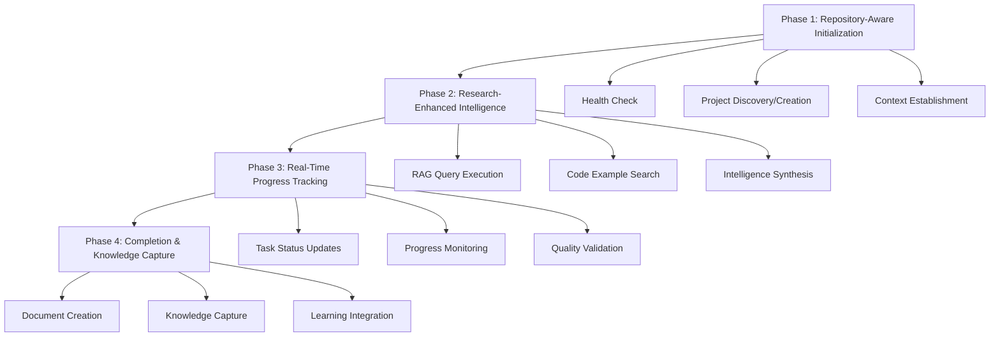

# 🚀 4-Phase Archon MCP Integration Framework

## Overview

This document defines the standardized 4-phase Archon MCP integration framework used by all Claude Code agents. This framework combines repository awareness, research intelligence, progress tracking, and knowledge capture for maximum agent effectiveness.

## Integration Architecture



## Phase 1: Repository-Aware Initialization & Intelligence Gathering

### Automatic Repository Detection & Project Association

Every agent starts with repository context establishment and Archon project association.

```bash
# Standard repository context variables (available to all agents)
REPO_URL=$(git remote get-url origin 2>/dev/null || echo "local-development")
REPO_NAME=$(basename "$REPO_URL" .git 2>/dev/null | sed 's/.*\///' || echo "unnamed-project")
REPO_BRANCH=$(git branch --show-current 2>/dev/null || echo "main")
COMMIT_HASH=$(git rev-parse --short HEAD 2>/dev/null || echo "unknown")
```

### Standard Context Function Template

Each agent implements a context function following this exact pattern:

```python
def establish_archon_[AGENT_DOMAIN]_context():
    """
    Establish Archon MCP context for [AGENT_PURPOSE].

    Returns:
        str: Project ID for task tracking, or None if Archon unavailable
    """
    # 0. Verify Archon MCP connectivity
    health = mcp__archon__health_check()
    if not health.get('success', False):
        print("⚠️  Archon MCP unavailable - operating in local-only mode")
        return None

    # 1. Try to find existing project by repository URL or name
    projects = mcp__archon__list_projects()

    matching_project = None
    for project in projects:
        if (project.get('github_repo') and
            REPO_URL in project['github_repo']) or \
           (REPO_NAME.lower() in project['title'].lower()):
            matching_project = project
            break

    # 2. Create new project if none found
    if not matching_project:
        matching_project = mcp__archon__create_project(
            title=f"[AGENT_TITLE]: {REPO_NAME}",
            description=f"""
[AGENT_DESCRIPTION]

## Repository Information
- Repository: {REPO_URL}
- Current Branch: {REPO_BRANCH}
- Latest Commit: {COMMIT_HASH}

## [AGENT_DOMAIN] Scope
[AGENT_SPECIFIC_SCOPE]
            """,
            github_repo=REPO_URL if REPO_URL != "local-development" else None
        )

    return matching_project['project_id']
```

### Function Customization Parameters

Each agent customizes the template with these variables:

- **`[AGENT_DOMAIN]`**: Short domain identifier (e.g., `pr_comment`, `debug`, `api_design`)
- **`[AGENT_PURPOSE]`**: Brief purpose description for docstring
- **`[AGENT_TITLE]`**: Human-readable title for project creation
- **`[AGENT_DESCRIPTION]`**: Detailed agent description
- **`[AGENT_SPECIFIC_SCOPE]`**: Domain-specific scope and capabilities

## Phase 2: Research-Enhanced Intelligence

### Multi-Dimensional RAG Intelligence Gathering

Standard pattern for gathering domain-specific intelligence:

```python
async def gather_[AGENT_DOMAIN]_intelligence(context_params):
    """
    Gather comprehensive intelligence for [AGENT_PURPOSE].

    Args:
        context_params: Domain-specific context parameters

    Returns:
        dict: Intelligence synthesis with patterns and examples
    """

    # Primary: Archon RAG for domain-specific patterns
    domain_patterns = mcp__archon__perform_rag_query(
        query=f"[DOMAIN_QUERY] patterns best practices standards compliance",
        match_count=5
    )

    # Secondary: Code examples for implementation approaches  
    implementation_examples = mcp__archon__search_code_examples(
        query=f"[IMPLEMENTATION_QUERY] examples quality gates",
        match_count=3
    )

    # Intelligence synthesis
    return {
        'patterns': domain_patterns.get('results', []),
        'examples': implementation_examples.get('results', []),
        'synthesis': analyze_intelligence_patterns(domain_patterns, implementation_examples)
    }
```

### Domain Query Templates

Standard query patterns by agent type:

| Agent Type | Domain Query | Implementation Query |
|------------|--------------|---------------------|
| PR Comments | `PR comment resolution feedback implementation` | `pull request review fixes compliance` |
| Debug | `debugging systematic root cause analysis` | `error investigation troubleshooting` |
| API Design | `RESTful API design architecture patterns` | `FastAPI endpoint implementation` |
| Security | `security audit vulnerability assessment` | `security scanning compliance validation` |
| Testing | `comprehensive test strategy quality assurance` | `pytest testing patterns automation` |
| Documentation | `technical documentation architecture` | `API documentation generation` |

## Phase 3: Real-Time Progress Tracking

### Dynamic Task Status Management

Standard pattern for progress tracking throughout agent execution:

```python
async def track_[AGENT_DOMAIN]_progress(task_id, phase, progress_data):
    """
    Track real-time progress for [AGENT_PURPOSE].

    Args:
        task_id: Archon task identifier
        phase: Current execution phase
        progress_data: Phase-specific progress information
    """
    if not task_id:
        return  # Local-only mode

    # Update task with current progress
    mcp__archon__update_task(
        task_id=task_id,
        status="doing",
        description=f"""
## Current Progress: {phase}

### Completed Steps
{progress_data.get('completed', [])}

### Current Step  
{progress_data.get('current_step', 'Initializing...')}

### Next Actions
{progress_data.get('next_actions', [])}

### Intelligence Applied
- RAG Patterns: {len(progress_data.get('rag_patterns', []))} patterns identified
- Code Examples: {len(progress_data.get('code_examples', []))} examples analyzed
- Quality Gates: {progress_data.get('quality_checks', 'Pending')}
        """
    )
```

### Progress Tracking Phases

Standard progress phases across all agents:

1. **Initialization**: Context establishment and project association
2. **Intelligence Gathering**: RAG queries and pattern analysis  
3. **Planning**: Strategy formulation based on intelligence
4. **Execution**: Primary task implementation with quality gates
5. **Validation**: Quality checks and compliance verification
6. **Completion**: Final validation and knowledge capture

## Phase 4: Completion & Knowledge Capture

### Comprehensive Knowledge Documentation

Standard pattern for capturing agent outcomes and lessons learned:

```python
async def capture_[AGENT_DOMAIN]_knowledge(task_id, execution_results):
    """
    Capture comprehensive knowledge from [AGENT_PURPOSE] execution.

    Args:
        task_id: Archon task identifier
        execution_results: Complete results from agent execution
    """
    if not task_id:
        return  # Local-only mode

    # Create comprehensive documentation
    mcp__archon__create_document(
        project_id=execution_results['project_id'],
        title=f"[AGENT_TITLE] Execution Report - {datetime.now().strftime('%Y-%m-%d')}",
        document_type="execution_report",
        content={
            "execution_summary": {
                "agent_type": "[AGENT_DOMAIN]",
                "repository": execution_results.get('repository_info', {}),
                "duration": execution_results.get('execution_time', 'Unknown'),
                "status": execution_results.get('final_status', 'Completed')
            },
            "intelligence_applied": {
                "rag_patterns_used": execution_results.get('rag_patterns', []),
                "code_examples_referenced": execution_results.get('code_examples', []),
                "successful_applications": execution_results.get('successful_patterns', [])
            },
            "outcomes_achieved": {
                "primary_objectives": execution_results.get('objectives_met', []),
                "quality_metrics": execution_results.get('quality_results', {}),
                "compliance_status": execution_results.get('compliance_check', 'Verified')
            },
            "lessons_learned": {
                "successful_strategies": execution_results.get('successful_strategies', []),
                "challenges_encountered": execution_results.get('challenges', []),
                "optimization_opportunities": execution_results.get('optimizations', [])
            },
            "knowledge_contributions": {
                "new_patterns_discovered": execution_results.get('new_patterns', []),
                "reusable_solutions": execution_results.get('reusable_solutions', []),
                "improvement_recommendations": execution_results.get('recommendations', [])
            }
        },
        tags=["[AGENT_DOMAIN]", "execution_report", "knowledge_capture"],
        author="Claude Code Agent"
    )

    # Update task to completed status
    mcp__archon__update_task(
        task_id=task_id,
        status="done",
        description=f"""
## ✅ [AGENT_TITLE] Completed Successfully

### Final Results
{execution_results.get('summary', 'Task completed with full ONEX compliance')}

### Knowledge Captured
- Execution report created with comprehensive findings
- {len(execution_results.get('new_patterns', []))} new patterns identified
- {len(execution_results.get('reusable_solutions', []))} reusable solutions documented

### Quality Assurance
- All quality gates passed
- ONEX standards compliance verified
- Knowledge base updated with findings
        """
    )

    # UAKS: Unified Agent Knowledge System Integration
    # Automatically capture structured knowledge for collective intelligence
    unified_knowledge_doc = await unified_knowledge_capture(execution_results, "[AGENT_DOMAIN]")

    # Cross-domain pattern synthesis (optional, for complex executions)
    if execution_results.get('complexity_level') in ['complex', 'critical']:
        correlations = await synthesize_cross_domain_patterns()
        execution_results['cross_domain_insights'] = correlations
```

## MCP Function Reference

### Core Functions

| Function | Purpose | Required Parameters | Return Value |
|----------|---------|-------------------|--------------|
| `mcp__archon__health_check()` | Verify Archon MCP connectivity | None | `{'success': bool}` |
| `mcp__archon__list_projects()` | Get all available projects | None | `List[Project]` |
| `mcp__archon__create_project()` | Create new project | `title`, `description`, `github_repo?` | `{'project_id': str}` |
| `mcp__archon__perform_rag_query()` | Query knowledge base | `query`, `match_count?` | `{'results': List[Document]}` |
| `mcp__archon__search_code_examples()` | Find code examples | `query`, `match_count?` | `{'results': List[CodeExample]}` |
| `mcp__archon__update_task()` | Update task progress | `task_id`, `status?`, `description?` | `{'success': bool}` |
| `mcp__archon__create_document()` | Create documentation | `project_id`, `title`, `document_type`, `content` | `{'document_id': str}` |

### Task Status Values

- `todo`: Task created but not started
- `doing`: Task currently in progress  
- `review`: Task completed, awaiting review
- `done`: Task fully completed and validated

### Document Types

- `execution_report`: Agent execution results and findings
- `intelligence_summary`: RAG/KB research synthesis
- `pattern_analysis`: Identified patterns and best practices
- `quality_assessment`: Quality checks and compliance reports
- `knowledge_base`: Reusable knowledge for future executions

## Error Handling & Fallback

### Archon MCP Unavailable

When Archon MCP is unavailable, agents automatically fall back to local-only mode:

```python
# Standard fallback pattern
if not mcp_available:
    print("⚠️  Archon MCP unavailable - operating in local-only mode")
    print("📝 Reduced functionality: No project tracking, RAG queries, or knowledge capture")
    # Continue with core agent functionality
    return execute_local_mode()
```

### Connection Recovery

```python
# Retry pattern for transient failures
def with_archon_retry(func, max_retries=3):
    for attempt in range(max_retries):
        try:
            return func()
        except Exception as e:
            if attempt == max_retries - 1:
                print(f"⚠️  Archon MCP connection failed after {max_retries} attempts")
                return None
            time.sleep(2 ** attempt)  # Exponential backoff
```

## Agent Implementation Guide

### Step 1: Add Framework Reference

Add this line to your agent's core responsibility section:

```markdown
**📚 Integration Framework**: This agent implements the standardized @ARCHON_INTEGRATION.md framework for comprehensive project intelligence, progress tracking, and knowledge capture.
```

### Step 2: Implement Context Function  

Replace agent-specific implementation with framework template, customizing only the variables:

```python
# Replace existing context function with:
def establish_archon_[YOUR_DOMAIN]_context():
    # Use standard template from ARCHON_INTEGRATION.md
    # Customize: [AGENT_DOMAIN], [AGENT_PURPOSE], [AGENT_TITLE], etc.
```

### Step 3: Reference Intelligence Patterns

Replace lengthy intelligence sections with:

```markdown
### Research-Enhanced Intelligence
This agent follows Phase 2 patterns defined in @ARCHON_INTEGRATION.md with domain-specific queries:
- **Domain Query**: `[your specific domain query]`
- **Implementation Query**: `[your specific implementation query]`
```

### Step 4: Reference Progress Tracking

Replace progress sections with:

```markdown
### Real-Time Progress Tracking  
This agent implements Phase 3 progress tracking from @ARCHON_INTEGRATION.md with the following phases:
1. [Agent-specific phase 1]
2. [Agent-specific phase 2]
etc.
```

### Step 5: Reference Knowledge Capture

Replace knowledge sections with:

```markdown
### Knowledge Capture
This agent implements Phase 4 knowledge capture from @ARCHON_INTEGRATION.md, documenting:
- [Agent-specific knowledge type 1]
- [Agent-specific knowledge type 2]
etc.
```

## Benefits of This Framework

### For Agents
- **Consistency**: All agents follow identical integration patterns
- **Maintainability**: Single source of truth for integration logic
- **Reduced Size**: Agent files focus on domain-specific functionality
- **Enhanced Intelligence**: Standardized access to RAG and code examples

### For Development  
- **Easy Updates**: Change framework once, affects all agents
- **Testing**: Consistent patterns enable automated testing
- **Documentation**: Centralized integration documentation
- **Debugging**: Standard patterns simplify troubleshooting

### For Users
- **Predictability**: All agents behave consistently
- **Quality**: Standardized quality gates and compliance
- **Intelligence**: All agents leverage comprehensive knowledge base
- **Progress Visibility**: Consistent progress tracking across all agents

This framework transforms the Claude Code agent ecosystem into a coherent, intelligent, and maintainable system while preserving each agent's unique domain expertise.

## 🧠 Unified Agent Knowledge System (UAKS) Integration

All agents automatically participate in the Unified Agent Knowledge System for collective intelligence:

**📚 Knowledge Framework**: This framework integrates with @UNIFIED_KNOWLEDGE_CAPTURE.md for:
- **Automatic Learning**: Every execution contributes to collective intelligence
- **Cross-Domain Insights**: Patterns discovered by any agent benefit all agents
- **Enhanced RAG Queries**: Agents query collective knowledge for better results  
- **Continuous Improvement**: System intelligence grows with every execution

### UAKS Phase 4 Enhancement

Phase 4 automatically includes unified knowledge capture:
```python
# Integrated into every agent's Phase 4 completion
unified_knowledge_doc = await unified_knowledge_capture(execution_results, agent_domain)
```

This ensures all agents contribute to and benefit from collective intelligence without additional implementation overhead.
