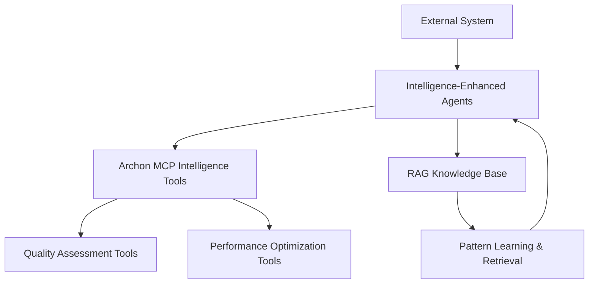

# Intelligence System Integration Guide

**Version**: 2.0  
**Target Audience**: External Systems, Development Teams, Integration Partners  
**Last Updated**: September 2025

## Quick Reference

### 🚀 What This System Provides
- **9 Intelligence Tools** (4 quality + 5 performance) for automated analysis
- **3 Enhanced Agents** with systematic quality, performance, and debug capabilities  
- **Unified Integration** through common reference patterns
- **RAG-Enhanced Learning** for continuous improvement and pattern recognition

### 📋 Integration Checklist
- [ ] **Archon MCP Server**: Required for intelligence tool access
- [ ] **Agent Files**: Copy enhanced agents to your `~/.claude/agents/` directory
- [ ] **Reference Guide**: Include `@INTELLIGENCE_INTEGRATION.md` in your agent directory
- [ ] **Test Integration**: Verify intelligence tools are accessible

## System Architecture Overview



## Enhanced Agent Capabilities

### agent-code-quality-analyzer
**Intelligence Focus**: Quality Assessment + ONEX Compliance

**Capabilities**:
- ONEX compliance scoring (0.0-1.0 scale)
- Anti-pattern detection with remediation guidance
- Architectural compliance verification
- Documentation quality assessment

**Usage**:
```bash
@agent-code-quality-analyzer
"Analyze this code using intelligence tools for quality, compliance, and patterns"
```

**Expected Output**:
```
Quality Score: 0.85/1.0
ONEX Compliance: 0.82/1.0  
Anti-Patterns Found: 2 (manual accumulation, explicit None comparison)
Recommendations: Use sum() with generator, implement proper error handling
```

### agent-performance  
**Intelligence Focus**: Performance Optimization + Predictive Analysis

**Capabilities**:
- Performance baseline establishment with metrics
- AI-powered optimization opportunity discovery
- Predictive trend analysis with bottleneck prediction
- ROI analysis for optimization investments

**Usage**:
```bash
@agent-performance
"Analyze performance using intelligence tools. Establish baselines and provide optimization roadmap"
```

**Expected Output**:
```
Critical Issues: N+1 query problem (up to 200 queries)
Optimization Impact: 95% reduction in database queries (200 → 1-2)
Expected Improvement: 90-95% response time reduction
ROI: 2-3 developer days → 95% performance gain + security fix
```

### agent-debug-intelligence
**Intelligence Focus**: Multi-Dimensional Root Cause Analysis

**Capabilities**:
- Quality-informed debugging with pattern correlation
- Performance intelligence for performance-related issues  
- Predictive issue detection through trend analysis
- Multi-dimensional root cause analysis

**Usage**:
```bash
@agent-debug-intelligence
"Investigate this bug using intelligence tools for root cause and prevention"
```

**Expected Output**:
```
Root Cause: Insufficient input validation bypassing None values
Quality Impact: Compliance improvement from 0.85 to 0.95
Solution: Multi-layer validation + error boundaries + resource management
Prevention: Pattern documented for future RAG-enhanced debugging
```

## Integration Methods

### Method 1: Direct Agent Usage (Recommended)
Copy enhanced agents to your system and use directly:

```bash
# Copy agents to your Claude Code agents directory
cp /path/to/enhanced/agents/* ~/.claude/agents/

# Use agents directly
@agent-code-quality-analyzer "Analyze this code with intelligence"
```

### Method 2: API Integration
For programmatic access:

```python
# Intelligence-enhanced analysis request
analysis_request = {
    "agent_type": "code-quality-analyzer",
    "intelligence_mode": "comprehensive",
    "analysis_scope": {
        "code_content": code_to_analyze,
        "file_path": source_file_path,
        "compliance_standards": ["onex", "clean_architecture"]
    }
}

# Expected response structure
{
    "intelligence_analysis": {
        "quality_score": 0.85,
        "compliance_score": 0.82,
        "anti_patterns": [...],
        "optimization_opportunities": [...]
    },
    "actionable_recommendations": [...],
    "knowledge_captured": true
}
```

### Method 3: System Integration
For larger system integration:

```yaml
# System integration configuration
intelligence_system:
  required_services:
    - archon_mcp_server
    - rag_knowledge_base
    - project_tracking

  intelligence_tools:
    quality: 4
    performance: 5

  enhanced_agents:
    - agent-code-quality-analyzer
    - agent-performance  
    - agent-debug-intelligence
```

## Intelligence Tool Reference

### Quality Assessment Tools (4)
1. **`assess_code_quality`** - ONEX compliance scoring with architectural validation
2. **`analyze_document_quality`** - Documentation completeness and quality analysis
3. **`get_quality_patterns`** - Best practices and anti-pattern identification  
4. **`check_architectural_compliance`** - ONEX standards compliance verification

### Performance Optimization Tools (5)
1. **`establish_performance_baseline`** - Systematic performance baseline creation
2. **`identify_optimization_opportunities`** - AI-powered bottleneck discovery
3. **`apply_performance_optimization`** - Automated performance improvements
4. **`get_optimization_report`** - Comprehensive performance analysis
5. **`monitor_performance_trends`** - Predictive performance analysis

## Success Metrics

### Quality Intelligence
- **ONEX Compliance Scoring**: 0.0-1.0 scale with specific improvement areas
- **Anti-Pattern Detection**: Automated identification with remediation guidance
- **Documentation Quality**: Completeness and clarity assessment
- **Architecture Validation**: Compliance verification against standards

### Performance Intelligence  
- **Baseline Establishment**: Systematic measurement and tracking
- **Optimization Discovery**: AI-powered improvement identification
- **Impact Quantification**: Specific performance improvement predictions
- **ROI Analysis**: Cost-benefit analysis for optimization investments

### Debug Intelligence
- **Root Cause Accuracy**: Multi-dimensional analysis capabilities
- **Prevention Effectiveness**: Trend-based prediction and proactive measures
- **Resolution Speed**: Intelligence-guided debugging workflows
- **Pattern Learning**: Continuous improvement through captured intelligence

## Benefits

### Development Workflow Enhancement
- **Automated Quality Gates**: Systematic compliance verification at every stage
- **Predictive Issue Prevention**: Trend analysis prevents problems before occurrence
- **Data-Driven Decisions**: Quantified recommendations with ROI analysis
- **Continuous Learning**: All insights captured for progressive intelligence improvement

### System Intelligence Growth
- **Pattern Recognition**: Identifies recurring issues and successful solutions
- **Knowledge Accumulation**: RAG-enhanced learning from all analysis outcomes
- **Cross-Domain Insights**: Quality and performance intelligence correlation
- **Predictive Capabilities**: Future issue prediction based on trend analysis

## Common Use Cases

### Code Review Enhancement
```bash
# Intelligence-enhanced PR review
@agent-code-quality-analyzer
"Review this PR using intelligence tools. Provide compliance scoring and improvement recommendations."
```

### Performance Optimization
```bash  
# Comprehensive performance analysis
@agent-performance
"Analyze this component for performance optimization. Provide baseline establishment and optimization roadmap."
```

### Incident Investigation
```bash
# Intelligence-driven debugging
@agent-debug-intelligence  
"Investigate this production incident using intelligence tools. Provide root cause analysis and preventive measures."
```

## Support Resources

### Documentation
- **`INTELLIGENCE_AGENTS_OVERVIEW.md`**: Complete system overview with examples
- **`@INTELLIGENCE_INTEGRATION.md`**: Technical integration reference
- **Individual Agent Docs**: Specific capabilities and usage patterns

### Getting Started
1. **Review Overview**: Read `INTELLIGENCE_AGENTS_OVERVIEW.md` for comprehensive understanding
2. **Copy Agents**: Install enhanced agents in your Claude Code agents directory  
3. **Test Integration**: Verify intelligence tools are accessible
4. **Begin Usage**: Start with simple analysis requests to verify functionality

### Technical Support
- **Agent-Specific Help**: Each agent provides contextual usage guidance
- **Integration Support**: Technical assistance for system integration
- **Pattern Guidance**: Best practices for intelligence tool utilization

---

**Ready to Get Started?**

1. Copy the enhanced agents to your system
2. Review the overview documentation  
3. Test with a simple analysis request
4. Begin leveraging intelligence capabilities in your development workflow

The intelligence-enhanced agent system is production-ready and provides immediate value through systematic analysis, data-driven recommendations, and continuous learning capabilities.
