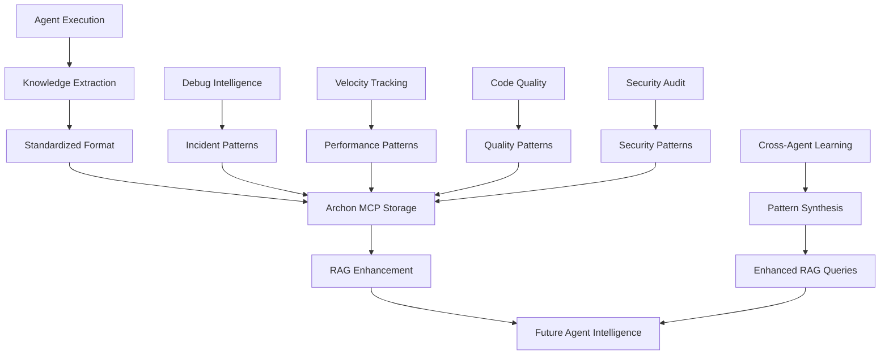

# 🧠 Unified Agent Knowledge System (UAKS)

## Overview

The Unified Agent Knowledge System provides a standardized framework for all 39 Claude Code agents to automatically contribute to a shared knowledge base, enabling continuous learning, pattern recognition, and intelligence enhancement across the entire agent ecosystem.

## Architecture



## Core Principles

### 1. **Automatic Capture**
- Every agent execution automatically generates knowledge
- No manual intervention required
- Standardized capture regardless of agent domain

### 2. **Structured Intelligence**
- Consistent knowledge format across all agents
- Machine-readable and human-understandable
- Queryable through RAG system

### 3. **Cross-Domain Learning**
- Debug patterns inform security audits
- Performance insights enhance code quality
- All agents benefit from collective intelligence

### 4. **Continuous Enhancement**
- Knowledge base grows with every execution
- RAG queries become more intelligent over time
- Agents learn from collective experience

## Knowledge Capture Framework

### Standard Knowledge Document Structure

Every agent execution creates a knowledge document with this structure:

```json
{
  "knowledge_capture": {
    "metadata": {
      "agent_type": "string",
      "execution_id": "uuid",
      "timestamp": "ISO8601",
      "repository": {
        "url": "string",
        "name": "string",
        "branch": "string",
        "commit": "string"
      },
      "project_id": "archon_project_uuid",
      "task_id": "archon_task_uuid"
    },
    "execution_context": {
      "trigger": "user_request|automated|scheduled",
      "input_summary": "brief description of task",
      "complexity_level": "simple|moderate|complex|critical",
      "duration": "execution time in seconds"
    },
    "domain_intelligence": {
      "patterns_discovered": [
        {
          "pattern_type": "string",
          "description": "string",
          "frequency": "common|uncommon|rare|first_time",
          "effectiveness": "high|medium|low",
          "reusability": "universal|domain_specific|context_specific"
        }
      ],
      "successful_strategies": [
        {
          "strategy": "string",
          "context": "when this works",
          "outcome": "what was achieved",
          "confidence": "high|medium|low"
        }
      ],
      "failed_approaches": [
        {
          "approach": "string",
          "failure_mode": "why it failed",
          "lesson_learned": "what to avoid",
          "alternative": "what to try instead"
        }
      ]
    },
    "cross_domain_insights": {
      "security_implications": "any security considerations discovered",
      "performance_impact": "any performance insights",
      "quality_observations": "code quality patterns noticed",
      "debugging_hints": "troubleshooting insights for future",
      "collaboration_patterns": "how other agents could help"
    },
    "rag_enhancement": {
      "new_query_patterns": [
        "queries that would have helped this execution"
      ],
      "knowledge_gaps": [
        "areas where more information would help"
      ],
      "improved_examples": [
        "better code examples for similar tasks"
      ]
    },
    "future_intelligence": {
      "automation_opportunities": "tasks that could be automated",
      "pattern_predictions": "likely future patterns to watch",
      "optimization_suggestions": "ways to improve similar executions",
      "prevention_strategies": "how to avoid problems encountered"
    }
  }
}
```

## Agent Integration Pattern

### Phase 4 Enhancement

All agents add this to their Phase 4 knowledge capture:

```python
async def unified_knowledge_capture(execution_results, agent_type):
    """
    Capture unified knowledge following UAKS framework.

    This function automatically extracts and stores knowledge in the
    standardized format, making it available for RAG enhancement
    across all agents.
    """

    # Extract standardized knowledge
    knowledge_doc = {
        "metadata": {
            "agent_type": agent_type,
            "execution_id": str(uuid.uuid4()),
            "timestamp": datetime.utcnow().isoformat(),
            "repository": execution_results.get('repository_info', {}),
            "project_id": execution_results.get('project_id'),
            "task_id": execution_results.get('task_id')
        },
        "execution_context": extract_execution_context(execution_results),
        "domain_intelligence": extract_domain_patterns(execution_results, agent_type),
        "cross_domain_insights": extract_cross_domain_insights(execution_results),
        "rag_enhancement": identify_rag_improvements(execution_results),
        "future_intelligence": predict_future_patterns(execution_results)
    }

    # Store in Archon MCP for RAG access
    mcp__archon__create_document(
        project_id=execution_results['project_id'],
        title=f"Knowledge Capture - {agent_type} - {datetime.now().strftime('%Y-%m-%d-%H%M%S')}",
        document_type="unified_knowledge",
        content={"knowledge_capture": knowledge_doc},
        tags=["knowledge_capture", agent_type, "uaks", "rag_enhancement"],
        author="UAKS System"
    )

    return knowledge_doc
```

## Domain-Specific Knowledge Patterns

### Debug Intelligence Patterns
```yaml
debug_patterns:
  - incident_type: "classification of debugging issue"
  - resolution_path: "steps that led to solution"
  - time_to_resolution: "diagnostic efficiency metric"
  - root_cause_category: "system|code|configuration|integration"
  - prevention_strategy: "how to avoid similar issues"
```

### Performance Optimization Patterns
```yaml
performance_patterns:
  - bottleneck_type: "CPU|memory|IO|network|database"
  - optimization_technique: "specific approach used"
  - impact_measurement: "before/after metrics"
  - applicability_scope: "local|project|universal"
  - tool_effectiveness: "which tools were most helpful"
```

### Security Audit Patterns
```yaml
security_patterns:
  - vulnerability_class: "OWASP category or custom"
  - detection_method: "how vulnerability was found"
  - remediation_approach: "fix strategy"
  - severity_assessment: "risk level evaluation"
  - prevention_controls: "proactive security measures"
```

### Code Quality Patterns
```yaml
quality_patterns:
  - quality_issue_type: "complexity|duplication|coupling|cohesion"
  - refactoring_technique: "specific improvement method"
  - maintainability_impact: "long-term code health effect"
  - testing_implications: "test coverage considerations"
  - architectural_insights: "design pattern observations"
```

## Cross-Agent Intelligence Synthesis

### Pattern Correlation Engine

```python
async def synthesize_cross_domain_patterns():
    """
    Analyze knowledge across all agents to identify cross-domain patterns.
    """

    # Query all knowledge documents
    all_knowledge = mcp__archon__perform_rag_query(
        query="unified knowledge capture patterns across all agent types",
        match_count=100
    )

    # Identify correlations
    correlations = {
        'debug_security_patterns': correlate_debug_security(all_knowledge),
        'performance_quality_patterns': correlate_performance_quality(all_knowledge),
        'automation_opportunities': identify_automation_patterns(all_knowledge),
        'common_failure_modes': extract_common_failures(all_knowledge),
        'successful_collaboration': identify_agent_collaboration_success(all_knowledge)
    }

    return correlations
```

### Enhanced RAG Queries

With unified knowledge, agents can make much more intelligent queries:

```python
# Instead of generic queries
old_query = "API design patterns"

# Agents can now query with context from collective intelligence
enhanced_query = """
API design patterns based on successful Claude Code agent implementations,
including performance considerations from agent-performance,
security patterns from agent-security-audit,
and debugging insights from agent-debug-intelligence.
Focus on patterns with high reusability and proven effectiveness
in ONEX microservices contexts.
"""
```

## Implementation Strategy

### Phase 1: Framework Integration (Immediate)
1. **Add UAKS to ARCHON_INTEGRATION.md**: Update framework with unified knowledge capture
2. **Enhance Phase 4**: All agents automatically capture knowledge
3. **Create Knowledge Templates**: Domain-specific extraction patterns
4. **Deploy Detection**: Update detection script to verify UAKS integration

### Phase 2: Intelligence Enhancement (Week 1)
1. **Pattern Synthesis**: Implement cross-domain correlation engine
2. **Enhanced RAG Queries**: Upgrade all agent RAG patterns to use unified knowledge
3. **Automated Learning**: Implement continuous improvement based on captured knowledge
4. **Dashboard Creation**: Build knowledge insights visualization

### Phase 3: Advanced Intelligence (Week 2)
1. **Predictive Patterns**: Implement future pattern prediction
2. **Automated Optimization**: Self-improving agent performance
3. **Cross-Agent Collaboration**: Intelligent agent routing based on knowledge patterns
4. **Quality Metrics**: Measure knowledge capture effectiveness

## Benefits

### For Individual Agents
- **Smarter RAG Queries**: Access to collective intelligence from all agent executions
- **Faster Problem Resolution**: Learn from similar issues solved by other agents
- **Improved Success Rates**: Avoid approaches that have failed before
- **Automated Optimization**: Continuously improve based on accumulated knowledge

### For Agent Ecosystem
- **Collective Intelligence**: All agents benefit from the experience of every execution
- **Pattern Recognition**: Identify trends and recurring issues across domains
- **Proactive Problem Prevention**: Anticipate and prevent issues before they occur
- **Intelligent Automation**: Automate recurring patterns discovered across agents

### For Development Team
- **Unified Knowledge Base**: Single source of truth for all agent intelligence
- **Cross-Domain Insights**: Understand relationships between different aspects of development
- **Continuous Learning**: System automatically gets smarter over time
- **Evidence-Based Decisions**: Make decisions based on actual agent execution data

## Success Metrics

### Knowledge Capture Metrics
- **Capture Rate**: Percentage of agent executions generating knowledge documents
- **Knowledge Quality**: Usefulness rating of captured patterns
- **Cross-Domain Correlations**: Number of successful pattern correlations found
- **RAG Enhancement**: Improvement in RAG query effectiveness

### Agent Improvement Metrics
- **Success Rate Improvement**: Increase in successful task completion
- **Time to Resolution**: Reduction in average task completion time
- **Pattern Reuse**: Frequency of applying previously learned patterns
- **Error Reduction**: Decrease in failed approaches due to learned patterns

### System Intelligence Metrics
- **Knowledge Graph Growth**: Expansion of interconnected knowledge patterns
- **Prediction Accuracy**: Success rate of predicted patterns and solutions
- **Automation Opportunities**: Number of tasks automated based on learned patterns
- **Collective IQ**: Overall system intelligence improvement over time

This Unified Agent Knowledge System transforms the Claude Code agent ecosystem from individual specialists into a **collective intelligence network** where every execution contributes to the wisdom of all agents.
