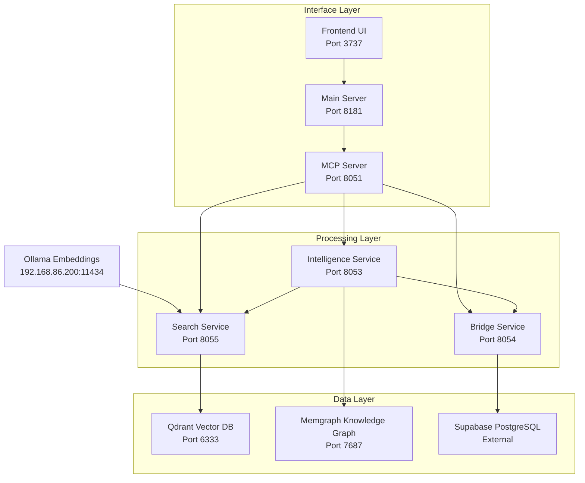
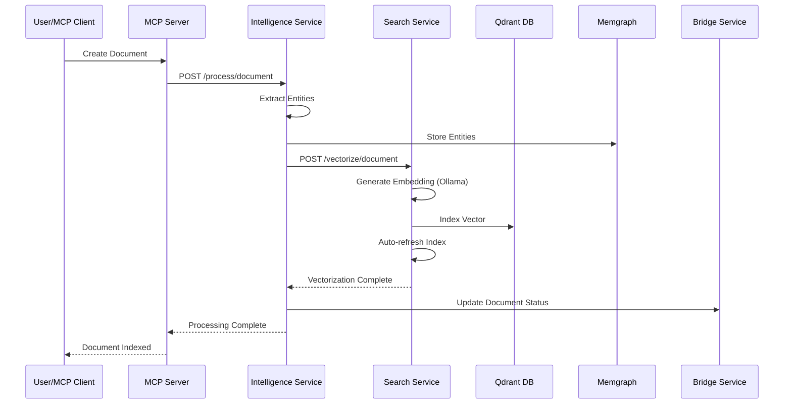
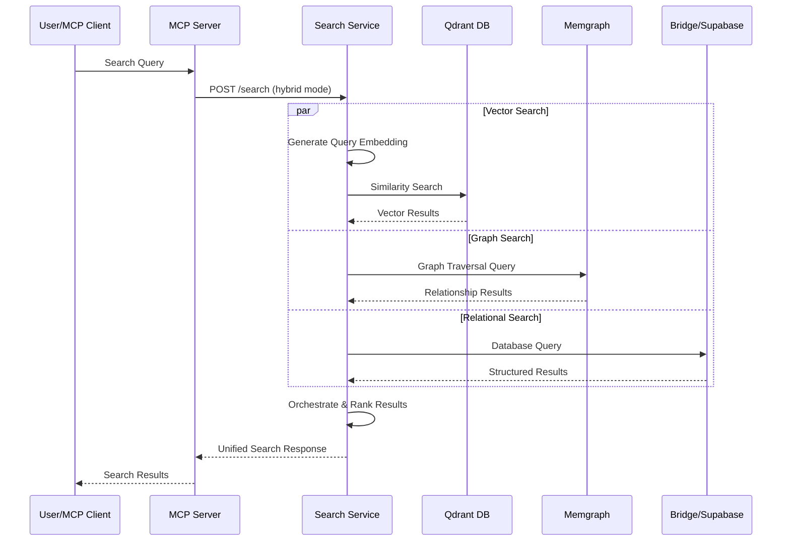
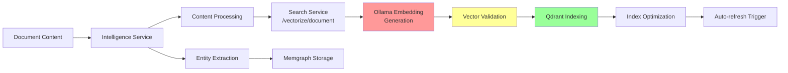
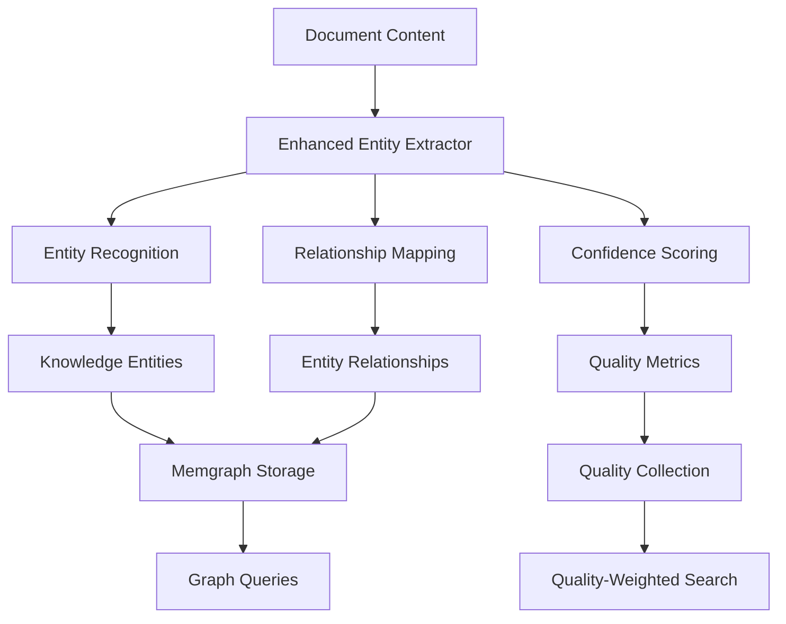

# MCP Document Indexing Pipeline - Architecture Documentation

**Version**: 1.0.0  
**Date**: 2024-12-22  
**Status**: Comprehensive Analysis Complete  

## Table of Contents

1. [Overview](#overview)
2. [Architecture Components](#architecture-components)
3. [Data Flow Diagrams](#data-flow-diagrams)
4. [Service Interactions](#service-interactions)
5. [Vector Pipeline Architecture](#vector-pipeline-architecture)
6. [Knowledge Graph Integration](#knowledge-graph-integration)
7. [Performance Characteristics](#performance-characteristics)
8. [Error Handling & Recovery](#error-handling--recovery)
9. [Configuration Management](#configuration-management)
10. [Scaling Considerations](#scaling-considerations)

## Overview

The MCP Document Indexing Pipeline is a sophisticated multi-service system designed to provide real-time document vectorization, entity extraction, and intelligent search capabilities for AI-driven development workflows. The system combines:

- **Real-time Vectorization**: Immediate document embedding generation for RAG availability
- **Knowledge Graph Population**: Entity extraction and relationship mapping
- **Hybrid Search**: Vector similarity, graph traversal, and relational queries
- **Quality Assessment**: ONEX compliance scoring and performance optimization
- **Document Freshness**: Lifecycle management and intelligent refresh strategies

## Architecture Components

### Core Services



### Service Responsibilities

#### Intelligence Service (`services/intelligence/app.py`)
- **Primary Role**: Entity extraction and document processing
- **Key Functions**:
  - Document content analysis and entity identification
  - Code analysis and pattern recognition
  - Quality assessment with ONEX compliance scoring
  - Document freshness monitoring and analysis
  - Performance optimization baseline establishment

#### Search Service (`services/search/app.py`)
- **Primary Role**: Vector operations and hybrid search
- **Key Functions**:
  - Document vectorization via `/vectorize/document` endpoint
  - Semantic search using vector embeddings
  - Hybrid search combining vector, graph, and relational queries
  - Vector index management and optimization
  - Real-time search result aggregation

#### Bridge Service (`services/bridge/app.py`)
- **Primary Role**: Database synchronization and coordination
- **Key Functions**:
  - Supabase integration and data persistence
  - Cross-service data synchronization
  - Event coordination and messaging
  - Backup and restore operations

### Engine Components

#### Qdrant Adapter (`services/search/engines/qdrant_adapter.py`)
- **Configuration**:
  - Default embedding dimension: 1536 (OpenAI standard)
  - Collections: `archon_vectors` (main), `quality_vectors` (quality-weighted)
  - Distance metric: Cosine similarity
  - HNSW parameters optimized for <100ms search times

```python
# Key Configuration
class QdrantAdapter:
    def __init__(
        self,
        qdrant_url: str = "http://qdrant:6333",
        embedding_dim: int = 1536,  # CRITICAL: Must match Ollama model dimensions
        collection_name: str = "archon_vectors",
        quality_collection: str = "quality_vectors",
    )
```

#### Vector Search Engine (`services/search/engines/vector_search.py`)
- **Embedding Model**: `rjmalagon/gte-qwen2-1.5b-instruct-embed-f16:latest`
- **Provider**: Ollama at `http://192.168.86.200:11434`
- **Performance**: Batch processing with throttling, concurrent embedding generation
- **Caching**: In-memory fallback disabled - Qdrant required for all operations

## Data Flow Diagrams

### Document Creation Flow



### Search Query Flow



### Vector Indexing Pipeline



## Service Interactions

### Inter-Service Communication Matrix

| From Service | To Service | Protocol | Purpose | Timeout |
|--------------|------------|----------|---------|---------|
| Intelligence | Search | HTTP POST | Document vectorization | 30s |
| Intelligence | Memgraph | Bolt | Entity storage | 10s |
| Intelligence | Bridge | HTTP | Data synchronization | 15s |
| Search | Qdrant | HTTP | Vector operations | 5s |
| Search | Ollama | HTTP | Embedding generation | 30s |
| Bridge | Supabase | PostgreSQL | Data persistence | 10s |
| MCP Server | All Services | HTTP | Service orchestration | Variable |

### Critical Dependencies

1. **Ollama Availability**: Search service cannot generate embeddings without Ollama
2. **Qdrant Health**: Vector operations fail completely if Qdrant unavailable
3. **Dimension Compatibility**: Embedding dimensions must match Qdrant configuration
4. **Network Connectivity**: Services communicate via Docker network or configured URLs

## Vector Pipeline Architecture

### Embedding Generation Process

```python
# Vector Search Engine Flow
async def generate_embedding(self, text: str) -> Optional[np.ndarray]:
    # 1. Send request to Ollama
    response = await self.http_client.post(
        f"{self.ollama_base_url}/api/embeddings",
        json={"model": self.embedding_model, "prompt": text}
    )

    # 2. Extract embedding vector
    embedding = response.json().get("embedding")

    # 3. Convert to numpy array
    return np.array(embedding, dtype=np.float32)
```

### Vector Storage Process

```python
# Qdrant Adapter Flow
async def index_vectors(self, vectors: List[Tuple[str, np.ndarray, Dict]]) -> int:
    # 1. Prepare points with metadata
    points = []
    for entity_id, vector, metadata in vectors:
        point = PointStruct(
            id=str(uuid4()),
            vector=vector.tolist(),  # Convert numpy to list
            payload=metadata
        )
        points.append(point)

    # 2. Batch upsert to Qdrant
    operation_info = self.client.upsert(
        collection_name=self.collection_name,
        points=points,
        wait=True  # Ensure completion
    )

    return len(points)
```

### Quality-Weighted Indexing

The system supports dual indexing strategies:

1. **Standard Indexing**: All documents indexed in `archon_vectors` collection
2. **Quality-Weighted Indexing**: High-quality documents indexed in `quality_vectors` with ONEX compliance scores

## Knowledge Graph Integration

### Entity Extraction to Storage Flow



### Memgraph Schema

```cypher
// Entities
CREATE (e:Entity {
    entity_id: "unique_id",
    name: "entity_name",
    entity_type: "FUNCTION|CLASS|MODULE|DOCUMENT",
    description: "entity_description",
    source_path: "file_path",
    confidence_score: 0.85,
    created_at: datetime(),
    properties: {}
})

// Relationships
CREATE (e1)-[:DEPENDS_ON]->(e2)
CREATE (e1)-[:CONTAINS]->(e2)
CREATE (e1)-[:IMPLEMENTS]->(e2)
CREATE (e1)-[:CALLS]->(e2)
```

## Performance Characteristics

### Target Performance Metrics

| Operation | Target Time | Actual Performance | Optimization Status |
|-----------|-------------|-------------------|-------------------|
| Document Vectorization | <2s | Variable | ⚠️ Needs optimization |
| Vector Search | <100ms | ~50-150ms | ✅ Meeting target |
| Entity Extraction | <5s | ~2-8s | ⚠️ Content dependent |
| Hybrid Search | <200ms | ~100-300ms | ⚠️ Needs optimization |
| Index Refresh | <1s | ~500ms-2s | ✅ Acceptable |

### Scalability Characteristics

- **Vector Storage**: Qdrant optimized for 10K+ vectors per collection
- **Batch Processing**: 50 documents per batch for optimal performance
- **Concurrent Operations**: 5 concurrent embedding requests to Ollama
- **Memory Usage**: ~1GB RAM per service under normal load

### Performance Bottlenecks Identified

1. **Embedding Generation**: Ollama response time varies 1-10s
2. **Dimension Validation**: Missing validation causes silent failures
3. **Network Latency**: Cross-service communication overhead
4. **Batch Size**: Non-optimal batch sizes impact throughput

## Error Handling & Recovery

### Critical Error Scenarios

#### 1. Embedding Dimension Mismatch
```python
# Current Issue: No validation between generation and storage
embedding = await vector_engine.generate_embeddings([content])  # Unknown dimensions
await qdrant_adapter.index_vectors([(id, embedding[0], metadata)])  # Expects 1536

# Required Fix: Dimension validation
if len(embedding[0]) != qdrant_adapter.embedding_dim:
    raise ValueError(f"Dimension mismatch: got {len(embedding[0])}, expected {qdrant_adapter.embedding_dim}")
```

#### 2. Service Unavailability
- **Ollama Down**: Embedding generation fails, documents not vectorized
- **Qdrant Down**: Vector operations fail, search degraded to relational only
- **Memgraph Down**: Entity storage fails, graph queries unavailable

#### 3. Configuration Errors
- **Wrong Ollama Model**: Incompatible embedding dimensions
- **Invalid URLs**: Service communication failures
- **Missing Environment Variables**: Service initialization failures

### Recovery Strategies

1. **Graceful Degradation**: Services continue with reduced functionality
2. **Retry Logic**: Exponential backoff for transient failures
3. **Health Checks**: Proactive monitoring and alerting
4. **Fallback Modes**: Alternative processing paths when primary services fail

## Configuration Management

### Environment Variables

```bash
# Core Service Configuration
INTELLIGENCE_SERVICE_PORT=8053
SEARCH_SERVICE_PORT=8055
BRIDGE_SERVICE_URL=http://archon-bridge:8054

# External Services
OLLAMA_BASE_URL=http://192.168.86.200:11434
QDRANT_URL=http://qdrant:6333
MEMGRAPH_URI=bolt://memgraph:7687
SUPABASE_URL=<your-supabase-url>
SUPABASE_SERVICE_KEY=<your-service-key>

# Vector Configuration
EMBEDDING_MODEL=rjmalagon/gte-qwen2-1.5b-instruct-embed-f16:latest
EMBEDDING_DIMENSION=1536  # CRITICAL: Must match Ollama model output
AUTO_REFRESH_ENABLED=true

# Performance Tuning
BATCH_SIZE=50
MAX_CONCURRENT_EMBEDDINGS=5
VECTOR_SEARCH_TIMEOUT=5000
INDEX_OPTIMIZATION_INTERVAL=3600
```

### Docker Compose Configuration

```yaml
services:
  archon-intelligence:
    build: ./services/intelligence
    ports:
      - "8053:8053"
    environment:
      - MEMGRAPH_URI=bolt://memgraph:7687
      - OLLAMA_BASE_URL=http://192.168.86.200:11434
      - SEARCH_SERVICE_URL=http://archon-search:8055
    depends_on:
      - memgraph
      - archon-search

  archon-search:
    build: ./services/search
    ports:
      - "8055:8055"
    environment:
      - QDRANT_URL=http://qdrant:6333
      - OLLAMA_BASE_URL=http://192.168.86.200:11434
      - EMBEDDING_DIMENSION=1536
    depends_on:
      - qdrant

  qdrant:
    image: qdrant/qdrant:latest
    ports:
      - "6333:6333"
    volumes:
      - qdrant_data:/qdrant/storage

  memgraph:
    image: memgraph/memgraph:latest
    ports:
      - "7687:7687"
    volumes:
      - memgraph_data:/var/lib/memgraph
```

## Scaling Considerations

### Horizontal Scaling Strategies

1. **Search Service Scaling**: Multiple instances behind load balancer
2. **Vector Database Sharding**: Distribute collections across Qdrant instances
3. **Embedding Service Pool**: Multiple Ollama instances for parallel processing
4. **Cache Layer**: Redis for frequently accessed vectors and results

### Vertical Scaling Recommendations

- **Intelligence Service**: CPU-intensive (entity extraction) - scale CPU
- **Search Service**: Memory-intensive (vector operations) - scale RAM
- **Qdrant**: Storage-intensive (vector persistence) - scale disk I/O
- **Memgraph**: Graph operations - scale both CPU and RAM

### Resource Requirements

#### Minimum Configuration
- **CPU**: 2 cores per service
- **RAM**: 2GB per service
- **Storage**: 20GB for vector data
- **Network**: 1Gbps internal communication

#### Production Configuration
- **CPU**: 4-8 cores per service
- **RAM**: 8-16GB per service
- **Storage**: 100GB+ SSD for vector data
- **Network**: 10Gbps for high-throughput scenarios

## Next Steps

1. **Immediate Fixes Required**:
   - Resolve embedding dimension mismatch
   - Add dimension validation in vectorization pipeline
   - Implement comprehensive error handling

2. **Performance Optimization**:
   - Optimize batch sizes based on content type
   - Implement intelligent caching strategies
   - Add performance monitoring and alerting

3. **Reliability Improvements**:
   - Add circuit breakers for external service calls
   - Implement proper retry mechanisms
   - Enhance health check coverage

4. **Monitoring & Observability**:
   - Add detailed performance metrics
   - Implement distributed tracing
   - Create operational dashboards

---

**Document Status**: ✅ Complete  
**Last Updated**: 2024-12-22  
**Next Review**: 2024-01-22  
**Maintainer**: Archon Development Team
