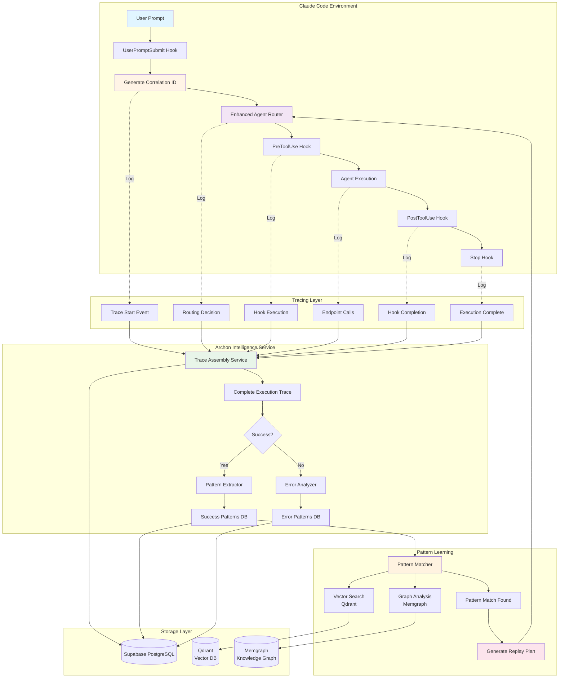
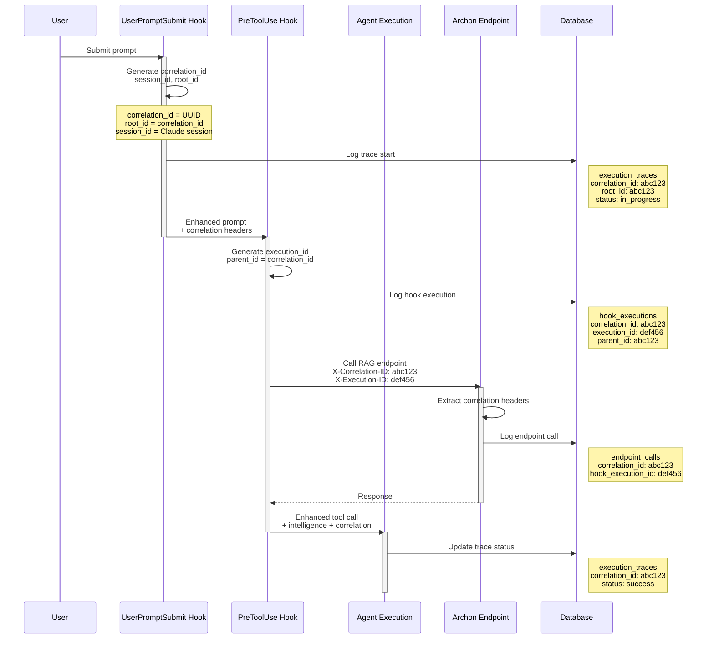
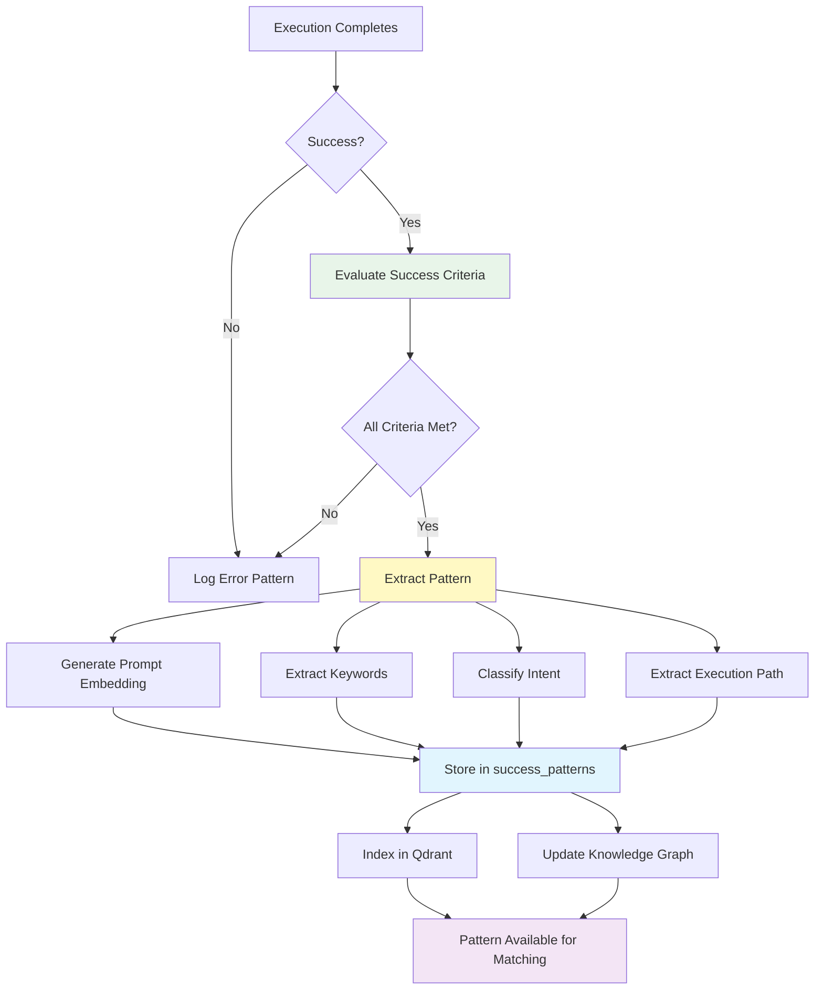
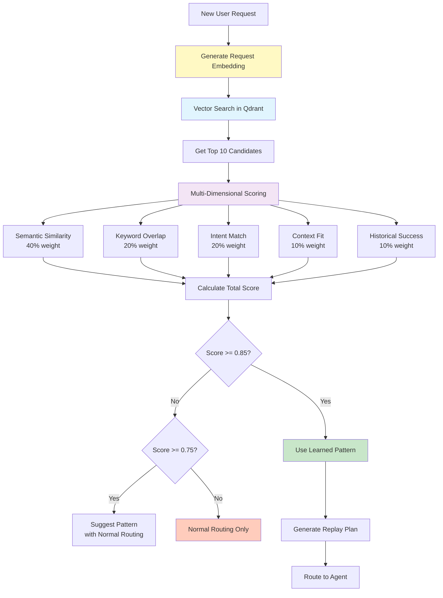
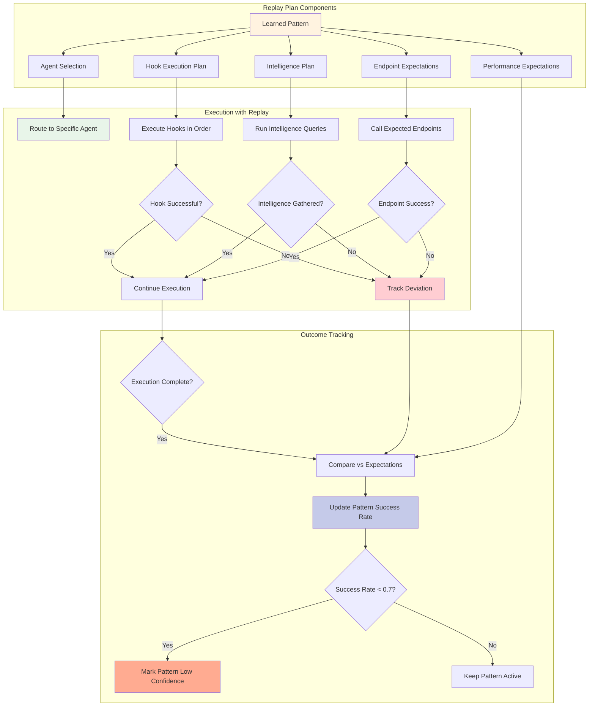
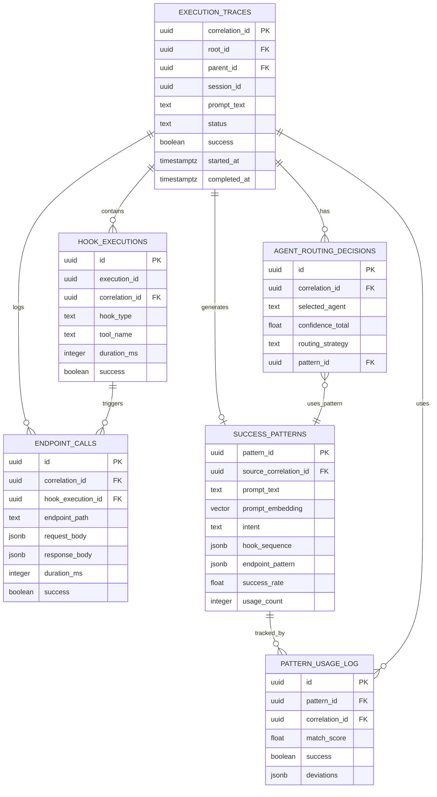
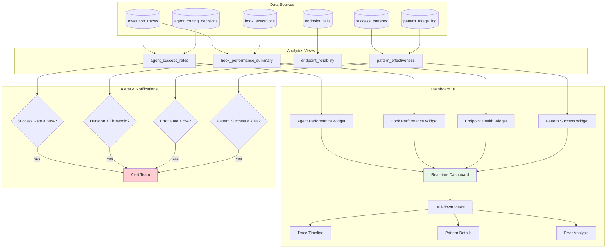
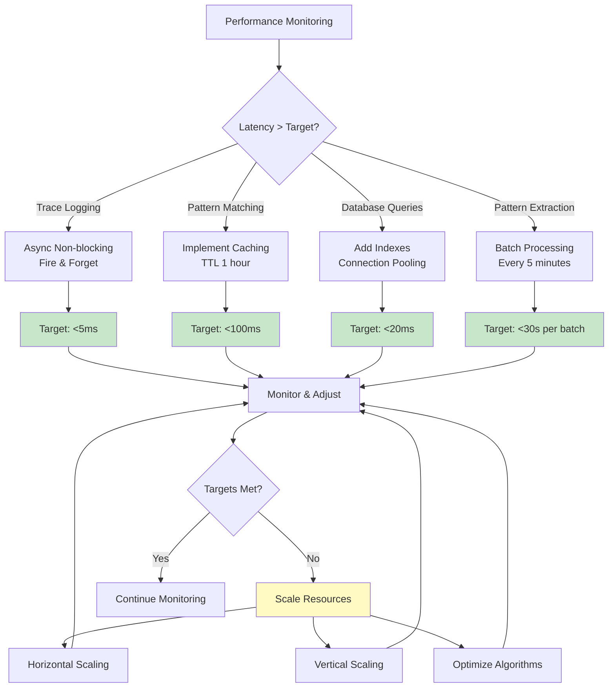
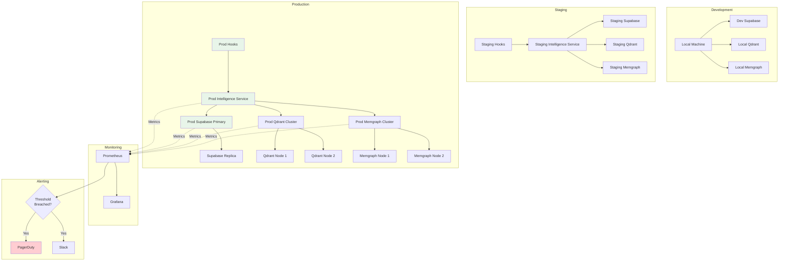
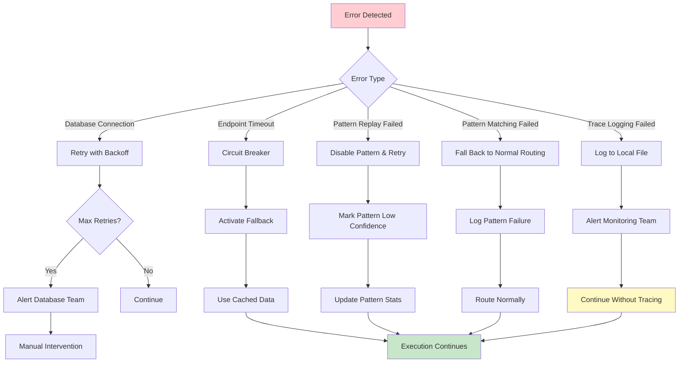

# Traceability & Pattern Learning - Architecture Diagrams

**Visual reference for system architecture**

---

## 1. Complete System Overview

---

## 2. Correlation ID Flow

---

## 3. Pattern Learning Workflow

---

## 4. Pattern Matching Flow

---

## 5. Pattern Replay Architecture

---

## 6. Database Schema Relationships

---

## 7. Analytics Dashboard Architecture

---

## 8. Performance Optimization Strategy

---

## 9. Deployment Architecture

---

## 10. Error Handling & Recovery

---

**Document Status**: Architecture Reference
**Last Updated**: 2025-10-01
