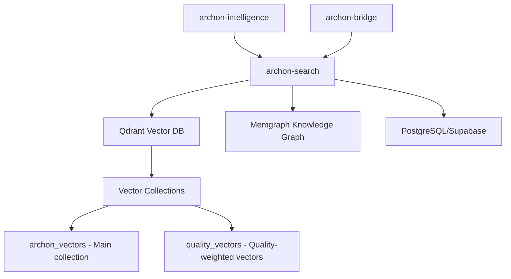

# Qdrant Vector Database Integration

## Overview

Phase 5C integration of Qdrant vector database into Archon's infrastructure for advanced search intelligence capabilities. This implementation provides high-performance vector search with quality-weighted indexing and ONEX compliance scoring.

## Architecture

### Service Integration



### Key Components

1. **Qdrant Vector Database**: High-performance vector storage and search
2. **archon-search Service**: Enhanced search with vector, graph, and relational capabilities
3. **Quality-Weighted Indexing**: ONEX compliance scoring integration
4. **Batch Processing**: Large-scale vector indexing capabilities

## Configuration

### Environment Variables

```bash
# Qdrant Connection
QDRANT_HOST=qdrant
QDRANT_PORT=6333
QDRANT_GRPC_PORT=6334
QDRANT_URL=http://qdrant:6333

# Vector Configuration
VECTOR_DIMENSIONS=1536  # OpenAI text-embedding-3-small
EMBEDDING_DIMENSIONS=1536

# Collections
QDRANT_COLLECTION_NAME=archon_vectors
QDRANT_QUALITY_COLLECTION=quality_vectors
```

### Docker Compose Services

#### Production Qdrant Service

```yaml
qdrant:
  image: qdrant/qdrant:v1.7.4
  container_name: archon-qdrant
  ports:
    - "6333:6333"  # REST API
    - "6334:6334"  # gRPC
  environment:
    # Performance optimized for 1536-dimensional vectors
    - QDRANT__SERVICE__MAX_WORKERS=0
    - QDRANT__STORAGE__ON_DISK_PAYLOAD=true
    - QDRANT__STORAGE__OPTIMIZERS__DEFAULT_SEGMENT_NUMBER=4
  volumes:
    - qdrant_data:/qdrant/storage
    - qdrant_snapshots:/qdrant/snapshots
  deploy:
    resources:
      limits:
        memory: 2G
      reservations:
        memory: 512M
```

#### Enhanced archon-search Integration

```yaml
archon-search:
  environment:
    # Qdrant integration
    - QDRANT_HOST=qdrant
    - QDRANT_PORT=6333
    - QDRANT_URL=http://qdrant:6333
    - VECTOR_DIMENSIONS=1536
  depends_on:
    qdrant:
      condition: service_healthy
    # ... other dependencies
```

## Usage

### Starting Services

```bash
# Start all services including Qdrant
docker compose up -d

# Start only Qdrant and dependencies
docker compose up -d qdrant

# Development mode with UI
docker compose -f docker-compose.yml -f docker-compose.qdrant.yml --profile ui up -d
```

### Development and Testing

```bash
# Validate integration
./scripts/validate-qdrant-integration.sh

# Check Qdrant health
curl http://localhost:6333/health

# View collections
curl http://localhost:6333/collections

# Access Qdrant Web UI (development mode)
open http://localhost:4000
```

## Vector Collections

### Main Collection: archon_vectors

- **Purpose**: Primary vector storage for document embeddings
- **Dimensions**: 1536 (OpenAI text-embedding-3-small)
- **Distance Metric**: Cosine similarity
- **Payload Fields**:
  - `text`: Original text content
  - `source`: Source identifier
  - `url`: Source URL
  - `metadata`: Additional structured data
  - `created_at`: Timestamp
  - `updated_at`: Update timestamp

### Quality Collection: quality_vectors

- **Purpose**: Quality-weighted vectors with ONEX compliance scoring
- **Dimensions**: 1536 + quality features
- **Distance Metric**: Custom weighted cosine
- **Payload Fields**:
  - All fields from main collection
  - `quality_score`: ONEX compliance score (0.0-1.0)
  - `quality_metrics`: Detailed quality breakdown
  - `architectural_compliance`: ONEX architectural score
  - `performance_score`: Performance quality score

## Performance Optimization

### Memory Management

- **Memory Mapping**: Activated for collections >500MB
- **Segment Optimization**: Auto-tuned for balanced read/write performance
- **WAL Configuration**: 64MB capacity with 2 segments ahead

### Indexing Strategy

- **HNSW Parameters**:
  - `m`: 16 (bi-directional links)
  - `ef_construct`: 200 (construction candidate list size)
  - `full_scan_threshold`: 10,000 (brute force threshold)

### Resource Limits

- **Memory**: 2GB limit, 512MB reservation
- **Storage**: Persistent volumes with snapshot support
- **Network**: Internal Docker network with health checks

## Quality-Weighted Vector Indexing

### ONEX Compliance Integration

```python
# Example quality-weighted vector creation
quality_vector = {
    "id": document_id,
    "vector": embedding_vector,  # 1536 dimensions
    "payload": {
        "text": content,
        "source": source_url,
        "quality_score": onex_compliance_score,
        "quality_metrics": {
            "architectural_compliance": 0.92,
            "performance_score": 0.88,
            "security_score": 0.95,
            "maintainability": 0.89
        }
    }
}
```

### Search with Quality Weighting

- Hybrid search combining vector similarity and quality scores
- Quality threshold filtering for high-confidence results
- Weighted ranking algorithm prioritizing quality

## Monitoring and Maintenance

### Health Checks

- **Endpoint**: `http://localhost:6333/health`
- **Frequency**: Every 30 seconds
- **Timeout**: 10 seconds
- **Start Period**: 60 seconds (allows index initialization)

### Metrics and Logging

- **Log Level**: INFO (configurable via `LOG_LEVEL`)
- **Telemetry**: Enabled for performance monitoring
- **Container Stats**: CPU, memory, network, and storage usage

### Backup and Recovery

- **Snapshots**: Automated snapshot creation
- **Volume Persistence**: Named volumes for data and snapshots
- **Restoration**: Point-in-time recovery from snapshots

## Security Considerations

### Network Security

- **Internal Communication**: Docker network isolation
- **CORS**: Disabled for internal services
- **TLS**: Ready for production TLS configuration

### Access Control

- **Service Authentication**: TOKEN-based service authentication
- **Network Isolation**: No external network access by default
- **Resource Limits**: Memory and CPU constraints

## Troubleshooting

### Common Issues

1. **Memory Errors**
   - Increase Docker memory allocation
   - Adjust `QDRANT__STORAGE__OPTIMIZERS__MEMMAP_THRESHOLD_KB`

2. **Slow Indexing**
   - Reduce `DEFAULT_SEGMENT_NUMBER` for faster startup
   - Increase `MAX_WORKERS` for parallel processing

3. **Connection Issues**
   - Verify Docker network configuration
   - Check service dependencies and health checks

### Debugging Commands

```bash
# Check container logs
docker compose logs qdrant

# Monitor resource usage
docker stats archon-qdrant

# Test connectivity from archon-search
docker compose exec archon-search curl http://qdrant:6333/health

# Inspect collections
curl http://localhost:6333/collections | jq
```

## Next Steps

1. **Implement Qdrant Adapter**: Create Python adapter for vector operations
2. **Quality Integration**: Implement ONEX quality scoring in vector indexing
3. **MCP Tools**: Add vector search capabilities to MCP tool suite
4. **Batch Processing**: Implement large-scale vector indexing workflows
5. **Performance Tuning**: Optimize for production workloads

## References

- [Qdrant Documentation](https://qdrant.tech/documentation/)
