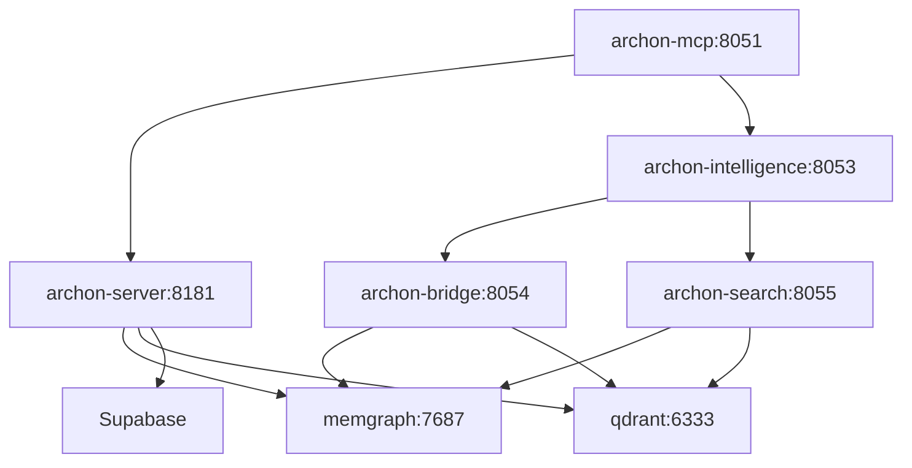

# Archon Intelligence Services: Technical Integration Manual

**Version**: 1.0.0  
**Target Audience**: Developers, DevOps Engineers, Technical Architects  
**Prerequisites**: Docker, Python 3.12+, Node.js 18+

## System Architecture

### Service Topology

```
┌─────────────────────────────────────────────────────────────────┐
│                    Archon Intelligence Services                  │
├─────────────────┬─────────────────┬─────────────────────────────┤
│   Core Services │   Intelligence  │      Data & Storage         │
├─────────────────┼─────────────────┼─────────────────────────────┤
│ archon-server   │ intelligence    │ memgraph (Knowledge Graph) │
│ (Port: 8181)    │ (Port: 8053)    │ (Port: 7687)               │
│                 │                 │                             │
│ archon-mcp      │ archon-bridge   │ qdrant (Vector Store)       │
│ (Port: 8051)    │ (Port: 8054)    │ (Port: 6333)               │
│                 │                 │                             │
│ archon-agents   │ archon-search   │ External: Supabase          │
│ (Port: 8052)    │ (Port: 8055)    │ (PostgreSQL + Real-time)    │
└─────────────────┴─────────────────┴─────────────────────────────┘
```

### Service Dependencies



## Core Service Integration

### 1. Main Server (archon-server:8181)

**Purpose**: Primary API gateway and WebSocket hub

```python
# Python Client Integration
import httpx
import asyncio

class ArchonClient:
    def __init__(self, base_url: str = "http://localhost:8181"):
        self.base_url = base_url
        self.client = httpx.AsyncClient()

    async def get_projects(self):
        """Retrieve all projects"""
        response = await self.client.get(f"{self.base_url}/api/projects")
        return response.json()

    async def create_project(self, title: str, description: str = "", github_repo: str = None):
        """Create new project with AI-generated PRP documentation"""
        payload = {
            "title": title,
            "description": description,
            "github_repo": github_repo
        }
        response = await self.client.post(f"{self.base_url}/api/projects", json=payload)
        return response.json()

    async def health_check(self):
        """Verify service health"""
        response = await self.client.get(f"{self.base_url}/health")
        return response.json()

# Usage Example
async def main():
    client = ArchonClient()

    # Health check
    health = await client.health_check()
    print(f"Server Status: {health.get('status')}")

    # Create project
    project = await client.create_project(
        title="Authentication Service",
        description="OAuth2 implementation with JWT tokens",
        github_repo="https://github.com/org/auth-service"
    )
    print(f"Created Project: {project['project_id']}")

asyncio.run(main())
```

**Key Endpoints**:

```http
# Project Management
GET    /api/projects                 # List projects
POST   /api/projects                 # Create project
GET    /api/projects/{id}            # Get project details
PUT    /api/projects/{id}            # Update project
DELETE /api/projects/{id}            # Delete project

# Task Management
GET    /api/projects/{id}/tasks      # List project tasks
POST   /api/projects/{id}/tasks      # Create task
PUT    /api/tasks/{task_id}          # Update task status
DELETE /api/tasks/{task_id}          # Delete task

# Health & Status
GET    /health                       # Service health
GET    /performance                  # Performance metrics
GET    /websocket/status             # WebSocket connection status
```

### 2. MCP Server (archon-mcp:8051)

**Purpose**: Model Context Protocol for AI assistant integration

```json
# Claude Code MCP Configuration
{
  "mcpServers": {
    "archon": {
      "command": "npx",
      "args": [
        "-y",
        "@modelcontextprotocol/server-fetch",
        "http://localhost:8051/mcp"
      ],
      "env": {
        "ARCHON_MCP_PORT": "8051",
        "ARCHON_API_BASE": "http://localhost:8181"
      }
    }
  }
}
```

**Available MCP Tools**:

```typescript
// Project Management Tools
create_project(title: string, description?: string, github_repo?: string)
list_projects()
get_project(project_id: string)
update_project(project_id: string, title?: string, description?: string)
delete_project(project_id: string)

// Task Management Tools
create_task(project_id: string, title: string, description: string, assignee?: string)
list_tasks(filter_by?: "status" | "project" | "assignee", filter_value?: string)
get_task(task_id: string)
update_task(task_id: string, status?: "todo" | "doing" | "review" | "done")
delete_task(task_id: string)

// Knowledge & RAG Tools
perform_rag_query(query: string, source_domain?: string, match_count?: number)
search_code_examples(query: string, source_domain?: string, match_count?: number)
get_available_sources()

// Intelligence Tools (Phase 5A)
assess_code_quality(content: string, source_path?: string, language?: string)
analyze_document_quality(content: string, document_type?: string)
establish_performance_baseline(operation_name: string, metrics?: object)
identify_optimization_opportunities(operation_name: string)
apply_performance_optimization(operation_name: string, optimization_type: string)
```

**MCP Usage Examples**:

```typescript
// In Claude Code or AI Assistant
"Use Archon to create a new project for my authentication service"
// Translates to: create_project("Authentication Service", "OAuth2 with JWT", "github.com/org/auth")

"Search for React hook patterns using RAG"
// Translates to: perform_rag_query("React hooks patterns", "docs.react.dev", 5)

"Analyze this code for ONEX compliance"
// Translates to: assess_code_quality(code_content, "src/auth.py", "python")
```

### 3. Intelligence Service (archon-intelligence:8053)

**Purpose**: Code quality analysis, performance optimization, ONEX compliance

```python
# Direct HTTP API Integration
import httpx

class ArchonIntelligence:
    def __init__(self, base_url: str = "http://localhost:8053"):
        self.base_url = base_url
        self.client = httpx.AsyncClient()

    async def assess_code_quality(self, content: str, language: str = "python", source_path: str = ""):
        """Assess code quality with ONEX compliance scoring"""
        payload = {
            "content": content,
            "language": language,
            "source_path": source_path
        }
        response = await self.client.post(f"{self.base_url}/assess/code", json=payload)
        return response.json()

    async def establish_performance_baseline(self, operation_name: str, metrics: dict = None):
        """Create performance baseline for optimization tracking"""
        payload = {
            "operation_name": operation_name,
            "metrics": metrics or {}
        }
        response = await self.client.post(f"{self.base_url}/performance/baseline", json=payload)
        return response.json()

    async def identify_optimization_opportunities(self, operation_name: str):
        """Find performance optimization opportunities"""
        response = await self.client.get(f"{self.base_url}/performance/opportunities/{operation_name}")
        return response.json()

# Usage Example
async def intelligence_demo():
    intel = ArchonIntelligence()

    # Code Quality Assessment
    code = '''
    def authenticate_user(username, password):
        # Simple authentication logic
        if username == "admin" and password == "password":
            return {"user": username, "role": "admin"}
        return None
    '''

    quality_result = await intel.assess_code_quality(code, "python", "auth/login.py")
    print(f"Quality Score: {quality_result['quality_score']}")
    print(f"Compliance Score: {quality_result['compliance_score']}")
    print(f"Issues Found: {len(quality_result['issues'])}")

    # Performance Baseline
    baseline_result = await intel.establish_performance_baseline(
        "user_authentication",
        {"response_time_ms": 150, "requests_per_second": 100}
    )
    print(f"Baseline Established: {baseline_result['baseline_id']}")

asyncio.run(intelligence_demo())
```

**Intelligence API Endpoints**:

```http
# Code Quality Analysis
POST   /assess/code                  # Code quality assessment
POST   /assess/document              # Document quality analysis
GET    /patterns/quality             # Quality patterns analysis
POST   /compliance/architecture      # Architectural compliance check

# Performance Optimization
POST   /performance/baseline         # Establish performance baseline
GET    /performance/opportunities/{operation}  # Identify optimization opportunities
POST   /performance/optimize         # Apply optimization
GET    /performance/report           # Performance report
GET    /performance/trends           # Performance trend analysis

# Health & Status
GET    /health                       # Service health
GET    /stats                        # Service statistics
```

## Knowledge Management Integration

### Vector Search (Qdrant:6333)

```python
# Vector Search Integration
from qdrant_client import QdrantClient
from qdrant_client.http import models

class ArchonVectorSearch:
    def __init__(self, url: str = "http://localhost:6333"):
        self.client = QdrantClient(url=url)

    async def semantic_search(self, query: str, limit: int = 10, threshold: float = 0.7):
        """Perform semantic similarity search"""
        # Note: This requires pre-embedded query vector
        search_result = self.client.search(
            collection_name="archon_knowledge",
            query_vector=await self._embed_query(query),
            limit=limit,
            score_threshold=threshold
        )
        return search_result

    async def hybrid_search(self, query: str, filters: dict = None):
        """Combined vector and metadata search"""
        search_params = models.SearchParams(
            hnsw_ef=128,
            exact=False
        )

        search_result = self.client.search(
            collection_name="archon_knowledge",
            query_vector=await self._embed_query(query),
            query_filter=models.Filter(**filters) if filters else None,
            search_params=search_params,
            limit=10
        )
        return search_result
```

### Knowledge Graph (Memgraph:7687)

```python
# Knowledge Graph Integration  
from neo4j import GraphDatabase

class ArchonKnowledgeGraph:
    def __init__(self, uri: str = "bolt://localhost:7687", user: str = "", password: str = ""):
        self.driver = GraphDatabase.driver(uri, auth=(user, password))

    def find_related_entities(self, entity_id: str, relationship_type: str = None, max_depth: int = 3):
        """Discover entity relationships through graph traversal"""
        with self.driver.session() as session:
            if relationship_type:
                query = f"""
                MATCH (start:Entity {{id: $entity_id}})
                MATCH (start)-[r:{relationship_type}*1..{max_depth}]-(related:Entity)
                RETURN related, r
                """
            else:
                query = f"""
                MATCH (start:Entity {{id: $entity_id}})
                MATCH (start)-[r*1..{max_depth}]-(related:Entity)
                RETURN related, r
                """

            result = session.run(query, entity_id=entity_id)
            return [record for record in result]

    def get_entity_connections(self, entity_id: str):
        """Get all direct connections for an entity"""
        with self.driver.session() as session:
            query = """
            MATCH (entity:Entity {id: $entity_id})-[r]-(connected)
            RETURN entity, type(r) as relationship_type, connected
            """
            result = session.run(query, entity_id=entity_id)
            return [record for record in result]
```

## Advanced Integration Patterns

### 1. RAG-Enhanced Development Workflow

```python
class ArchonRAGWorkflow:
    def __init__(self):
        self.client = ArchonClient()
        self.intel = ArchonIntelligence()

    async def intelligent_development_cycle(self, task_description: str):
        """Complete development cycle with RAG intelligence"""

        # 1. Research Phase - RAG Query
        research = await self.client.perform_rag_query(
            query=task_description,
            match_count=5
        )

        # 2. Code Examples Search
        examples = await self.client.search_code_examples(
            query=task_description,
            match_count=3
        )

        # 3. Quality Assessment (after implementation)
        quality_result = await self.intel.assess_code_quality(
            content=implemented_code,
            language="python"
        )

        # 4. Performance Baseline
        baseline = await self.intel.establish_performance_baseline(
            operation_name=f"feature_{task_description.replace(' ', '_')}",
            metrics={"initial": True}
        )

        return {
            "research": research,
            "examples": examples,
            "quality": quality_result,
            "baseline": baseline
        }
```

### 2. Real-Time Intelligence Monitoring

```python
import socketio

class ArchonRealtimeMonitor:
    def __init__(self, server_url: str = "http://localhost:8181"):
        self.sio = socketio.AsyncClient()
        self.setup_handlers()

    def setup_handlers(self):
        @self.sio.on('intelligence_analysis')
        async def on_intelligence_analysis(data):
            """Handle real-time intelligence analysis results"""
            analysis_type = data.get('type')
            results = data.get('results')

            if analysis_type == 'quality_assessment':
                await self.handle_quality_update(results)
            elif analysis_type == 'performance_optimization':
                await self.handle_performance_update(results)

        @self.sio.on('task_updated')
        async def on_task_updated(data):
            """Handle task status changes"""
            task_id = data.get('task_id')
            new_status = data.get('status')
            await self.sync_task_status(task_id, new_status)

    async def connect_and_monitor(self):
        """Connect to real-time monitoring"""
        await self.sio.connect('http://localhost:8181')
        await self.sio.wait()
```

### 3. Multi-Service Health Monitoring

```python
class ArchonHealthMonitor:
    def __init__(self):
        self.services = {
            "server": "http://localhost:8181/health",
            "mcp": "http://localhost:8051/health",
            "intelligence": "http://localhost:8053/health",
            "bridge": "http://localhost:8054/health",
            "search": "http://localhost:8055/health"
        }
        self.client = httpx.AsyncClient(timeout=5.0)

    async def comprehensive_health_check(self):
        """Check health of all Archon services"""
        health_status = {}

        for service_name, health_url in self.services.items():
            try:
                response = await self.client.get(health_url)
                health_status[service_name] = {
                    "status": "healthy" if response.status_code == 200 else "unhealthy",
                    "response_time": response.elapsed.total_seconds() * 1000,
                    "details": response.json()
                }
            except Exception as e:
                health_status[service_name] = {
                    "status": "error",
                    "error": str(e)
                }

        return health_status

    async def monitor_performance_metrics(self):
        """Collect performance metrics from all services"""
        metrics = {}

        # Server metrics
        server_response = await self.client.get("http://localhost:8181/performance")
        metrics["server"] = server_response.json()

        # Intelligence metrics
        intel_response = await self.client.get("http://localhost:8053/stats")
        metrics["intelligence"] = intel_response.json()

        return metrics
```

## Error Handling & Recovery

### Common Issues and Solutions

```python
class ArchonErrorHandler:

    @staticmethod
    async def handle_mcp_datetime_error():
        """Handle MCP DateTime serialization error (HIGH PRIORITY)"""
        # This is a known issue affecting RAG queries
        try:
            # Use HTTP API instead of MCP for RAG queries temporarily
            response = await httpx.get("http://localhost:8181/api/rag/query",
                                     params={"query": "test", "match_count": 1})
            return response.json()
        except Exception as e:
            logger.error(f"RAG query failed: {e}")
            return {"error": "RAG service temporarily unavailable"}

    @staticmethod
    async def handle_search_service_degradation():
        """Handle search service performance issues"""
        # Monitor response times and fallback to basic search
        start_time = time.time()

        try:
            response = await httpx.get("http://localhost:8055/health", timeout=2.0)
            response_time = (time.time() - start_time) * 1000

            if response_time > 1000:  # > 1 second
                logger.warning(f"Search service degraded: {response_time}ms")
                return {"status": "degraded", "response_time": response_time}

            return {"status": "healthy", "response_time": response_time}

        except Exception as e:
            logger.error(f"Search service error: {e}")
            return {"status": "error", "fallback": "basic_search_available"}

    @staticmethod
    async def initialize_bridge_sync():
        """Initialize bridge synchronization (0% → 100%)"""
        try:
            # Force bridge initialization
            response = await httpx.post("http://localhost:8054/sync/initialize",
                                      json={"force": True, "full_sync": True})

            if response.status_code == 200:
                result = response.json()
                logger.info(f"Bridge sync initialized: {result}")
                return result
            else:
                raise Exception(f"Bridge initialization failed: {response.status_code}")

        except Exception as e:
            logger.error(f"Bridge initialization error: {e}")
            return {"error": "Bridge initialization failed", "manual_action_required": True}
```

## Configuration Management

### Environment Configuration

```bash
# Core Services Configuration
ARCHON_SERVER_PORT=8181
ARCHON_MCP_PORT=8051
ARCHON_AGENTS_PORT=8052
INTELLIGENCE_SERVICE_PORT=8053
ARCHON_BRIDGE_PORT=8054
SEARCH_SERVICE_PORT=8055

# Database Configuration
SUPABASE_URL=<your-supabase-url>
SUPABASE_SERVICE_KEY=<your-service-key>
MEMGRAPH_URI=bolt://memgraph:7687
QDRANT_URL=http://qdrant:6333

# AI/ML Configuration
OPENAI_API_KEY=<your-openai-key>
ANTHROPIC_API_KEY=<your-anthropic-key>
OLLAMA_BASE_URL=http://192.168.86.200:11434

# Security & Authentication
SERVICE_AUTH_TOKEN=<secure-token>
JWT_SECRET=<jwt-secret>
API_KEY_SALT=<api-key-salt>

# Performance & Monitoring
LOG_LEVEL=INFO
ENABLE_METRICS=true
ENABLE_TRACING=true
MAX_CONCURRENT_REQUESTS=100

# Feature Flags
INTELLIGENCE_ENABLED=true
FRESHNESS_ENABLED=true
ENHANCED_SEARCH_ENABLED=true
REAL_TIME_SYNC_ENABLED=true
```

### Docker Compose Configuration

```yaml
# docker-compose.prod.yml
version: '3.8'

services:
  archon-server:
    build: ./services/server
    ports:
      - "8181:8181"
    environment:
      - NODE_ENV=production
      - SUPABASE_URL=${SUPABASE_URL}
      - SUPABASE_SERVICE_KEY=${SUPABASE_SERVICE_KEY}
    depends_on:
      - memgraph
      - qdrant
    restart: unless-stopped

  archon-mcp:
    build: ./services/mcp
    ports:
      - "8051:8051"
    environment:
      - MCP_PORT=8051
      - ARCHON_API_BASE=http://archon-server:8181
    depends_on:
      - archon-server
    restart: unless-stopped

  archon-intelligence:
    build: ./services/intelligence
    ports:
      - "8053:8053"
    environment:
      - INTELLIGENCE_PORT=8053
      - OPENAI_API_KEY=${OPENAI_API_KEY}
      - OLLAMA_BASE_URL=${OLLAMA_BASE_URL}
    restart: unless-stopped

  memgraph:
    image: memgraph/memgraph:latest
    ports:
      - "7687:7687"
    volumes:
      - memgraph_data:/var/lib/memgraph
    restart: unless-stopped

  qdrant:
    image: qdrant/qdrant:latest
    ports:
      - "6333:6333"
    volumes:
      - qdrant_data:/qdrant/storage
    restart: unless-stopped

volumes:
  memgraph_data:
  qdrant_data:
```

## Testing & Validation

### Integration Test Suite

```python
import pytest
import asyncio
from archon_client import ArchonClient, ArchonIntelligence

class TestArchonIntegration:

    @pytest.fixture
    async def archon_client(self):
        client = ArchonClient("http://localhost:8181")
        yield client
        await client.client.aclose()

    @pytest.fixture  
    async def intelligence_client(self):
        intel = ArchonIntelligence("http://localhost:8053")
        yield intel
        await intel.client.aclose()

    async def test_full_development_workflow(self, archon_client, intelligence_client):
        """Test complete development workflow"""

        # 1. Create project
        project = await archon_client.create_project(
            title="Test Integration Project",
            description="Testing full Archon integration"
        )
        assert project["success"] is True
        project_id = project["project_id"]

        # 2. Create task
        task = await archon_client.create_task(
            project_id=project_id,
            title="Implement authentication",
            description="Add JWT-based authentication",
            assignee="AI IDE Agent"
        )
        assert task["success"] is True
        task_id = task["task_id"]

        # 3. RAG query for research
        rag_result = await archon_client.perform_rag_query(
            query="JWT authentication implementation",
            match_count=3
        )
        assert rag_result["success"] is True
        assert len(rag_result["results"]) > 0

        # 4. Code quality assessment
        sample_code = '''
        import jwt

        def create_token(user_id: str, secret: str) -> str:
            payload = {"user_id": user_id}
            return jwt.encode(payload, secret, algorithm="HS256")
        '''

        quality_result = await intelligence_client.assess_code_quality(
            content=sample_code,
            language="python",
            source_path="auth/token.py"
        )
        assert quality_result["quality_score"] > 0.5

        # 5. Performance baseline
        baseline = await intelligence_client.establish_performance_baseline(
            operation_name="jwt_token_creation",
            metrics={"response_time_ms": 10}
        )
        assert baseline["success"] is True

        # 6. Update task to completed
        updated_task = await archon_client.update_task(
            task_id=task_id,
            status="done"
        )
        assert updated_task["success"] is True
        assert updated_task["task"]["status"] == "done"

    async def test_service_health_checks(self, archon_client, intelligence_client):
        """Verify all services are healthy"""

        # Main server health
        server_health = await archon_client.health_check()
        assert server_health["status"] == "healthy"

        # Intelligence service health  
        intel_health = await intelligence_client.client.get("http://localhost:8053/health")
        assert intel_health.status_code == 200

        # MCP service health
        mcp_health = await archon_client.client.get("http://localhost:8051/health")
        assert mcp_health.status_code == 200

    async def test_performance_metrics(self, archon_client):
        """Verify performance meets requirements"""

        start_time = asyncio.get_event_loop().time()

        # Simple query should be <100ms
        projects = await archon_client.get_projects()
        simple_query_time = (asyncio.get_event_loop().time() - start_time) * 1000
        assert simple_query_time < 100, f"Simple query took {simple_query_time}ms, expected <100ms"

        # Complex search should be <1000ms
        start_time = asyncio.get_event_loop().time()
        search_result = await archon_client.perform_rag_query("complex search query", match_count=10)
        complex_query_time = (asyncio.get_event_loop().time() - start_time) * 1000
        assert complex_query_time < 1000, f"Complex query took {complex_query_time}ms, expected <1000ms"

# Run tests
if __name__ == "__main__":
    pytest.main([__file__, "-v"])
```

## Deployment Strategies

### Production Deployment

```bash
#!/bin/bash
# deploy-archon-production.sh

set -e

echo "Deploying Archon Intelligence Services to Production..."

# 1. Pre-deployment checks
echo "Running pre-deployment health checks..."
python scripts/pre_deployment_check.py

# 2. Build production images
echo "Building production Docker images..."
docker-compose -f docker-compose.prod.yml build --no-cache

# 3. Deploy with zero downtime
echo "Performing rolling deployment..."
docker-compose -f docker-compose.prod.yml up -d --force-recreate --remove-orphans

# 4. Wait for services to be ready
echo "Waiting for services to be ready..."
python scripts/wait_for_services.py

# 5. Run post-deployment validation
echo "Running post-deployment validation..."
python scripts/post_deployment_validation.py

# 6. Initialize bridge sync if needed
echo "Checking bridge synchronization..."
python scripts/initialize_bridge_sync.py

echo "Deployment completed successfully!"
```

### Scaling Strategies

```yaml
# Horizontal scaling configuration
version: '3.8'

services:
  archon-server:
    deploy:
      replicas: 3
      restart_policy:
        condition: on-failure
        delay: 5s
        max_attempts: 3
      resources:
        limits:
          cpus: '1.0'
          memory: 2G
        reservations:
          cpus: '0.5'
          memory: 1G

  archon-intelligence:
    deploy:
      replicas: 2  # CPU-intensive service
      restart_policy:
        condition: on-failure
        delay: 5s
        max_attempts: 3
      resources:
        limits:
          cpus: '2.0'
          memory: 4G
```

## Security Considerations

### Authentication & Authorization

```python
class ArchonSecurityConfig:
    """Security configuration for Archon services"""

    @staticmethod
    def setup_service_auth():
        """Configure inter-service authentication"""
        return {
            "service_token": os.getenv("SERVICE_AUTH_TOKEN"),
            "jwt_secret": os.getenv("JWT_SECRET"),
            "api_key_salt": os.getenv("API_KEY_SALT"),
            "token_expiry": 3600  # 1 hour
        }

    @staticmethod
    def setup_api_rate_limiting():
        """Configure API rate limiting"""
        return {
            "requests_per_minute": 60,
            "burst_requests": 10,
            "per_service_limits": {
                "intelligence": 30,  # CPU-intensive
                "search": 100,      # I/O intensive
                "rag": 20           # Complex processing
            }
        }

    @staticmethod
    def setup_data_privacy():
        """Configure data privacy settings"""
        return {
            "log_sanitization": True,
            "pii_detection": True,
            "secure_headers": True,
            "cors_origins": ["http://localhost:3737"],
            "cookie_security": {
                "secure": True,
                "httponly": True,
                "samesite": "strict"
            }
        }
```

## Conclusion

This technical manual provides comprehensive integration guidance for Archon Intelligence Services. The platform delivers production-ready capabilities with demonstrated performance metrics and clear integration patterns.

Key implementation priorities:
1. **Immediate**: Resolve DateTime serialization issue and initialize bridge sync
2. **Short-term**: Implement comprehensive monitoring and error handling
3. **Long-term**: Scale services based on load patterns and optimize performance

For additional support, refer to the troubleshooting guide and best practices documentation.
