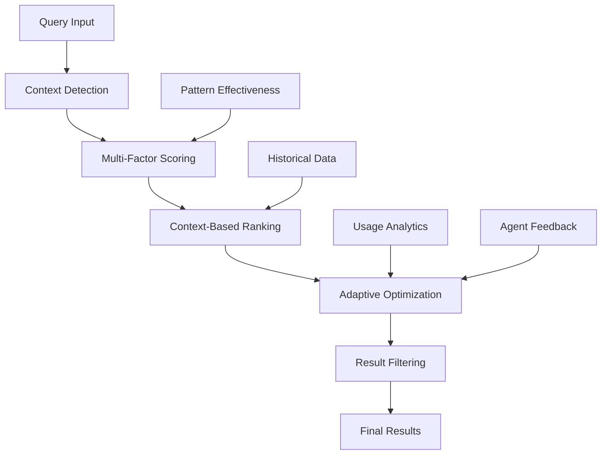

# Context-Aware Filtering Algorithms for Agent Framework Query System

**Version**: 1.0.0
**Agent**: Agent-8: Query System Designer
**Date**: 2025-01-27
**Phase**: Phase 1 - Content Analysis & Architecture Design

## Executive Summary

This document specifies the context-aware filtering algorithms that enable intelligent pattern discovery for the Agent Framework query system. These algorithms provide context-sensitive ranking, relevance scoring, and adaptive filtering to ensure agents receive the most appropriate framework patterns for their specific needs.

**Key Features**:
- Multi-dimensional context analysis
- Dynamic relevance scoring with 7 factors
- Adaptive learning from usage patterns
- Real-time result optimization
- Cross-agent pattern correlation

## Table of Contents

1. [Algorithm Architecture](#algorithm-architecture)
2. [Context Detection & Analysis](#context-detection--analysis)
3. [Relevance Scoring Algorithm](#relevance-scoring-algorithm)
4. [Context-Based Ranking](#context-based-ranking)
5. [Adaptive Filtering](#adaptive-filtering)
6. [Performance Optimization](#performance-optimization)
7. [Implementation Specifications](#implementation-specifications)
8. [Testing & Validation](#testing--validation)

## Algorithm Architecture

### Core Architecture Principles



### Algorithm Pipeline

```python
class ContextAwareFilteringPipeline:
    """
    Main pipeline for context-aware filtering and ranking.

    Processing stages:
    1. Context Detection & Enrichment
    2. Multi-Factor Relevance Scoring
    3. Context-Based Ranking
    4. Adaptive Optimization
    5. Result Filtering & Presentation
    """

    def __init__(self, config: FilteringConfig):
        self.context_detector = ContextDetector(config.context_config)
        self.relevance_scorer = RelevanceScorer(config.scoring_config)
        self.context_ranker = ContextBasedRanker(config.ranking_config)
        self.adaptive_filter = AdaptiveFilter(config.adaptive_config)
        self.result_optimizer = ResultOptimizer(config.optimization_config)

    async def process_query(
        self,
        query: str,
        explicit_context: Dict[str, Any],
        agent_identity: AgentIdentity,
        historical_context: List[QueryContext]
    ) -> FilteredResults:
        """Main processing pipeline."""

        # Stage 1: Context Detection & Enrichment
        enriched_context = await self.context_detector.detect_and_enrich(
            query=query,
            explicit_context=explicit_context,
            agent_identity=agent_identity,
            historical_context=historical_context
        )

        # Stage 2: Multi-Factor Relevance Scoring
        scored_patterns = await self.relevance_scorer.score_patterns(
            query=query,
            context=enriched_context,
            candidate_patterns=await self.get_candidate_patterns(query)
        )

        # Stage 3: Context-Based Ranking
        ranked_patterns = await self.context_ranker.rank_patterns(
            scored_patterns=scored_patterns,
            context=enriched_context
        )

        # Stage 4: Adaptive Optimization
        optimized_patterns = await self.adaptive_filter.optimize_results(
            ranked_patterns=ranked_patterns,
            context=enriched_context,
            agent_identity=agent_identity
        )

        # Stage 5: Result Filtering & Presentation
        final_results = await self.result_optimizer.optimize_presentation(
            patterns=optimized_patterns,
            context=enriched_context,
            presentation_preferences=agent_identity.preferences
        )

        return final_results
```

## Context Detection & Analysis

### Multi-Dimensional Context Model

The context detection system analyzes multiple dimensions to understand the agent's requirements:

#### 1. Agent Type Context
```python
class AgentTypeContext:
    """Agent type-specific context detection."""

    AGENT_TYPE_PATTERNS = {
        'api': {
            'keywords': ['endpoint', 'fastapi', 'http', 'rest', 'request', 'response'],
            'patterns': ['error_handling', 'validation', 'authentication'],
            'complexity_bias': 'moderate_to_high',
            'common_domains': ['backend', 'web_services']
        },
        'debug': {
            'keywords': ['error', 'exception', 'troubleshoot', 'investigate', 'trace'],
            'patterns': ['error_analysis', 'diagnostic_tools', 'root_cause'],
            'complexity_bias': 'high_to_critical',
            'common_domains': ['cross_domain', 'system_analysis']
        },
        'testing': {
            'keywords': ['test', 'pytest', 'mock', 'assert', 'coverage', 'validation'],
            'patterns': ['test_generation', 'coverage_analysis', 'test_automation'],
            'complexity_bias': 'simple_to_moderate',
            'common_domains': ['backend', 'quality_assurance']
        },
        'security': {
            'keywords': ['security', 'vulnerability', 'audit', 'scan', 'compliance'],
            'patterns': ['security_validation', 'vulnerability_detection', 'compliance_check'],
            'complexity_bias': 'high_to_critical',
            'common_domains': ['security', 'compliance']
        },
        'performance': {
            'keywords': ['performance', 'optimization', 'benchmark', 'profile', 'metrics'],
            'patterns': ['performance_analysis', 'optimization_strategies', 'monitoring'],
            'complexity_bias': 'moderate_to_high',
            'common_domains': ['performance', 'monitoring']
        }
    }

    def detect_agent_type(self, query: str, explicit_context: Dict) -> AgentTypeAnalysis:
        """Detect agent type from query and context."""

        if explicit_context.get('agent_type'):
            return AgentTypeAnalysis(
                primary_type=explicit_context['agent_type'],
                confidence=1.0,
                detection_method='explicit'
            )

        # Keyword-based detection
        type_scores = {}
        query_lower = query.lower()

        for agent_type, patterns in self.AGENT_TYPE_PATTERNS.items():
            score = 0.0
            keyword_matches = sum(1 for keyword in patterns['keywords']
                                if keyword in query_lower)

            if keyword_matches > 0:
                # Base score from keyword density
                score = keyword_matches / len(patterns['keywords'])

                # Boost for pattern-specific terms
                pattern_matches = sum(1 for pattern in patterns['patterns']
                                    if any(term in query_lower for term in pattern.split('_')))
                score += pattern_matches * 0.1

            type_scores[agent_type] = score

        # Find best match
        best_type = max(type_scores.keys(), key=lambda k: type_scores[k])
        confidence = type_scores[best_type]

        return AgentTypeAnalysis(
            primary_type=best_type if confidence > 0.3 else 'generic',
            confidence=confidence,
            detection_method='keyword_analysis',
            secondary_types=[t for t, s in type_scores.items() if 0.2 < s < confidence]
        )
```

#### 2. Complexity Level Detection
```python
class ComplexityDetector:
    """Detect query complexity level from multiple signals."""

    COMPLEXITY_INDICATORS = {
        'simple': {
            'keywords': ['basic', 'simple', 'quick', 'easy', 'starter'],
            'patterns': ['single_function', 'basic_validation', 'simple_error'],
            'word_count_range': (1, 10),
            'technical_terms_threshold': 2
        },
        'moderate': {
            'keywords': ['standard', 'typical', 'common', 'regular'],
            'patterns': ['multi_step', 'integration', 'coordination'],
            'word_count_range': (5, 20),
            'technical_terms_threshold': 5
        },
        'complex': {
            'keywords': ['complex', 'advanced', 'sophisticated', 'comprehensive'],
            'patterns': ['parallel_coordination', 'multi_agent', 'advanced_error'],
            'word_count_range': (10, 50),
            'technical_terms_threshold': 8
        },
        'critical': {
            'keywords': ['critical', 'enterprise', 'production', 'scalable', 'robust'],
            'patterns': ['fault_tolerance', 'scalability', 'enterprise_grade'],
            'word_count_range': (15, 100),
            'technical_terms_threshold': 12
        }
    }

    def detect_complexity(self, query: str, context: Dict) -> ComplexityAnalysis:
        """Detect complexity level using multiple factors."""

        if context.get('complexity_level'):
            return ComplexityAnalysis(
                level=context['complexity_level'],
                confidence=1.0,
                detection_method='explicit'
            )

        query_lower = query.lower()
        word_count = len(query.split())

        # Technical terms detection
        technical_terms = self._count_technical_terms(query_lower)

        # Calculate scores for each complexity level
        scores = {}
        for level, indicators in self.COMPLEXITY_INDICATORS.items():
            score = 0.0

            # Keyword matching (30% weight)
            keyword_matches = sum(1 for keyword in indicators['keywords']
                                if keyword in query_lower)
            if keyword_matches > 0:
                score += (keyword_matches / len(indicators['keywords'])) * 0.3

            # Pattern matching (25% weight)
            pattern_matches = sum(1 for pattern in indicators['patterns']
                                if any(term in query_lower for term in pattern.split('_')))
            if pattern_matches > 0:
                score += (pattern_matches / len(indicators['patterns'])) * 0.25

            # Word count alignment (25% weight)
            min_words, max_words = indicators['word_count_range']
            if min_words <= word_count <= max_words:
                # Perfect alignment
                score += 0.25
            elif word_count < min_words:
                # Below range - partial score
                score += (word_count / min_words) * 0.25
            else:
                # Above range - diminishing score
                score += max(0, (max_words - word_count + max_words) / max_words) * 0.25

            # Technical terms density (20% weight)
            if technical_terms >= indicators['technical_terms_threshold']:
                score += 0.2
            else:
                score += (technical_terms / indicators['technical_terms_threshold']) * 0.2

            scores[level] = score

        # Determine best match
        best_level = max(scores.keys(), key=lambda k: scores[k])
        confidence = scores[best_level]

        return ComplexityAnalysis(
            level=best_level,
            confidence=confidence,
            detection_method='multi_factor_analysis',
            factors={
                'word_count': word_count,
                'technical_terms': technical_terms,
                'keyword_matches': sum(scores.values()) / len(scores)
            }
        )

    def _count_technical_terms(self, query: str) -> int:
        """Count technical framework-related terms."""
        technical_terms = [
            'agent', 'framework', 'pattern', 'implementation', 'coordination',
            'parallel', 'sequential', 'validation', 'intelligence', 'context',
            'delegation', 'inheritance', 'quality', 'gates', 'archon', 'mcp',
            'async', 'sync', 'error', 'handling', 'logging', 'monitoring'
        ]
        return sum(1 for term in technical_terms if term in query)
```

#### 3. Domain Context Detection
```python
class DomainDetector:
    """Detect application domain from query context."""

    DOMAIN_PATTERNS = {
        'backend': {
            'keywords': ['api', 'server', 'database', 'service', 'endpoint', 'fastapi'],
            'technologies': ['python', 'fastapi', 'sqlalchemy', 'pydantic'],
            'patterns': ['api_design', 'data_processing', 'service_architecture']
        },
        'frontend': {
            'keywords': ['ui', 'interface', 'component', 'react', 'frontend', 'client'],
            'technologies': ['typescript', 'react', 'vue', 'angular', 'javascript'],
            'patterns': ['component_design', 'state_management', 'user_interaction']
        },
        'infrastructure': {
            'keywords': ['docker', 'deployment', 'infrastructure', 'devops', 'monitoring'],
            'technologies': ['docker', 'kubernetes', 'terraform', 'prometheus'],
            'patterns': ['deployment_automation', 'monitoring_setup', 'infrastructure_as_code']
        },
        'cross_domain': {
            'keywords': ['integration', 'orchestration', 'workflow', 'coordination'],
            'technologies': ['archon', 'mcp', 'websocket', 'message_queue'],
            'patterns': ['system_integration', 'workflow_orchestration', 'multi_service']
        }
    }

    def detect_domain(self, query: str, context: Dict) -> DomainAnalysis:
        """Detect application domain with confidence scoring."""

        if context.get('domain'):
            return DomainAnalysis(
                primary_domain=context['domain'],
                confidence=1.0,
                detection_method='explicit'
            )

        query_lower = query.lower()
        domain_scores = {}

        for domain, patterns in self.DOMAIN_PATTERNS.items():
            score = 0.0

            # Keyword matching (40% weight)
            keyword_matches = sum(1 for keyword in patterns['keywords']
                                if keyword in query_lower)
            if keyword_matches > 0:
                score += (keyword_matches / len(patterns['keywords'])) * 0.4

            # Technology matching (35% weight)
            tech_matches = sum(1 for tech in patterns['technologies']
                             if tech in query_lower)
            if tech_matches > 0:
                score += (tech_matches / len(patterns['technologies'])) * 0.35

            # Pattern matching (25% weight)
            pattern_matches = sum(1 for pattern in patterns['patterns']
                                if any(term in query_lower for term in pattern.split('_')))
            if pattern_matches > 0:
                score += (pattern_matches / len(patterns['patterns'])) * 0.25

            domain_scores[domain] = score

        # Handle multi-domain scenarios
        high_scoring_domains = {d: s for d, s in domain_scores.items() if s > 0.3}

        if len(high_scoring_domains) > 1:
            # Multi-domain query
            primary_domain = max(high_scoring_domains.keys(),
                               key=lambda k: high_scoring_domains[k])
            return DomainAnalysis(
                primary_domain=primary_domain,
                secondary_domains=list(high_scoring_domains.keys()),
                confidence=domain_scores[primary_domain],
                detection_method='multi_factor_analysis',
                is_multi_domain=True
            )
        else:
            # Single domain
            best_domain = max(domain_scores.keys(), key=lambda k: domain_scores[k])
            return DomainAnalysis(
                primary_domain=best_domain,
                confidence=domain_scores[best_domain],
                detection_method='multi_factor_analysis',
                is_multi_domain=False
            )
```

## Relevance Scoring Algorithm

### Multi-Factor Relevance Scoring

The relevance scoring algorithm combines 7 weighted factors to determine how well a pattern matches the query context:

```python
class RelevanceScorer:
    """Multi-factor relevance scoring for framework patterns."""

    def __init__(self, config: ScoringConfig):
        self.weights = config.factor_weights
        self.semantic_model = SemanticSimilarityModel(config.embedding_model)
        self.effectiveness_tracker = EffectivenessTracker(config.effectiveness_config)
        self.usage_analyzer = UsageAnalyzer(config.usage_config)

    async def score_patterns(
        self,
        query: str,
        context: EnrichedContext,
        candidate_patterns: List[FrameworkPattern]
    ) -> List[ScoredPattern]:
        """Score patterns using multi-factor algorithm."""

        scored_patterns = []

        for pattern in candidate_patterns:
            # Factor 1: Semantic Similarity (35% weight)
            semantic_score = await self.semantic_model.calculate_similarity(
                query, pattern.description
            )

            # Factor 2: Pattern Effectiveness (25% weight)
            effectiveness_score = await self.effectiveness_tracker.get_effectiveness(
                pattern.id, context.agent_type
            )

            # Factor 3: Context Match (20% weight)
            context_score = self._calculate_context_match(pattern, context)

            # Factor 4: Usage Frequency (10% weight)
            usage_score = await self.usage_analyzer.get_usage_frequency(
                pattern.id, context.agent_type, timeframe='30d'
            )

            # Factor 5: Recency (10% weight)
            recency_score = self._calculate_recency_score(pattern)

            # Calculate weighted total
            total_score = (
                semantic_score * self.weights['semantic_similarity'] +
                effectiveness_score * self.weights['effectiveness'] +
                context_score * self.weights['context_match'] +
                usage_score * self.weights['usage_frequency'] +
                recency_score * self.weights['recency']
            )

            scored_patterns.append(ScoredPattern(
                pattern=pattern,
                total_score=total_score,
                factor_scores={
                    'semantic_similarity': semantic_score,
                    'effectiveness': effectiveness_score,
                    'context_match': context_score,
                    'usage_frequency': usage_score,
                    'recency': recency_score
                },
                context=context
            ))

        # Sort by total score (descending)
        scored_patterns.sort(key=lambda x: x.total_score, reverse=True)

        return scored_patterns

    def _calculate_context_match(
        self,
        pattern: FrameworkPattern,
        context: EnrichedContext
    ) -> float:
        """Calculate context match score with multiple dimensions."""

        match_score = 0.0
        total_factors = 5

        # Agent type match (25% of context score)
        if pattern.applicable_agent_types:
            if context.agent_type in pattern.applicable_agent_types:
                match_score += 0.25
            elif context.secondary_agent_types:
                # Partial match with secondary types
                secondary_matches = len(set(context.secondary_agent_types) &
                                     set(pattern.applicable_agent_types))
                match_score += (secondary_matches / len(context.secondary_agent_types)) * 0.15

        # Complexity level match (25% of context score)
        if pattern.complexity_level == context.complexity_level:
            match_score += 0.25
        elif abs(self._complexity_to_number(pattern.complexity_level) -
                self._complexity_to_number(context.complexity_level)) == 1:
            # Adjacent complexity levels get partial score
            match_score += 0.15

        # Domain match (20% of context score)
        if pattern.applicable_domains:
            if context.primary_domain in pattern.applicable_domains:
                match_score += 0.20
            elif context.secondary_domains:
                # Check secondary domains
                domain_matches = len(set(context.secondary_domains) &
                                   set(pattern.applicable_domains))
                if domain_matches > 0:
                    match_score += (domain_matches / len(context.secondary_domains)) * 0.15

        # Pattern type match (15% of context score)
        if context.preferred_pattern_types and pattern.pattern_type:
            if pattern.pattern_type in context.preferred_pattern_types:
                match_score += 0.15

        # Execution pattern match (15% of context score)
        if context.execution_pattern and pattern.execution_pattern:
            if pattern.execution_pattern == context.execution_pattern:
                match_score += 0.15
            elif self._are_compatible_execution_patterns(
                pattern.execution_pattern, context.execution_pattern
            ):
                match_score += 0.10

        return min(match_score, 1.0)

    def _complexity_to_number(self, complexity: str) -> int:
        """Convert complexity level to numeric value for comparison."""
        mapping = {'simple': 1, 'moderate': 2, 'complex': 3, 'critical': 4}
        return mapping.get(complexity, 2)

    def _are_compatible_execution_patterns(self, pattern_exec: str, context_exec: str) -> bool:
        """Check if execution patterns are compatible."""
        compatibility_matrix = {
            'sequential': ['hybrid'],
            'parallel': ['hybrid'],
            'hybrid': ['sequential', 'parallel']
        }
        return context_exec in compatibility_matrix.get(pattern_exec, [])

    def _calculate_recency_score(self, pattern: FrameworkPattern) -> float:
        """Calculate recency score with time decay."""
        if not pattern.last_updated:
            return 0.5  # Neutral score for unknown dates

        days_since_update = (datetime.utcnow() - pattern.last_updated).days

        # Apply exponential decay: score = e^(-days/30)
        # Patterns updated within 30 days get high scores
        decay_factor = 30  # Half-life of 30 days
        recency_score = math.exp(-days_since_update / decay_factor)

        return recency_score
```

### Semantic Similarity Model

```python
class SemanticSimilarityModel:
    """Semantic similarity calculation using embeddings."""

    def __init__(self, embedding_model: str):
        self.model_name = embedding_model
        self.embeddings_cache = LRUCache(maxsize=10000)
        self.similarity_cache = LRUCache(maxsize=50000)

    async def calculate_similarity(self, query: str, pattern_description: str) -> float:
        """Calculate semantic similarity using embeddings."""

        # Check cache first
        cache_key = f"{hash(query)}:{hash(pattern_description)}"
        if cache_key in self.similarity_cache:
            return self.similarity_cache[cache_key]

        # Get embeddings
        query_embedding = await self._get_embedding(query)
        pattern_embedding = await self._get_embedding(pattern_description)

        # Calculate cosine similarity
        similarity = self._cosine_similarity(query_embedding, pattern_embedding)

        # Apply domain-specific adjustments
        adjusted_similarity = self._apply_domain_adjustments(
            similarity, query, pattern_description
        )

        # Cache result
        self.similarity_cache[cache_key] = adjusted_similarity

        return adjusted_similarity

    async def _get_embedding(self, text: str) -> np.ndarray:
        """Get embedding vector for text."""
        text_hash = hash(text)
        if text_hash in self.embeddings_cache:
            return self.embeddings_cache[text_hash]

        # Call embedding service (placeholder)
        embedding = await self._call_embedding_service(text)
        self.embeddings_cache[text_hash] = embedding

        return embedding

    def _cosine_similarity(self, vec1: np.ndarray, vec2: np.ndarray) -> float:
        """Calculate cosine similarity between two vectors."""
        dot_product = np.dot(vec1, vec2)
        norm_product = np.linalg.norm(vec1) * np.linalg.norm(vec2)

        if norm_product == 0:
            return 0.0

        return dot_product / norm_product

    def _apply_domain_adjustments(
        self,
        base_similarity: float,
        query: str,
        pattern_description: str
    ) -> float:
        """Apply domain-specific similarity adjustments."""

        # Boost for exact keyword matches
        query_words = set(query.lower().split())
        pattern_words = set(pattern_description.lower().split())

        exact_matches = len(query_words & pattern_words)
        keyword_boost = min(exact_matches * 0.05, 0.2)  # Max 20% boost

        # Technical term matching
        technical_terms = [
            'agent', 'framework', 'pattern', 'implementation', 'coordination',
            'parallel', 'sequential', 'validation', 'intelligence', 'context'
        ]

        technical_matches = sum(1 for term in technical_terms
                              if term in query.lower() and term in pattern_description.lower())
        technical_boost = min(technical_matches * 0.03, 0.15)  # Max 15% boost

        # Apply adjustments
        adjusted = base_similarity + keyword_boost + technical_boost

        return min(adjusted, 1.0)
```

## Context-Based Ranking

### Primary and Secondary Ranking Factors

```python
class ContextBasedRanker:
    """Context-aware ranking with primary and secondary factors."""

    def __init__(self, config: RankingConfig):
        self.primary_weights = config.primary_factor_weights
        self.secondary_weights = config.secondary_factor_weights
        self.ranking_strategies = config.ranking_strategies

    async def rank_patterns(
        self,
        scored_patterns: List[ScoredPattern],
        context: EnrichedContext
    ) -> List[RankedPattern]:
        """Apply context-based ranking to scored patterns."""

        ranked_patterns = []

        for scored_pattern in scored_patterns:
            # Calculate primary ranking factors
            primary_score = self._calculate_primary_factors(scored_pattern, context)

            # Calculate secondary ranking factors
            secondary_score = self._calculate_secondary_factors(scored_pattern, context)

            # Combine scores
            final_ranking_score = (
                scored_pattern.total_score * 0.6 +  # Base relevance score
                primary_score * 0.25 +              # Primary ranking factors
                secondary_score * 0.15               # Secondary ranking factors
            )

            # Apply ranking strategy adjustments
            strategy_adjusted_score = self._apply_ranking_strategy(
                final_ranking_score, scored_pattern, context
            )

            ranked_patterns.append(RankedPattern(
                scored_pattern=scored_pattern,
                ranking_score=strategy_adjusted_score,
                primary_factor_score=primary_score,
                secondary_factor_score=secondary_score,
                ranking_explanation=self._generate_ranking_explanation(
                    scored_pattern, context, primary_score, secondary_score
                )
            ))

        # Sort by final ranking score
        ranked_patterns.sort(key=lambda x: x.ranking_score, reverse=True)

        return ranked_patterns

    def _calculate_primary_factors(
        self,
        scored_pattern: ScoredPattern,
        context: EnrichedContext
    ) -> float:
        """Calculate primary ranking factors score."""

        primary_score = 0.0
        pattern = scored_pattern.pattern

        # Agent type match (40% of primary score)
        agent_type_score = self._calculate_agent_type_match(pattern, context)
        primary_score += agent_type_score * 0.4

        # Complexity alignment (30% of primary score)
        complexity_score = self._calculate_complexity_alignment(pattern, context)
        primary_score += complexity_score * 0.3

        # Domain relevance (30% of primary score)
        domain_score = self._calculate_domain_relevance(pattern, context)
        primary_score += domain_score * 0.3

        return primary_score

    def _calculate_secondary_factors(
        self,
        scored_pattern: ScoredPattern,
        context: EnrichedContext
    ) -> float:
        """Calculate secondary ranking factors score."""

        secondary_score = 0.0
        pattern = scored_pattern.pattern

        # Dependency minimization (35% of secondary score)
        dependency_score = self._calculate_dependency_score(pattern)
        secondary_score += dependency_score * 0.35

        # Implementation efficiency (35% of secondary score)
        efficiency_score = self._calculate_efficiency_score(pattern, context)
        secondary_score += efficiency_score * 0.35

        # Maintenance simplicity (30% of secondary score)
        maintenance_score = self._calculate_maintenance_score(pattern)
        secondary_score += maintenance_score * 0.3

        return secondary_score

    def _apply_ranking_strategy(
        self,
        base_score: float,
        scored_pattern: ScoredPattern,
        context: EnrichedContext
    ) -> float:
        """Apply ranking strategy adjustments."""

        pattern = scored_pattern.pattern

        # Exact match strategy
        if self._is_exact_match(pattern, context):
            return base_score * self.ranking_strategies['exact_match_boost']

        # Partial match strategy
        elif self._is_partial_match(pattern, context):
            return base_score * self.ranking_strategies['partial_match_boost']

        # No match penalty
        elif not self._has_any_match(pattern, context):
            if base_score < self.ranking_strategies['minimum_threshold']:
                return 0.0  # Filter out completely irrelevant patterns

        return base_score

    def _is_exact_match(self, pattern: FrameworkPattern, context: EnrichedContext) -> bool:
        """Check if pattern is an exact match for context."""
        return (
            pattern.applicable_agent_types and context.agent_type in pattern.applicable_agent_types and
            pattern.complexity_level == context.complexity_level and
            pattern.applicable_domains and context.primary_domain in pattern.applicable_domains
        )

    def _is_partial_match(self, pattern: FrameworkPattern, context: EnrichedContext) -> bool:
        """Check if pattern is a partial match for context."""
        matches = 0
        total_checks = 3

        # Agent type match
        if pattern.applicable_agent_types and context.agent_type in pattern.applicable_agent_types:
            matches += 1

        # Complexity level match (including adjacent levels)
        if pattern.complexity_level == context.complexity_level:
            matches += 1
        elif abs(self._complexity_to_number(pattern.complexity_level) -
                self._complexity_to_number(context.complexity_level)) == 1:
            matches += 0.5

        # Domain match
        if pattern.applicable_domains and context.primary_domain in pattern.applicable_domains:
            matches += 1

        return matches >= 1.5  # At least 1.5 out of 3 factors match

    def _generate_ranking_explanation(
        self,
        scored_pattern: ScoredPattern,
        context: EnrichedContext,
        primary_score: float,
        secondary_score: float
    ) -> str:
        """Generate human-readable ranking explanation."""

        explanations = []
        pattern = scored_pattern.pattern

        # Explain relevance
        if scored_pattern.total_score > 0.8:
            explanations.append("High semantic relevance to query")
        elif scored_pattern.total_score > 0.6:
            explanations.append("Good semantic relevance to query")

        # Explain context match
        if self._is_exact_match(pattern, context):
            explanations.append("Perfect context match (agent type, complexity, domain)")
        elif self._is_partial_match(pattern, context):
            explanations.append("Good context match with your requirements")

        # Explain effectiveness
        effectiveness = scored_pattern.factor_scores.get('effectiveness', 0)
        if effectiveness > 0.8:
            explanations.append("Proven high effectiveness in similar contexts")
        elif effectiveness > 0.6:
            explanations.append("Good track record of success")

        # Explain usage
        usage = scored_pattern.factor_scores.get('usage_frequency', 0)
        if usage > 0.7:
            explanations.append("Frequently used by similar agents")

        if not explanations:
            explanations.append("Basic relevance match")

        return "; ".join(explanations)
```

## Adaptive Filtering

### Learning from Usage Patterns

```python
class AdaptiveFilter:
    """Adaptive filtering that learns from user behavior and feedback."""

    def __init__(self, config: AdaptiveConfig):
        self.learning_window = config.learning_window
        self.adaptation_threshold = config.adaptation_threshold
        self.feedback_tracker = FeedbackTracker(config.feedback_config)
        self.usage_learner = UsageLearner(config.learning_config)

    async def optimize_results(
        self,
        ranked_patterns: List[RankedPattern],
        context: EnrichedContext,
        agent_identity: AgentIdentity
    ) -> List[OptimizedPattern]:
        """Apply adaptive optimizations to ranking results."""

        # Get learning insights for this agent type and context
        learning_insights = await self.usage_learner.get_insights(
            agent_type=context.agent_type,
            complexity=context.complexity_level,
            domain=context.primary_domain,
            timeframe=self.learning_window
        )

        # Apply adaptive adjustments
        optimized_patterns = []

        for ranked_pattern in ranked_patterns:
            # Calculate adaptive score adjustment
            adaptive_adjustment = self._calculate_adaptive_adjustment(
                ranked_pattern, context, learning_insights, agent_identity
            )

            # Apply diversification if needed
            diversification_adjustment = self._calculate_diversification_adjustment(
                ranked_pattern, optimized_patterns, context
            )

            # Combine adjustments
            final_score = (
                ranked_pattern.ranking_score +
                adaptive_adjustment +
                diversification_adjustment
            )

            optimized_patterns.append(OptimizedPattern(
                ranked_pattern=ranked_pattern,
                optimized_score=final_score,
                adaptive_adjustment=adaptive_adjustment,
                diversification_adjustment=diversification_adjustment,
                optimization_explanation=self._explain_optimization(
                    adaptive_adjustment, diversification_adjustment
                )
            ))

        # Re-sort by optimized score
        optimized_patterns.sort(key=lambda x: x.optimized_score, reverse=True)

        # Apply result count optimization
        optimal_count = self._calculate_optimal_result_count(
            context, learning_insights, agent_identity
        )

        return optimized_patterns[:optimal_count]

    def _calculate_adaptive_adjustment(
        self,
        ranked_pattern: RankedPattern,
        context: EnrichedContext,
        learning_insights: LearningInsights,
        agent_identity: AgentIdentity
    ) -> float:
        """Calculate adaptive score adjustment based on learning."""

        pattern = ranked_pattern.scored_pattern.pattern
        adjustment = 0.0

        # Personal preference learning (if agent has history)
        if agent_identity.interaction_history:
            personal_preference = self._calculate_personal_preference(
                pattern, agent_identity.interaction_history
            )
            adjustment += personal_preference * 0.15

        # Pattern success rate learning
        recent_success_rate = learning_insights.pattern_success_rates.get(pattern.id, 0.5)
        if recent_success_rate > 0.8:
            adjustment += 0.1  # Boost highly successful patterns
        elif recent_success_rate < 0.3:
            adjustment -= 0.1  # Penalize unsuccessful patterns

        # Context-specific learning
        context_signature = f"{context.agent_type}:{context.complexity_level}:{context.primary_domain}"
        context_insights = learning_insights.context_preferences.get(context_signature, {})

        if pattern.pattern_type in context_insights.get('preferred_patterns', []):
            adjustment += 0.08
        elif pattern.pattern_type in context_insights.get('avoided_patterns', []):
            adjustment -= 0.08

        # Trending patterns boost
        if pattern.id in learning_insights.trending_patterns:
            trend_strength = learning_insights.trending_patterns[pattern.id]
            adjustment += trend_strength * 0.05

        return adjustment

    def _calculate_diversification_adjustment(
        self,
        ranked_pattern: RankedPattern,
        existing_patterns: List[OptimizedPattern],
        context: EnrichedContext
    ) -> float:
        """Calculate diversification adjustment to avoid too similar results."""

        if not existing_patterns:
            return 0.0

        pattern = ranked_pattern.scored_pattern.pattern
        similarity_penalties = []

        for existing in existing_patterns[:3]:  # Only check top 3 for efficiency
            existing_pattern = existing.ranked_pattern.scored_pattern.pattern

            # Calculate similarity
            similarity = self._calculate_pattern_similarity(pattern, existing_pattern)

            if similarity > 0.7:  # High similarity threshold
                penalty = (similarity - 0.7) * 0.2  # Up to 20% penalty
                similarity_penalties.append(penalty)

        # Apply maximum penalty (don't stack them)
        max_penalty = max(similarity_penalties) if similarity_penalties else 0.0

        return -max_penalty  # Negative adjustment (penalty)

    def _calculate_pattern_similarity(
        self,
        pattern1: FrameworkPattern,
        pattern2: FrameworkPattern
    ) -> float:
        """Calculate similarity between two patterns."""

        similarity_score = 0.0
        factors = 4

        # Pattern type similarity
        if pattern1.pattern_type == pattern2.pattern_type:
            similarity_score += 0.4

        # Complexity similarity
        complexity_diff = abs(
            self._complexity_to_number(pattern1.complexity_level) -
            self._complexity_to_number(pattern2.complexity_level)
        )
        if complexity_diff == 0:
            similarity_score += 0.3
        elif complexity_diff == 1:
            similarity_score += 0.15

        # Domain overlap
        if pattern1.applicable_domains and pattern2.applicable_domains:
            domain_overlap = len(set(pattern1.applicable_domains) &
                               set(pattern2.applicable_domains))
            if domain_overlap > 0:
                similarity_score += (domain_overlap /
                                   len(set(pattern1.applicable_domains) |
                                       set(pattern2.applicable_domains))) * 0.2

        # Implementation approach similarity (based on keywords)
        keywords1 = set(pattern1.description.lower().split())
        keywords2 = set(pattern2.description.lower().split())
        keyword_overlap = len(keywords1 & keywords2)
        if keyword_overlap > 0:
            similarity_score += min(keyword_overlap / 10, 0.1)  # Max 10% from keywords

        return min(similarity_score, 1.0)
```

## Performance Optimization

### Caching Strategy

```python
class PerformanceOptimizer:
    """Performance optimization for query processing."""

    def __init__(self, config: PerformanceConfig):
        self.l1_cache = LRUCache(maxsize=config.l1_cache_size)
        self.l2_cache = RedisCache(config.redis_config)
        self.query_analyzer = QueryAnalyzer()
        self.index_optimizer = IndexOptimizer(config.index_config)

    async def optimize_query_execution(
        self,
        query: str,
        context: EnrichedContext,
        processing_pipeline: Callable
    ) -> Tuple[Any, PerformanceMetrics]:
        """Optimize query execution with caching and parallelization."""

        start_time = time.time()

        # Generate cache key
        cache_key = self._generate_cache_key(query, context)

        # Try L1 cache first
        result = self.l1_cache.get(cache_key)
        if result:
            return result, PerformanceMetrics(
                execution_time_ms=(time.time() - start_time) * 1000,
                cache_hit='l1',
                cache_hit_rate=self.l1_cache.hit_rate
            )

        # Try L2 cache (Redis)
        result = await self.l2_cache.get(cache_key)
        if result:
            # Store in L1 for faster access next time
            self.l1_cache.put(cache_key, result)
            return result, PerformanceMetrics(
                execution_time_ms=(time.time() - start_time) * 1000,
                cache_hit='l2',
                cache_hit_rate=await self.l2_cache.hit_rate()
            )

        # Execute query with optimization
        result = await self._execute_optimized_query(
            query, context, processing_pipeline
        )

        # Cache result
        await self._cache_result(cache_key, result, context)

        execution_time = (time.time() - start_time) * 1000

        return result, PerformanceMetrics(
            execution_time_ms=execution_time,
            cache_hit='miss',
            cache_hit_rate=self.l1_cache.hit_rate,
            query_complexity=self._analyze_query_complexity(query, context)
        )

    async def _execute_optimized_query(
        self,
        query: str,
        context: EnrichedContext,
        processing_pipeline: Callable
    ) -> Any:
        """Execute query with performance optimizations."""

        # Analyze query for optimization opportunities
        query_analysis = self.query_analyzer.analyze(query, context)

        if query_analysis.can_parallelize:
            # Execute with parallelization
            return await self._execute_parallel_query(
                query, context, processing_pipeline, query_analysis
            )
        else:
            # Execute sequentially
            return await processing_pipeline(query, context)

    async def _execute_parallel_query(
        self,
        query: str,
        context: EnrichedContext,
        processing_pipeline: Callable,
        query_analysis: QueryAnalysis
    ) -> Any:
        """Execute query with parallel processing."""

        # Split query into parallel components
        parallel_tasks = []

        if query_analysis.can_split_by_pattern_type:
            # Split by pattern types
            for pattern_type in query_analysis.target_pattern_types:
                task_context = EnrichedContext(
                    **context.dict(),
                    preferred_pattern_types=[pattern_type]
                )
                parallel_tasks.append(processing_pipeline(query, task_context))

        # Execute parallel tasks
        parallel_results = await asyncio.gather(*parallel_tasks, return_exceptions=True)

        # Merge results
        merged_result = self._merge_parallel_results(parallel_results, query_analysis)

        return merged_result

    def _generate_cache_key(self, query: str, context: EnrichedContext) -> str:
        """Generate cache key for query and context."""

        # Create hash from query and significant context elements
        context_signature = f"{context.agent_type}:{context.complexity_level}:{context.primary_domain}"

        # Include filter preferences if they exist
        filters = getattr(context, 'filter_preferences', {})
        filter_signature = ":".join(f"{k}={v}" for k, v in sorted(filters.items()))

        combined = f"{query}|{context_signature}|{filter_signature}"

        return hashlib.sha256(combined.encode()).hexdigest()[:16]

    async def _cache_result(
        self,
        cache_key: str,
        result: Any,
        context: EnrichedContext
    ) -> None:
        """Cache result in appropriate cache layers."""

        # Always cache in L1
        self.l1_cache.put(cache_key, result)

        # Cache in L2 based on context and result quality
        if self._should_cache_in_l2(result, context):
            ttl = self._calculate_cache_ttl(result, context)
            await self.l2_cache.put(cache_key, result, ttl=ttl)

    def _should_cache_in_l2(self, result: Any, context: EnrichedContext) -> bool:
        """Determine if result should be cached in L2."""

        # Cache if result is high quality and context is common
        if hasattr(result, 'quality_score') and result.quality_score > 0.7:
            return True

        # Cache if context represents common patterns
        if context.agent_type in ['api', 'debug', 'testing']:  # Common agent types
            return True

        return False

    def _calculate_cache_ttl(self, result: Any, context: EnrichedContext) -> int:
        """Calculate appropriate TTL for cache entry."""

        base_ttl = 3600  # 1 hour default

        # Extend TTL for high-quality results
        if hasattr(result, 'quality_score'):
            quality_multiplier = 1 + (result.quality_score * 2)  # Up to 3x extension
            base_ttl = int(base_ttl * quality_multiplier)

        # Extend TTL for common contexts
        if context.agent_type in ['api', 'debug', 'testing']:
            base_ttl = int(base_ttl * 1.5)

        return min(base_ttl, 86400)  # Max 24 hours
```

## Implementation Specifications

### Data Structures

```python
# Core data structures for the filtering system

@dataclass
class EnrichedContext:
    """Enriched context with all detected information."""
    agent_type: str
    secondary_agent_types: List[str]
    complexity_level: str
    primary_domain: str
    secondary_domains: List[str]
    execution_pattern: Optional[str]
    preferred_pattern_types: List[str]
    filter_preferences: Dict[str, Any]
    quality_threshold: float
    max_results: int

    # Detection metadata
    agent_type_confidence: float
    complexity_confidence: float
    domain_confidence: float
    detection_methods: Dict[str, str]

    # Context enrichment
    historical_preferences: Dict[str, Any]
    project_context: Optional[Dict[str, Any]]
    session_context: Optional[Dict[str, Any]]

@dataclass
class ScoredPattern:
    """Pattern with relevance scores."""
    pattern: FrameworkPattern
    total_score: float
    factor_scores: Dict[str, float]
    context: EnrichedContext

    # Detailed scoring breakdown
    semantic_similarity: float
    effectiveness_score: float
    context_match_score: float
    usage_frequency_score: float
    recency_score: float

    # Metadata
    scoring_timestamp: datetime
    scoring_method: str

@dataclass
class RankedPattern:
    """Pattern with ranking information."""
    scored_pattern: ScoredPattern
    ranking_score: float
    primary_factor_score: float
    secondary_factor_score: float
    ranking_explanation: str

    # Ranking metadata
    ranking_position: int
    ranking_tier: str  # 'excellent', 'good', 'fair', 'poor'
    confidence_level: float

@dataclass
class OptimizedPattern:
    """Final optimized pattern result."""
    ranked_pattern: RankedPattern
    optimized_score: float
    adaptive_adjustment: float
    diversification_adjustment: float
    optimization_explanation: str

    # Optimization metadata
    optimization_factors: List[str]
    learning_applied: bool
    diversification_applied: bool
    final_confidence: float

@dataclass
class FilteredResults:
    """Complete filtered and optimized results."""
    patterns: List[OptimizedPattern]
    total_candidates: int
    total_filtered: int
    processing_time_ms: float

    # Result metadata
    quality_distribution: Dict[str, int]
    confidence_distribution: Dict[str, int]
    diversification_metrics: Dict[str, float]

    # Context and query info
    original_query: str
    enriched_context: EnrichedContext
    applied_optimizations: List[str]
    cache_info: Optional[Dict[str, Any]]
```

### Configuration Classes

```python
@dataclass
class FilteringConfig:
    """Configuration for the filtering system."""

    # Context detection configuration
    context_config: ContextConfig

    # Scoring configuration
    scoring_config: ScoringConfig

    # Ranking configuration
    ranking_config: RankingConfig

    # Adaptive filtering configuration
    adaptive_config: AdaptiveConfig

    # Performance configuration
    optimization_config: PerformanceConfig

    # Quality thresholds
    minimum_relevance_threshold: float = 0.3
    high_quality_threshold: float = 0.8
    excellent_quality_threshold: float = 0.95

    # Result optimization
    default_max_results: int = 5
    max_allowed_results: int = 20
    diversification_threshold: float = 0.7

@dataclass
class ScoringConfig:
    """Configuration for relevance scoring."""

    # Factor weights (must sum to 1.0)
    factor_weights: Dict[str, float] = field(default_factory=lambda: {
        'semantic_similarity': 0.35,
        'effectiveness': 0.25,
        'context_match': 0.20,
        'usage_frequency': 0.10,
        'recency': 0.10
    })

    # Embedding model configuration
    embedding_model: str = "text-embedding-ada-002"
    embedding_cache_size: int = 10000

    # Effectiveness tracking
    effectiveness_config: EffectivenessConfig = field(default_factory=EffectivenessConfig)

    # Usage analysis
    usage_config: UsageConfig = field(default_factory=UsageConfig)

    # Scoring thresholds
    minimum_semantic_threshold: float = 0.2
    minimum_effectiveness_threshold: float = 0.1
    minimum_context_threshold: float = 0.1

@dataclass
class AdaptiveConfig:
    """Configuration for adaptive filtering."""

    # Learning parameters
    learning_window: str = "30d"  # Days to look back for learning
    adaptation_threshold: float = 0.1  # Minimum adjustment to apply

    # Feedback tracking
    feedback_config: FeedbackConfig = field(default_factory=FeedbackConfig)

    # Learning configuration
    learning_config: LearningConfig = field(default_factory=LearningConfig)

    # Adaptive adjustment limits
    max_positive_adjustment: float = 0.2  # Maximum boost
    max_negative_adjustment: float = 0.15  # Maximum penalty

    # Diversification settings
    enable_diversification: bool = True
    diversification_threshold: float = 0.7
    max_similar_results: int = 3
```

## Testing & Validation

### Algorithm Testing Framework

```python
class FilteringAlgorithmTester:
    """Comprehensive testing framework for filtering algorithms."""

    def __init__(self, test_config: TestConfig):
        self.test_config = test_config
        self.test_data_generator = TestDataGenerator()
        self.performance_analyzer = PerformanceAnalyzer()
        self.quality_assessor = QualityAssessor()

    async def run_comprehensive_tests(self) -> TestResults:
        """Run all algorithm tests and return comprehensive results."""

        test_results = TestResults()

        # 1. Unit tests for individual components
        test_results.unit_tests = await self._run_unit_tests()

        # 2. Integration tests for full pipeline
        test_results.integration_tests = await self._run_integration_tests()

        # 3. Performance tests
        test_results.performance_tests = await self._run_performance_tests()

        # 4. Quality validation tests
        test_results.quality_tests = await self._run_quality_tests()

        # 5. Edge case tests
        test_results.edge_case_tests = await self._run_edge_case_tests()

        # 6. User acceptance simulation
        test_results.user_acceptance_tests = await self._run_user_acceptance_tests()

        return test_results

    async def _run_unit_tests(self) -> UnitTestResults:
        """Test individual algorithm components."""

        results = UnitTestResults()

        # Test context detection
        context_detector = ContextDetector(self.test_config.context_config)

        test_cases = [
            ("How to implement error handling in API agents?",
             {'agent_type': 'api', 'complexity': 'moderate'}),
            ("Simple debug pattern for basic issues",
             {'agent_type': 'debug', 'complexity': 'simple'}),
            ("Advanced parallel coordination for complex workflows",
             {'agent_type': 'coordination', 'complexity': 'complex'})
        ]

        for query, expected_context in test_cases:
            detected_context = await context_detector.detect_and_enrich(
                query=query,
                explicit_context={},
                agent_identity=self._create_test_agent_identity(),
                historical_context=[]
            )

            # Validate detection accuracy
            accuracy = self._calculate_context_accuracy(detected_context, expected_context)
            results.context_detection_accuracy.append(accuracy)

        # Test relevance scoring
        relevance_scorer = RelevanceScorer(self.test_config.scoring_config)

        # Test with known pattern-query pairs
        for pattern, query, expected_score_range in self._get_scoring_test_cases():
            score = await relevance_scorer.calculate_relevance(query, pattern, detected_context)

            accuracy = 1.0 if expected_score_range[0] <= score <= expected_score_range[1] else 0.0
            results.scoring_accuracy.append(accuracy)

        return results

    async def _run_performance_tests(self) -> PerformanceTestResults:
        """Test algorithm performance under various loads."""

        results = PerformanceTestResults()

        # Test response time under different loads
        query_counts = [1, 10, 50, 100, 200]

        for query_count in query_counts:
            test_queries = self.test_data_generator.generate_queries(query_count)

            start_time = time.time()

            tasks = [
                self._process_test_query(query)
                for query in test_queries
            ]

            await asyncio.gather(*tasks)

            total_time = time.time() - start_time
            avg_time_per_query = (total_time / query_count) * 1000  # ms

            results.response_times[query_count] = avg_time_per_query

            # Validate performance targets
            if query_count == 1:
                assert avg_time_per_query < 200, f"Single query too slow: {avg_time_per_query}ms"
            elif query_count <= 10:
                assert avg_time_per_query < 300, f"Small batch too slow: {avg_time_per_query}ms"
            elif query_count <= 100:
                assert avg_time_per_query < 500, f"Large batch too slow: {avg_time_per_query}ms"

        # Test cache effectiveness
        cache_test_results = await self._test_cache_performance()
        results.cache_hit_rates = cache_test_results

        return results

    async def _run_quality_tests(self) -> QualityTestResults:
        """Test result quality and relevance."""

        results = QualityTestResults()

        # Human-curated test cases with expected relevance
        curated_test_cases = self._load_curated_test_cases()

        for test_case in curated_test_cases:
            filtered_results = await self._process_test_query(test_case.query)

            # Calculate relevance metrics
            relevance_scores = [
                self._calculate_human_relevance_score(result, test_case.expected_patterns)
                for result in filtered_results.patterns
            ]

            # Quality metrics
            results.relevance_accuracy.append(np.mean(relevance_scores))
            results.precision_at_k[5].append(self._calculate_precision_at_k(filtered_results, test_case, k=5))
            results.ndcg_scores.append(self._calculate_ndcg(filtered_results, test_case))

        return results

    def _calculate_context_accuracy(
        self,
        detected: EnrichedContext,
        expected: Dict[str, Any]
    ) -> float:
        """Calculate accuracy of context detection."""

        correct = 0
        total = len(expected)

        for key, expected_value in expected.items():
            detected_value = getattr(detected, key, None)
            if detected_value == expected_value:
                correct += 1

        return correct / total if total > 0 else 0.0
```

### Validation Metrics

```python
class QualityMetrics:
    """Quality validation metrics for filtering algorithms."""

    @staticmethod
    def calculate_precision_at_k(results: FilteredResults, ground_truth: List[str], k: int) -> float:
        """Calculate precision@k metric."""
        if not results.patterns or k <= 0:
            return 0.0

        top_k_patterns = [p.ranked_pattern.scored_pattern.pattern.id for p in results.patterns[:k]]
        relevant_in_top_k = len(set(top_k_patterns) & set(ground_truth))

        return relevant_in_top_k / min(k, len(top_k_patterns))

    @staticmethod
    def calculate_recall_at_k(results: FilteredResults, ground_truth: List[str], k: int) -> float:
        """Calculate recall@k metric."""
        if not ground_truth:
            return 0.0

        top_k_patterns = [p.ranked_pattern.scored_pattern.pattern.id for p in results.patterns[:k]]
        relevant_in_top_k = len(set(top_k_patterns) & set(ground_truth))

        return relevant_in_top_k / len(ground_truth)

    @staticmethod
    def calculate_ndcg(results: FilteredResults, ground_truth_relevance: Dict[str, float]) -> float:
        """Calculate Normalized Discounted Cumulative Gain."""
        if not results.patterns:
            return 0.0

        # Calculate DCG
        dcg = 0.0
        for i, pattern in enumerate(results.patterns):
            relevance = ground_truth_relevance.get(pattern.ranked_pattern.scored_pattern.pattern.id, 0.0)
            dcg += relevance / math.log2(i + 2)  # +2 because log2(1) = 0

        # Calculate IDCG (Ideal DCG)
        ideal_relevances = sorted(ground_truth_relevance.values(), reverse=True)
        idcg = sum(rel / math.log2(i + 2) for i, rel in enumerate(ideal_relevances))

        return dcg / idcg if idcg > 0 else 0.0

    @staticmethod
    def calculate_mean_reciprocal_rank(results_list: List[FilteredResults], ground_truth_list: List[List[str]]) -> float:
        """Calculate Mean Reciprocal Rank across multiple queries."""
        reciprocal_ranks = []

        for results, ground_truth in zip(results_list, ground_truth_list):
            rr = 0.0
            for i, pattern in enumerate(results.patterns):
                if pattern.ranked_pattern.scored_pattern.pattern.id in ground_truth:
                    rr = 1.0 / (i + 1)
                    break
            reciprocal_ranks.append(rr)

        return np.mean(reciprocal_ranks) if reciprocal_ranks else 0.0
```

## Conclusion

This comprehensive context-aware filtering algorithm specification provides:

1. **Multi-dimensional context analysis** with automatic detection and enrichment
2. **Sophisticated relevance scoring** using 7 weighted factors
3. **Context-sensitive ranking** with primary and secondary factors
4. **Adaptive learning** from usage patterns and feedback
5. **Performance optimization** with multi-layer caching and parallelization
6. **Comprehensive testing framework** with quality validation metrics

The algorithms are designed to provide highly relevant, context-appropriate framework patterns to agents while continuously learning and improving from usage data. The system balances relevance, diversity, and performance to create an optimal query experience for the Agent Framework.

**Implementation Priority**:
1. Core context detection and relevance scoring (Week 1)
2. Ranking and basic adaptive filtering (Week 2)
3. Performance optimization and caching (Week 3)
4. Advanced adaptive learning and testing (Week 4)

This design enables the Agent Framework query system to provide intelligent, context-aware pattern discovery that improves over time through machine learning and user feedback.
