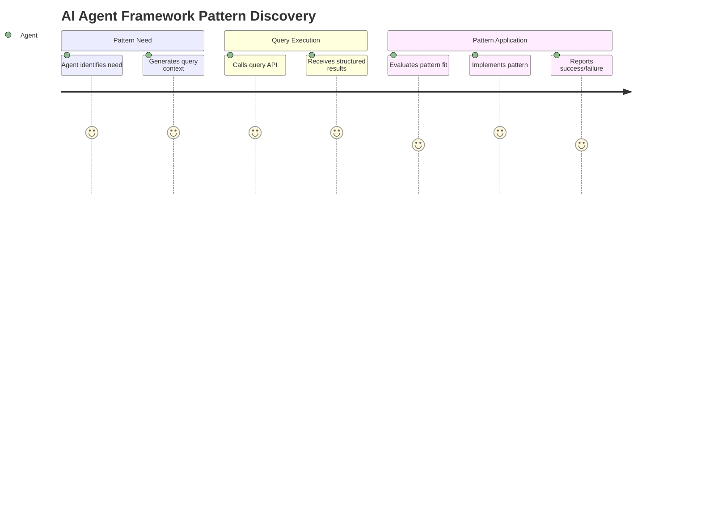
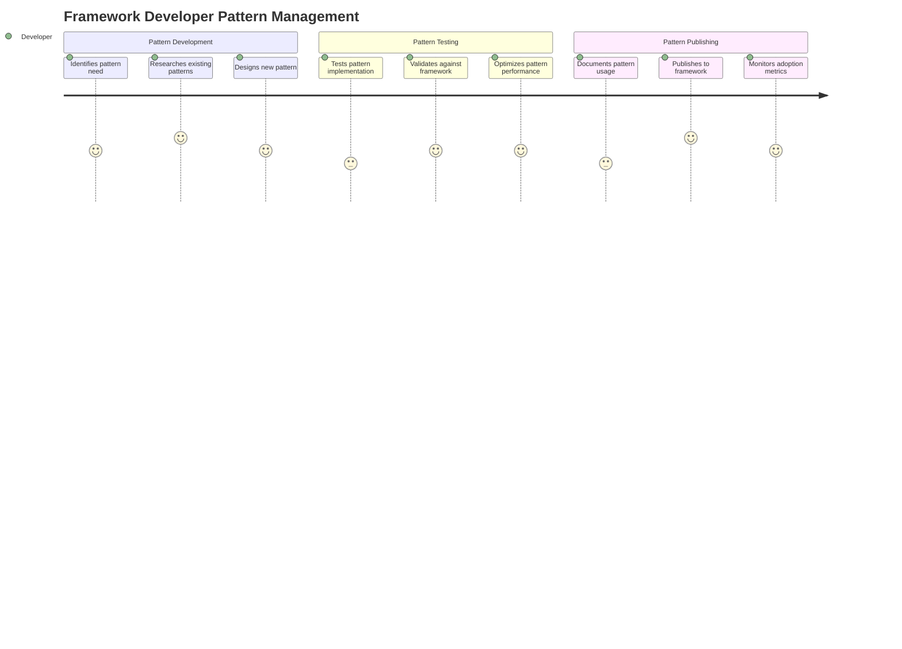
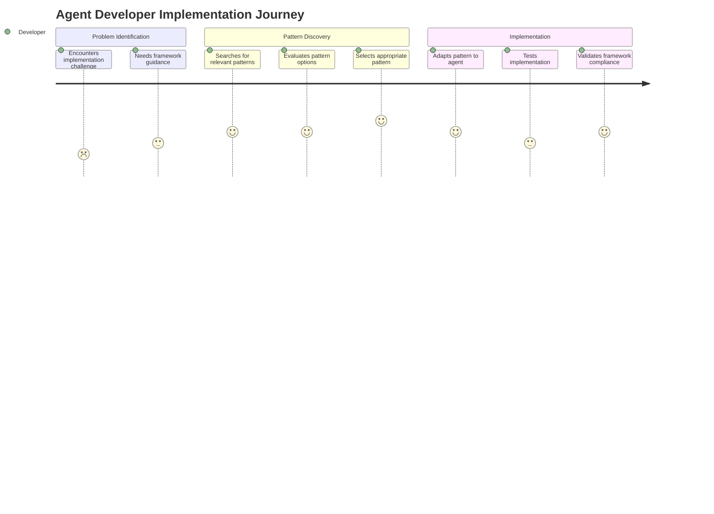
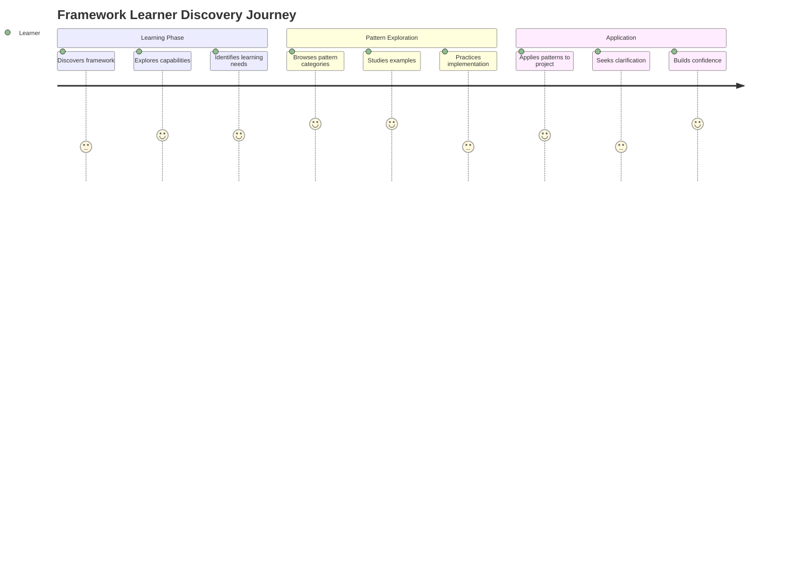
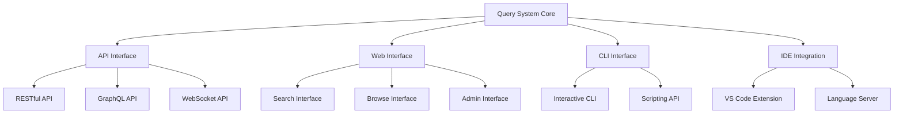

# Query System User Experience Design

**Version**: 1.0.0
**Agent**: Agent-8: Query System Designer
**Date**: 2025-01-27
**Phase**: Phase 1 - Content Analysis & Architecture Design

## Executive Summary

This document defines the user experience design for the Agent Framework Query System, focusing on intuitive, efficient, and intelligent interfaces that enable both automated agents and human developers to discover and utilize framework patterns effectively.

**Design Principles**:
- **Progressive Disclosure**: Show simple interface first, reveal complexity as needed
- **Context Awareness**: Adapt interface based on user type and current context
- **Intelligent Assistance**: Proactive suggestions and smart defaults
- **Graceful Degradation**: Maintain usability even when advanced features fail
- **Multi-Modal Interaction**: Support various interaction patterns and preferences

## Table of Contents

1. [User Personas & Journey Maps](#user-personas--journey-maps)
2. [Interface Architecture](#interface-architecture)
3. [Query Input Design](#query-input-design)
4. [Results Presentation](#results-presentation)
5. [Interactive Features](#interactive-features)
6. [Error Handling & Feedback](#error-handling--feedback)
7. [Accessibility & Inclusivity](#accessibility--inclusivity)
8. [Performance & Responsiveness](#performance--responsiveness)

## User Personas & Journey Maps

### Primary User Personas

#### 1. Automated AI Agent
**Profile**: Claude Code agent needing framework patterns
- **Technical Level**: High (programmatic interface)
- **Context**: Automated, goal-oriented, efficiency-focused
- **Primary Needs**: Fast, accurate pattern retrieval with minimal overhead
- **Interaction Pattern**: API calls with structured requests/responses

**User Journey**:


**Key UX Requirements**:
- Programmatic API with clear request/response schemas
- Fast response times (<200ms typical)
- Structured, machine-readable results
- Comprehensive error information for debugging
- Batch query capabilities for efficiency

#### 2. Framework Developer
**Profile**: Developer creating or modifying framework patterns
- **Technical Level**: Expert (framework internals)
- **Context**: Creation, testing, optimization of patterns
- **Primary Needs**: Advanced pattern analysis, validation, debugging tools
- **Interaction Pattern**: Web interface with developer tools integration

**User Journey**:


**Key UX Requirements**:
- Advanced query interface with filters and sorting
- Pattern validation and testing tools
- Analytics and adoption metrics
- Version control and history tracking
- Collaboration features for team development

#### 3. Agent Developer
**Profile**: Developer building or maintaining specific agents
- **Technical Level**: Intermediate to Advanced
- **Context**: Implementation, debugging, optimization of agents
- **Primary Needs**: Relevant patterns for specific agent requirements
- **Interaction Pattern**: IDE integration, documentation browsing, web interface

**User Journey**:


**Key UX Requirements**:
- Natural language query interface
- Context-aware suggestions based on current work
- Code examples and implementation guidance
- Integration with development tools (IDE, git)
- Clear documentation and tutorials

#### 4. Framework User/Learner
**Profile**: Developer learning the framework or implementing basic patterns
- **Technical Level**: Beginner to Intermediate
- **Context**: Learning, exploration, basic implementation
- **Primary Needs**: Educational content, step-by-step guidance, examples
- **Interaction Pattern**: Documentation browsing, tutorial following, web interface

**User Journey**:


**Key UX Requirements**:
- Guided exploration and tutorials
- Clear categorization and navigation
- Progressive complexity introduction
- Rich examples and explanations
- Community features (Q&A, discussions)

### Cross-Persona Requirements

**Universal UX Principles**:
- **Consistency**: Common patterns across all interfaces
- **Feedback**: Clear indication of system state and user actions
- **Error Recovery**: Helpful error messages and recovery suggestions
- **Performance**: Fast, responsive interactions
- **Accessibility**: Support for diverse users and tools

## Interface Architecture

### Multi-Modal Interface Strategy



### Interface Layer Specifications

#### 1. API Interface (Machine-to-Machine)
**Target Users**: AI Agents, Automated Systems, Scripts

**Core Features**:
```yaml
api_interface:
  endpoints:
    - path: "/api/v1/patterns/search"
      method: "POST"
      purpose: "Primary pattern search"
      response_time_target: "200ms"

    - path: "/api/v1/patterns/batch"
      method: "POST"
      purpose: "Batch pattern queries"
      max_batch_size: 50

    - path: "/api/v1/patterns/validate"
      method: "POST"
      purpose: "Pattern implementation validation"

  response_format:
    success_response:
      structure: "json"
      schema: "standardized_across_endpoints"
      compression: "gzip_optional"

    error_response:
      structure: "json"
      error_codes: "http_status_plus_custom_codes"
      debugging_info: "included_in_development"

  authentication:
    method: "bearer_token"
    rate_limiting: "per_token_basis"
    usage_analytics: "anonymous_aggregated"
```

#### 2. Web Interface (Human Interactive)
**Target Users**: Framework Developers, Agent Developers, Learners

**Interface Components**:

##### Search Interface
```html
<!-- Primary Search Interface -->
<div class="query-interface">
  <!-- Smart Query Input -->
  <div class="query-input-section">
    <input type="text"
           class="smart-query-input"
           placeholder="Describe what you're looking for..."
           data-suggestions="enabled"
           data-context-aware="true">

    <!-- Context Selectors (Progressive Disclosure) -->
    <div class="context-selectors" data-state="collapsed">
      <select name="agent-type">
        <option value="auto">Auto-detect</option>
        <option value="api">API Agent</option>
        <option value="debug">Debug Agent</option>
        <!-- ... -->
      </select>

      <select name="complexity">
        <option value="auto">Auto-detect</option>
        <option value="simple">Simple</option>
        <option value="moderate">Moderate</option>
        <option value="complex">Complex</option>
      </select>
    </div>
  </div>

  <!-- Advanced Filters (Collapsible) -->
  <div class="advanced-filters" data-state="collapsed">
    <fieldset>
      <legend>Pattern Types</legend>
      <label><input type="checkbox" value="implementation"> Implementation</label>
      <label><input type="checkbox" value="coordination"> Coordination</label>
      <label><input type="checkbox" value="error_handling"> Error Handling</label>
      <!-- ... -->
    </fieldset>
  </div>

  <!-- Search Actions -->
  <div class="search-actions">
    <button type="submit" class="primary-search">Search</button>
    <button type="button" class="advanced-toggle">Advanced Options</button>
    <button type="button" class="help-toggle">?</button>
  </div>
</div>
```

##### Results Interface
```html
<!-- Results Display -->
<div class="results-container">
  <!-- Results Summary -->
  <div class="results-summary">
    <span class="results-count">Found 12 patterns</span>
    <span class="search-time">in 156ms</span>
    <span class="quality-indicator" data-quality="high">High Quality Results</span>
  </div>

  <!-- Results List -->
  <div class="results-list">
    <article class="pattern-result" data-relevance="0.95">
      <header class="pattern-header">
        <h3 class="pattern-title">Error Handling for API Agents</h3>
        <div class="pattern-metadata">
          <span class="pattern-type">Implementation</span>
          <span class="complexity">Moderate</span>
          <span class="effectiveness">95% effective</span>
        </div>
      </header>

      <div class="pattern-summary">
        <p>Comprehensive error handling pattern for API agents including...</p>
      </div>

      <div class="pattern-actions">
        <button class="view-pattern">View Details</button>
        <button class="copy-code">Copy Code</button>
        <button class="save-pattern">Save</button>
      </div>

      <div class="relevance-explanation">
        <small>Relevant because: Perfect agent type match, good complexity alignment</small>
      </div>
    </article>
  </div>

  <!-- Pagination/Load More -->
  <div class="results-pagination">
    <button class="load-more">Load More Results</button>
  </div>
</div>
```

#### 3. CLI Interface (Command Line)
**Target Users**: Developers, Power Users, Automation Scripts

**Command Structure**:
```bash
# Primary command structure
archon-framework query [options] "<query_text>"

# Examples
archon-framework query "error handling for API agents"
archon-framework query --agent-type=debug --complexity=complex "investigation patterns"
archon-framework query --json "parallel coordination" | jq '.patterns[0].code'

# Interactive mode
archon-framework query --interactive

# Batch mode
archon-framework query --batch-file=queries.txt

# Configuration
archon-framework config set default-agent-type api
archon-framework config set output-format table
```

**CLI Output Formats**:
```yaml
cli_output_formats:
  table:
    description: "Human-readable table format"
    use_case: "Interactive terminal sessions"
    example: |
      Pattern Name              Type           Effectiveness  Complexity
      Error Handling Basic      Implementation 89%           Simple
      Parallel Coordination    Coordination   95%           Complex

  json:
    description: "Machine-readable JSON"
    use_case: "Scripting and automation"
    example: |
      {
        "query": "error handling",
        "results": [
          {
            "id": "error-001",
            "name": "Error Handling Basic",
            "code": "...",
            "metadata": {...}
          }
        ]
      }

  markdown:
    description: "Documentation-friendly format"
    use_case: "Documentation generation"
    example: |
      # Error Handling Patterns

      ## Error Handling Basic
      **Type**: Implementation
      **Effectiveness**: 89%

      ```python
      try:
          # implementation
      except Exception as e:
          # handling
      ```
```

### Responsive Design Strategy

#### Adaptive Layout System
```css
/* Responsive breakpoints for query interface */
.query-interface {
  display: grid;
  gap: 1rem;
}

/* Mobile-first approach */
@media (max-width: 768px) {
  .query-interface {
    grid-template-columns: 1fr;
    padding: 0.5rem;
  }

  .advanced-filters {
    display: none; /* Hidden by default on mobile */
  }

  .results-list .pattern-result {
    padding: 0.75rem;
    border-radius: 4px;
  }
}

/* Tablet layout */
@media (min-width: 769px) and (max-width: 1024px) {
  .query-interface {
    grid-template-columns: 2fr 1fr;
  }

  .results-list {
    grid-column: 1 / -1;
  }
}

/* Desktop layout */
@media (min-width: 1025px) {
  .query-interface {
    grid-template-columns: 3fr 1fr;
  }

  .results-container {
    display: grid;
    grid-template-columns: 2fr 1fr;
    gap: 2rem;
  }
}
```

## Query Input Design

### Smart Query Input Component

#### 1. Natural Language Processing
**Objective**: Enable natural, conversational queries while extracting structured context

**Features**:
- **Auto-completion**: Real-time suggestions based on common patterns
- **Syntax highlighting**: Visual indication of recognized terms and context
- **Smart parsing**: Extract agent type, complexity, domain from natural language

**Implementation**:
```typescript
interface SmartQueryInput {
  // Real-time query analysis
  analyzeQuery(query: string): QueryAnalysis;

  // Auto-completion suggestions
  getSuggestions(partialQuery: string, context: UserContext): Suggestion[];

  // Syntax highlighting tokens
  getHighlightingTokens(query: string): HighlightToken[];

  // Context extraction
  extractContext(query: string): ExtractedContext;
}

interface QueryAnalysis {
  detectedAgentType?: string;
  detectedComplexity?: string;
  detectedDomain?: string;
  patternTypes: string[];
  confidence: number;
  suggestions: string[];
}

interface Suggestion {
  text: string;
  type: 'completion' | 'correction' | 'enhancement';
  confidence: number;
  explanation?: string;
}
```

#### 2. Progressive Context Disclosure
**Objective**: Show simple interface initially, reveal advanced options as needed

**Design Pattern**:
```html
<!-- Initial Simple State -->
<div class="query-input simple-mode">
  <input type="text" placeholder="What pattern are you looking for?">
  <button type="submit">Search</button>
</div>

<!-- Progressive Enhancement -->
<div class="query-input enhanced-mode">
  <div class="main-query">
    <input type="text" placeholder="Describe your implementation need...">
    <button class="context-toggle" aria-label="Show context options">⚙️</button>
  </div>

  <!-- Context Options (Revealed on Demand) -->
  <div class="context-options" aria-hidden="true">
    <div class="quick-context">
      <label>I'm working on a <select name="agent-type">...</select> agent</label>
      <label>with <select name="complexity">...</select> complexity</label>
    </div>

    <details class="advanced-context">
      <summary>Advanced Options</summary>
      <div class="advanced-grid">
        <!-- Advanced filtering options -->
      </div>
    </details>
  </div>
</div>
```

#### 3. Query Templates & Examples
**Objective**: Help users understand query capabilities through examples

**Template Categories**:
```yaml
query_templates:
  beginner:
    - "How do I handle errors in my agent?"
    - "Show me basic context inheritance"
    - "What are the quality gates I need?"

  intermediate:
    - "Parallel coordination patterns for complex workflows"
    - "Performance optimization for API agents"
    - "Advanced debugging techniques"

  advanced:
    - "Cross-agent intelligence sharing patterns"
    - "Custom quality gate implementations"
    - "Framework extension strategies"

  by_domain:
    api_development:
      - "RESTful API error handling patterns"
      - "Request validation and sanitization"
      - "Authentication and authorization patterns"

    debugging:
      - "Root cause analysis methodologies"
      - "Multi-dimensional debugging approaches"
      - "Intelligence correlation techniques"
```

### Query Enhancement Features

#### 1. Auto-correction and Suggestions
```typescript
interface QueryEnhancement {
  // Spelling and terminology correction
  correctQuery(query: string): CorrectionResult;

  // Query expansion suggestions
  suggestExpansions(query: string): ExpansionSuggestion[];

  // Alternative query formulations
  suggestAlternatives(query: string, context: UserContext): Alternative[];
}

interface CorrectionResult {
  originalQuery: string;
  correctedQuery: string;
  corrections: Correction[];
  confidence: number;
}

interface ExpansionSuggestion {
  type: 'synonym' | 'related_concept' | 'specification';
  suggestion: string;
  explanation: string;
  impact: 'narrow' | 'broaden' | 'refine';
}
```

#### 2. Context-Aware Defaults
```typescript
interface ContextAwareDefaults {
  // Infer context from user's current work
  inferContextFromEnvironment(): InferredContext;

  // Apply smart defaults based on context
  applySmartDefaults(query: string, context: InferredContext): QueryWithDefaults;

  // Personalization based on user history
  personalizeDefaults(user: UserProfile): PersonalizedDefaults;
}

interface InferredContext {
  currentProject?: ProjectContext;
  recentQueries: QueryHistory[];
  userRole: 'developer' | 'learner' | 'expert';
  preferredPatterns: string[];
}
```

## Results Presentation

### Result Card Design

#### 1. Information Hierarchy
**Objective**: Present pattern information in scannable, actionable format

**Card Structure**:
```html
<article class="pattern-card" data-relevance="0.95">
  <!-- Primary Information -->
  <header class="pattern-header">
    <h3 class="pattern-title">Error Handling for API Agents</h3>
    <div class="pattern-badges">
      <span class="badge pattern-type">Implementation</span>
      <span class="badge complexity">Moderate</span>
      <span class="badge effectiveness" data-score="0.95">95% Effective</span>
    </div>
  </header>

  <!-- Secondary Information -->
  <div class="pattern-summary">
    <p class="description">Comprehensive error handling pattern that provides structured exception management, intelligent retry logic, and automated error reporting for API-focused agents.</p>

    <div class="pattern-metadata">
      <span class="usage-stats">Used by 47 agents</span>
      <span class="last-updated">Updated 3 days ago</span>
      <span class="author">Framework Team</span>
    </div>
  </div>

  <!-- Code Preview (Expandable) -->
  <details class="code-preview">
    <summary>View Code</summary>
    <pre><code class="language-python">
async def handle_api_error(error: Exception, context: RequestContext):
    # Error classification and handling logic
    ...
    </code></pre>
  </details>

  <!-- Action Buttons -->
  <div class="pattern-actions">
    <button class="action primary" data-action="implement">
      Use This Pattern
    </button>
    <button class="action secondary" data-action="save">
      Save for Later
    </button>
    <button class="action secondary" data-action="share">
      Share
    </button>
  </div>

  <!-- Relevance Explanation -->
  <details class="relevance-explanation">
    <summary>Why this pattern matches</summary>
    <ul>
      <li>Perfect agent type match (API)</li>
      <li>Appropriate complexity level</li>
      <li>High effectiveness in similar contexts</li>
      <li>Recently updated and well-maintained</li>
    </ul>
  </details>
</article>
```

#### 2. Visual Quality Indicators
**Objective**: Help users quickly assess pattern quality and suitability

**Quality Indicator System**:
```css
/* Quality indication through visual design */
.pattern-card {
  border-left: 4px solid var(--quality-color);
  background: var(--quality-background);
}

.pattern-card[data-quality="excellent"] {
  --quality-color: #10b981;
  --quality-background: #ecfdf5;
}

.pattern-card[data-quality="good"] {
  --quality-color: #3b82f6;
  --quality-background: #eff6ff;
}

.pattern-card[data-quality="fair"] {
  --quality-color: #f59e0b;
  --quality-background: #fffbeb;
}

.pattern-card[data-quality="poor"] {
  --quality-color: #ef4444;
  --quality-background: #fef2f2;
}

/* Effectiveness visualization */
.effectiveness-bar {
  display: flex;
  align-items: center;
  gap: 0.5rem;
}

.effectiveness-score {
  font-weight: 600;
  color: var(--effectiveness-color);
}

.effectiveness-visual {
  width: 60px;
  height: 4px;
  background: #e5e7eb;
  border-radius: 2px;
  overflow: hidden;
}

.effectiveness-fill {
  height: 100%;
  background: var(--effectiveness-color);
  width: var(--effectiveness-percentage);
  transition: width 0.3s ease;
}
```

### Result Filtering & Sorting

#### 1. Dynamic Filtering Interface
**Objective**: Allow users to refine results without new searches

```html
<div class="results-filters">
  <!-- Quick Filters -->
  <div class="quick-filters">
    <button class="filter-chip" data-filter="agent-type:api">
      API Agents (8)
    </button>
    <button class="filter-chip" data-filter="complexity:simple">
      Simple (3)
    </button>
    <button class="filter-chip" data-filter="effectiveness:high">
      High Effectiveness (12)
    </button>
  </div>

  <!-- Advanced Filters -->
  <details class="advanced-filters">
    <summary>More Filters</summary>
    <div class="filter-grid">
      <fieldset>
        <legend>Pattern Type</legend>
        <label><input type="checkbox" value="implementation"> Implementation (15)</label>
        <label><input type="checkbox" value="coordination"> Coordination (7)</label>
        <label><input type="checkbox" value="error_handling"> Error Handling (9)</label>
      </fieldset>

      <fieldset>
        <legend>Effectiveness</legend>
        <input type="range" min="0" max="100" value="70"
               data-filter="effectiveness-min">
        <span>70% or higher</span>
      </fieldset>
    </div>
  </details>
</div>
```

#### 2. Intelligent Sorting Options
**Objective**: Provide multiple ways to organize results based on user needs

```typescript
interface SortingOptions {
  relevance: 'desc' | 'asc';           // Default: best matches first
  effectiveness: 'desc' | 'asc';       // Most effective patterns first
  popularity: 'desc' | 'asc';          // Most used patterns first
  recency: 'desc' | 'asc';            // Recently updated patterns first
  complexity: 'asc' | 'desc';         // Simple to complex or vice versa
  alphabetical: 'asc' | 'desc';       // A-Z sorting
}

interface SortingInterface {
  currentSort: keyof SortingOptions;
  applySorting(option: keyof SortingOptions, direction: 'asc' | 'desc'): void;
  getAvailableSorts(): SortOption[];
}

interface SortOption {
  key: keyof SortingOptions;
  label: string;
  description: string;
  icon: string;
}
```

### Code Integration Features

#### 1. One-Click Implementation
**Objective**: Minimize friction between pattern discovery and implementation

```html
<div class="implementation-actions">
  <!-- Direct Code Copy -->
  <button class="action-copy" data-format="raw">
    📋 Copy Code
  </button>

  <!-- Customized Implementation -->
  <button class="action-customize" data-pattern-id="error-001">
    ⚙️ Customize & Generate
  </button>

  <!-- IDE Integration -->
  <button class="action-ide" data-ide="vscode">
    📁 Open in VS Code
  </button>

  <!-- Download as File -->
  <button class="action-download" data-format="python">
    💾 Download as .py
  </button>
</div>

<!-- Customization Modal -->
<dialog class="customization-modal">
  <form class="customization-form">
    <h3>Customize Error Handling Pattern</h3>

    <fieldset>
      <legend>Agent Configuration</legend>
      <label>Agent Name: <input type="text" value="MyAPIAgent"></label>
      <label>Agent Type: <select>...</select></label>
    </fieldset>

    <fieldset>
      <legend>Error Handling Options</legend>
      <label><input type="checkbox" checked> Include retry logic</label>
      <label><input type="checkbox" checked> Include logging</label>
      <label><input type="checkbox"> Include metrics reporting</label>
    </fieldset>

    <div class="modal-actions">
      <button type="submit">Generate Custom Code</button>
      <button type="button" data-action="cancel">Cancel</button>
    </div>
  </form>
</dialog>
```

#### 2. Implementation Guidance
**Objective**: Provide step-by-step guidance for pattern implementation

```html
<div class="implementation-guide">
  <h4>Implementation Steps</h4>
  <ol class="step-list">
    <li class="step">
      <div class="step-header">
        <span class="step-number">1</span>
        <h5>Import Required Dependencies</h5>
      </div>
      <div class="step-content">
        <pre><code>from archon.framework import DebugIntelligence</code></pre>
        <p>Add this import to the top of your agent file.</p>
      </div>
    </li>

    <li class="step">
      <div class="step-header">
        <span class="step-number">2</span>
        <h5>Implement Error Handler</h5>
      </div>
      <div class="step-content">
        <pre><code>async def handle_error(self, error: Exception):
    await capture_debug_intelligence_on_error(...)
        </code></pre>
        <p>Replace the placeholder with your agent-specific context.</p>
      </div>
    </li>
  </ol>

  <div class="implementation-notes">
    <h5>Important Notes</h5>
    <ul>
      <li>Ensure your agent inherits from BaseAgent</li>
      <li>Test error handling with common scenarios</li>
      <li>Configure appropriate logging levels</li>
    </ul>
  </div>
</div>
```

## Interactive Features

### Real-Time Query Enhancement

#### 1. Live Suggestions
**Objective**: Provide helpful suggestions as users type

```typescript
interface LiveSuggestions {
  // Suggest completions based on partial input
  getCompletions(partialQuery: string): Completion[];

  // Suggest corrections for potential typos
  getCorrections(query: string): Correction[];

  // Suggest query enhancements
  getEnhancements(query: string): Enhancement[];
}

interface Completion {
  text: string;
  type: 'pattern_name' | 'agent_type' | 'keyword' | 'phrase';
  confidence: number;
  preview?: string;
}

interface Enhancement {
  type: 'add_context' | 'refine_scope' | 'add_constraint';
  suggestion: string;
  explanation: string;
  impact: 'improve_relevance' | 'reduce_results' | 'add_specificity';
}
```

**UI Implementation**:
```html
<div class="query-input-container">
  <input type="text"
         class="smart-query-input"
         data-suggestions="enabled"
         aria-describedby="suggestions-help">

  <!-- Live Suggestions Dropdown -->
  <div class="suggestions-dropdown" role="listbox">
    <div class="suggestion-group">
      <h4>Completions</h4>
      <button class="suggestion" role="option">
        <span class="suggestion-text">error handling for API agents</span>
        <span class="suggestion-type">Common Pattern</span>
      </button>
    </div>

    <div class="suggestion-group">
      <h4>Did you mean?</h4>
      <button class="suggestion correction" role="option">
        <span class="suggestion-text">parallel coordination</span>
        <span class="suggestion-note">instead of "paralel coordination"</span>
      </button>
    </div>

    <div class="suggestion-group">
      <h4>Try adding</h4>
      <button class="suggestion enhancement" role="option">
        <span class="suggestion-text">for API agents</span>
        <span class="suggestion-benefit">to get more specific results</span>
      </button>
    </div>
  </div>
</div>
```

#### 2. Smart Context Detection
**Objective**: Automatically infer user context to improve results

```typescript
interface ContextDetection {
  // Detect context from user's environment
  detectEnvironmentContext(): EnvironmentContext;

  // Infer context from query history
  inferFromHistory(recentQueries: Query[]): HistoryContext;

  // Combine multiple context sources
  synthesizeContext(sources: ContextSource[]): SynthesizedContext;
}

interface EnvironmentContext {
  currentProject?: string;
  currentFile?: string;
  currentLanguage?: string;
  gitBranch?: string;
  workingDirectory?: string;
}

interface HistoryContext {
  frequentAgentTypes: string[];
  preferredComplexity: string;
  commonDomains: string[];
  recentPatterns: string[];
}
```

### Progressive Disclosure Features

#### 1. Expandable Content Sections
**Objective**: Show essential information first, details on demand

```html
<article class="pattern-result">
  <!-- Always Visible: Essential Info -->
  <header class="pattern-header">
    <h3>Error Handling Pattern</h3>
    <div class="essential-metadata">
      <span class="effectiveness">95%</span>
      <span class="type">Implementation</span>
    </div>
  </header>

  <!-- Always Visible: Brief Description -->
  <p class="pattern-summary">
    Comprehensive error handling with intelligent retry and reporting.
  </p>

  <!-- Progressive Disclosure: Detailed Information -->
  <details class="pattern-details">
    <summary>View Details</summary>
    <div class="detailed-content">
      <div class="usage-info">
        <h4>Usage Information</h4>
        <ul>
          <li>Used by 47 agents successfully</li>
          <li>Average implementation time: 15 minutes</li>
          <li>Maintenance overhead: Low</li>
        </ul>
      </div>

      <div class="requirements">
        <h4>Requirements</h4>
        <ul>
          <li>Agent must inherit from BaseAgent</li>
          <li>Python 3.8+ required</li>
          <li>Archon framework 2.0+</li>
        </ul>
      </div>
    </div>
  </details>

  <!-- Progressive Disclosure: Code Example -->
  <details class="code-example">
    <summary>View Code Example</summary>
    <div class="code-container">
      <pre><code class="language-python">
# Error handling implementation
async def handle_error(self, error: Exception, context: Dict):
    await capture_debug_intelligence_on_error(
        error_context=error,
        agent_type=self.agent_type,
        execution_context=context
    )
    # Additional handling logic...
      </code></pre>

      <div class="code-actions">
        <button class="copy-code">Copy Code</button>
        <button class="customize-code">Customize</button>
      </div>
    </div>
  </details>
</article>
```

#### 2. Adaptive Interface Complexity
**Objective**: Adjust interface complexity based on user expertise

```typescript
interface AdaptiveInterface {
  // User expertise levels
  userExpertise: 'beginner' | 'intermediate' | 'expert';

  // Adjust interface based on expertise
  adaptInterface(level: UserExpertise): InterfaceConfig;

  // Progressive feature revelation
  revealFeatures(userProgress: UserProgress): FeatureSet;
}

interface InterfaceConfig {
  showAdvancedFilters: boolean;
  showTechnicalDetails: boolean;
  showPerformanceMetrics: boolean;
  showDebugInformation: boolean;
  defaultResultFormat: 'simple' | 'detailed' | 'technical';
}

// Beginner Interface
const beginnerConfig: InterfaceConfig = {
  showAdvancedFilters: false,
  showTechnicalDetails: false,
  showPerformanceMetrics: false,
  showDebugInformation: false,
  defaultResultFormat: 'simple'
};

// Expert Interface
const expertConfig: InterfaceConfig = {
  showAdvancedFilters: true,
  showTechnicalDetails: true,
  showPerformanceMetrics: true,
  showDebugInformation: true,
  defaultResultFormat: 'technical'
};
```

### Collaboration Features

#### 1. Pattern Sharing & Collections
**Objective**: Enable users to share and organize patterns

```html
<div class="pattern-sharing">
  <!-- Save to Collection -->
  <div class="save-to-collection">
    <button class="save-dropdown-toggle">💾 Save</button>
    <div class="save-dropdown">
      <div class="existing-collections">
        <h5>Add to Collection</h5>
        <label><input type="radio" name="collection"> My API Patterns</label>
        <label><input type="radio" name="collection"> Error Handling Best Practices</label>
        <label><input type="radio" name="collection"> Team Standards</label>
      </div>

      <div class="new-collection">
        <h5>Create New Collection</h5>
        <input type="text" placeholder="Collection name">
        <button>Create & Add</button>
      </div>
    </div>
  </div>

  <!-- Share Pattern -->
  <div class="share-pattern">
    <button class="share-dropdown-toggle">🔗 Share</button>
    <div class="share-dropdown">
      <div class="share-options">
        <button class="share-link">Copy Link</button>
        <button class="share-email">Email to Team</button>
        <button class="share-export">Export as Markdown</button>
      </div>

      <div class="share-settings">
        <label><input type="checkbox"> Include my notes</label>
        <label><input type="checkbox"> Include implementation context</label>
      </div>
    </div>
  </div>
</div>
```

#### 2. Community Features
**Objective**: Enable knowledge sharing and collaborative improvement

```html
<div class="community-features">
  <!-- Pattern Rating -->
  <div class="pattern-rating">
    <h5>Rate this pattern</h5>
    <div class="star-rating" role="group" aria-label="Rate from 1 to 5 stars">
      <button class="star" data-rating="1">⭐</button>
      <button class="star" data-rating="2">⭐</button>
      <button class="star" data-rating="3">⭐</button>
      <button class="star" data-rating="4">⭐</button>
      <button class="star" data-rating="5">⭐</button>
    </div>
    <span class="rating-summary">4.2/5 (23 ratings)</span>
  </div>

  <!-- Comments & Discussion -->
  <details class="pattern-discussion">
    <summary>Discussion (5 comments)</summary>
    <div class="comments-section">
      <article class="comment">
        <header class="comment-header">
          <span class="author">DevTeamLead</span>
          <time>2 days ago</time>
        </header>
        <p>This pattern worked great for our API agents. One tip: make sure to configure the retry intervals based on your specific endpoints.</p>
      </article>

      <form class="add-comment">
        <textarea placeholder="Share your experience with this pattern..."></textarea>
        <button type="submit">Add Comment</button>
      </form>
    </div>
  </details>

  <!-- Usage Examples -->
  <details class="usage-examples">
    <summary>Community Examples</summary>
    <div class="examples-list">
      <article class="usage-example">
        <h5>E-commerce API Implementation</h5>
        <p>Used for handling payment processing errors with custom retry logic.</p>
        <code>// Custom retry configuration for payment endpoints</code>
      </article>
    </div>
  </details>
</div>
```

## Error Handling & Feedback

### Error State Design

#### 1. Graceful Error Presentation
**Objective**: Present errors in helpful, non-threatening ways

```html
<!-- No Results Found -->
<div class="error-state no-results">
  <div class="error-icon">🔍</div>
  <h3>No patterns found</h3>
  <p>We couldn't find patterns matching "<strong>paralel coordination</strong>"</p>

  <div class="error-suggestions">
    <h4>Try these suggestions:</h4>
    <ul>
      <li>
        <button class="suggestion-fix">Search for "parallel coordination"</button>
        <span class="suggestion-note">Fixed spelling</span>
      </li>
      <li>
        <button class="suggestion-broaden">Search for "coordination patterns"</button>
        <span class="suggestion-note">Broader search</span>
      </li>
      <li>
        <button class="suggestion-browse">Browse coordination patterns</button>
        <span class="suggestion-note">Explore category</span>
      </li>
    </ul>
  </div>

  <details class="advanced-help">
    <summary>Advanced Search Tips</summary>
    <div class="help-content">
      <h5>Query syntax:</h5>
      <ul>
        <li><code>"exact phrase"</code> - Search for exact phrase</li>
        <li><code>agent:api</code> - Filter by agent type</li>
        <li><code>complexity:simple</code> - Filter by complexity</li>
      </ul>
    </div>
  </details>
</div>

<!-- Service Degradation -->
<div class="error-state service-degraded">
  <div class="error-icon">⚠️</div>
  <h3>Limited functionality</h3>
  <p>Some search features are temporarily unavailable. Basic search is still working.</p>

  <div class="degradation-info">
    <h4>What's affected:</h4>
    <ul>
      <li>Advanced semantic search</li>
      <li>Personalized recommendations</li>
      <li>Real-time suggestions</li>
    </ul>

    <h4>What's still working:</h4>
    <ul class="working-features">
      <li>✅ Basic pattern search</li>
      <li>✅ Filtering and sorting</li>
      <li>✅ Code copying and downloads</li>
    </ul>
  </div>

  <button class="retry-action">Try Again</button>
</div>

<!-- Critical Error -->
<div class="error-state critical-error">
  <div class="error-icon">❌</div>
  <h3>Something went wrong</h3>
  <p>We're experiencing technical difficulties. Please try again in a few moments.</p>

  <div class="error-actions">
    <button class="retry-action primary">Retry</button>
    <button class="fallback-action">Browse Offline Patterns</button>
  </div>

  <details class="error-details">
    <summary>Technical Details</summary>
    <div class="technical-info">
      <p><strong>Error ID:</strong> ERR-2025-001-XYZ</p>
      <p><strong>Time:</strong> 2025-01-27 14:30:45 UTC</p>
      <p><strong>Status:</strong> Service temporarily unavailable</p>
    </div>
  </details>
</div>
```

#### 2. Progressive Error Recovery
**Objective**: Guide users through error recovery with clear steps

```typescript
interface ErrorRecovery {
  // Analyze error and suggest recovery actions
  analyzeError(error: QueryError): ErrorAnalysis;

  // Provide step-by-step recovery guidance
  getRecoverySteps(analysis: ErrorAnalysis): RecoveryStep[];

  // Execute automated recovery when possible
  attemptAutomaticRecovery(error: QueryError): Promise<RecoveryResult>;
}

interface RecoveryStep {
  action: string;
  description: string;
  automated: boolean;
  estimatedTime: string;
  successProbability: number;
}

// Example recovery flow
const recoverySteps: RecoveryStep[] = [
  {
    action: "retry_query",
    description: "Retry your search with the same terms",
    automated: true,
    estimatedTime: "5 seconds",
    successProbability: 0.7
  },
  {
    action: "simplify_query",
    description: "Try a simpler version of your search",
    automated: false,
    estimatedTime: "30 seconds",
    successProbability: 0.9
  },
  {
    action: "browse_categories",
    description: "Browse patterns by category instead",
    automated: false,
    estimatedTime: "2 minutes",
    successProbability: 0.95
  }
];
```

### Feedback Collection System

#### 1. Contextual Feedback
**Objective**: Collect feedback at relevant moments without being intrusive

```html
<!-- Post-Search Feedback -->
<div class="feedback-prompt contextual" data-trigger="search-completed">
  <div class="feedback-header">
    <span class="feedback-icon">💭</span>
    <span class="feedback-text">How relevant were these results?</span>
  </div>

  <div class="feedback-options">
    <button class="feedback-option" data-value="very-relevant">
      👍 Very relevant
    </button>
    <button class="feedback-option" data-value="somewhat-relevant">
      👌 Somewhat relevant
    </button>
    <button class="feedback-option" data-value="not-relevant">
      👎 Not relevant
    </button>
  </div>

  <button class="feedback-dismiss" aria-label="Dismiss feedback">×</button>
</div>

<!-- Pattern Implementation Feedback -->
<div class="feedback-prompt post-implementation" data-trigger="pattern-copied">
  <h4>How did this pattern work for you?</h4>
  <form class="implementation-feedback">
    <fieldset>
      <legend>Implementation experience</legend>
      <label><input type="radio" name="implementation" value="easy"> Easy to implement</label>
      <label><input type="radio" name="implementation" value="moderate"> Took some work</label>
      <label><input type="radio" name="implementation" value="difficult"> Difficult to implement</label>
    </fieldset>

    <fieldset>
      <legend>Effectiveness</legend>
      <label><input type="radio" name="effectiveness" value="solved"> Solved my problem completely</label>
      <label><input type="radio" name="effectiveness" value="partial"> Partially solved my problem</label>
      <label><input type="radio" name="effectiveness" value="not-helpful"> Didn't help</label>
    </fieldset>

    <div class="feedback-actions">
      <button type="submit">Share Feedback</button>
      <button type="button" data-action="skip">Skip</button>
    </div>
  </form>
</div>
```

#### 2. Continuous Improvement Loop
**Objective**: Use feedback to continuously improve the query system

```typescript
interface FeedbackSystem {
  // Collect feedback at appropriate moments
  collectFeedback(context: FeedbackContext): void;

  // Analyze feedback for improvement opportunities
  analyzeFeedback(timeRange: TimeRange): FeedbackAnalysis;

  // Apply improvements based on feedback
  applyImprovements(analysis: FeedbackAnalysis): ImprovementPlan;
}

interface FeedbackContext {
  type: 'search_relevance' | 'pattern_effectiveness' | 'usability' | 'error_experience';
  query: string;
  results: Pattern[];
  userAction: string;
  timestamp: Date;
}

interface FeedbackAnalysis {
  commonIssues: Issue[];
  improvementOpportunities: Opportunity[];
  successfulPatterns: Pattern[];
  userSatisfactionTrends: Trend[];
}
```

## Accessibility & Inclusivity

### Accessibility Standards Compliance

#### 1. WCAG 2.1 AA Compliance
**Objective**: Ensure the query system is accessible to users with disabilities

**Key Requirements**:
```css
/* Color and contrast */
:root {
  /* High contrast color scheme */
  --primary-text: #1a1a1a;
  --secondary-text: #4a4a4a;
  --background: #ffffff;
  --border: #d1d5db;

  /* Ensure minimum 4.5:1 contrast ratio */
  --success-color: #059669;
  --warning-color: #d97706;
  --error-color: #dc2626;
  --info-color: #2563eb;
}

/* Focus indicators */
:focus {
  outline: 2px solid var(--focus-color);
  outline-offset: 2px;
}

/* Skip navigation */
.skip-link {
  position: absolute;
  top: -40px;
  left: 6px;
  background: var(--background);
  color: var(--primary-text);
  padding: 8px;
  text-decoration: none;
  transition: top 0.3s;
}

.skip-link:focus {
  top: 6px;
}
```

**Semantic HTML Structure**:
```html
<!-- Proper heading hierarchy -->
<main role="main" aria-labelledby="main-heading">
  <h1 id="main-heading">Framework Pattern Search</h1>

  <section aria-labelledby="search-heading">
    <h2 id="search-heading">Search Patterns</h2>

    <form role="search" aria-label="Framework pattern search">
      <label for="query-input">
        Describe the pattern you're looking for
      </label>
      <input
        type="search"
        id="query-input"
        aria-describedby="query-help"
        autocomplete="off"
        spellcheck="true">

      <div id="query-help" class="help-text">
        Enter natural language descriptions like "error handling for API agents"
      </div>

      <button type="submit" aria-describedby="search-button-help">
        Search Patterns
      </button>
      <div id="search-button-help" class="sr-only">
        Press Enter or click to search for framework patterns
      </div>
    </form>
  </section>

  <section aria-labelledby="results-heading" aria-live="polite">
    <h2 id="results-heading">Search Results</h2>
    <!-- Results content -->
  </section>
</main>
```

#### 2. Screen Reader Optimization
**Objective**: Provide excellent experience for screen reader users

**ARIA Implementation**:
```html
<!-- Results list with proper ARIA -->
<div class="results-container" role="region" aria-labelledby="results-heading">
  <div class="results-summary" aria-live="polite">
    <span id="results-count">Found 12 patterns</span>
    <span id="search-time">in 156ms</span>
  </div>

  <ol class="results-list" aria-label="Framework patterns matching your search">
    <li class="pattern-result" role="article">
      <h3 id="pattern-1-title">
        <a href="#pattern-1" aria-describedby="pattern-1-summary">
          Error Handling for API Agents
        </a>
      </h3>

      <div id="pattern-1-summary" class="pattern-summary">
        Implementation pattern with 95% effectiveness rating.
        Suitable for moderate complexity API agents.
      </div>

      <div class="pattern-metadata" aria-label="Pattern metadata">
        <span aria-label="Effectiveness rating">95% effective</span>
        <span aria-label="Pattern type">Implementation</span>
        <span aria-label="Complexity level">Moderate</span>
      </div>

      <div class="pattern-actions">
        <button
          aria-describedby="pattern-1-title"
          data-action="view-details">
          View Details
        </button>
        <button
          aria-describedby="pattern-1-title"
          data-action="copy-code">
          Copy Code
        </button>
      </div>
    </li>
  </ol>
</div>
```

#### 3. Keyboard Navigation
**Objective**: Full functionality available via keyboard

**Navigation Patterns**:
```typescript
interface KeyboardNavigation {
  // Define keyboard shortcuts
  shortcuts: {
    'Ctrl+K': 'focus_search_input';
    'Escape': 'clear_search_or_close_modal';
    'Enter': 'execute_search_or_activate';
    'Tab': 'navigate_forward';
    'Shift+Tab': 'navigate_backward';
    'ArrowDown': 'next_result_or_suggestion';
    'ArrowUp': 'previous_result_or_suggestion';
    'Space': 'expand_collapse_details';
  };

  // Focus management
  manageFocus(action: string): void;

  // Skip links for efficient navigation
  skipLinks: {
    'Skip to search': '#search-form';
    'Skip to results': '#results-section';
    'Skip to filters': '#filters-section';
  };
}

// Focus trap for modal dialogs
class FocusTrap {
  private focusableElements: HTMLElement[];
  private firstFocusable: HTMLElement;
  private lastFocusable: HTMLElement;

  constructor(container: HTMLElement) {
    this.focusableElements = container.querySelectorAll(
      'button, [href], input, select, textarea, [tabindex]:not([tabindex="-1"])'
    );
    this.firstFocusable = this.focusableElements[0];
    this.lastFocusable = this.focusableElements[this.focusableElements.length - 1];
  }

  activate(): void {
    this.firstFocusable.focus();
    document.addEventListener('keydown', this.handleKeydown);
  }

  private handleKeydown = (e: KeyboardEvent): void => {
    if (e.key === 'Tab') {
      if (e.shiftKey && document.activeElement === this.firstFocusable) {
        e.preventDefault();
        this.lastFocusable.focus();
      } else if (!e.shiftKey && document.activeElement === this.lastFocusable) {
        e.preventDefault();
        this.firstFocusable.focus();
      }
    }
  };
}
```

### Internationalization & Localization

#### 1. Multi-Language Support
**Objective**: Support global developer community

```typescript
interface Internationalization {
  // Supported languages
  supportedLocales: string[];

  // Dynamic content translation
  translateContent(key: string, locale: string): string;

  // Locale-aware formatting
  formatNumbers(value: number, locale: string): string;
  formatDates(date: Date, locale: string): string;

  // RTL language support
  isRTL(locale: string): boolean;
}

// Example localization structure
const localizations = {
  'en-US': {
    search: {
      placeholder: 'Describe the pattern you\'re looking for...',
      button: 'Search Patterns',
      noResults: 'No patterns found',
      suggestionsHeading: 'Try these suggestions:'
    },
    patterns: {
      effectiveness: 'Effectiveness',
      complexity: 'Complexity',
      lastUpdated: 'Last updated',
      usageCount: 'Used by {count} agents'
    }
  },
  'es-ES': {
    search: {
      placeholder: 'Describe el patrón que estás buscando...',
      button: 'Buscar Patrones',
      noResults: 'No se encontraron patrones',
      suggestionsHeading: 'Prueba estas sugerencias:'
    },
    patterns: {
      effectiveness: 'Efectividad',
      complexity: 'Complejidad',
      lastUpdated: 'Última actualización',
      usageCount: 'Usado por {count} agentes'
    }
  }
};
```

#### 2. Cultural Adaptation
**Objective**: Adapt interface to different cultural contexts

```css
/* RTL language support */
[dir="rtl"] .query-interface {
  text-align: right;
}

[dir="rtl"] .pattern-actions {
  flex-direction: row-reverse;
}

[dir="rtl"] .effectiveness-bar {
  direction: rtl;
}

/* Cultural color considerations */
.theme-cultural {
  /* Avoid red/green combinations where culturally sensitive */
  --success-color: #2563eb; /* Blue instead of green in some cultures */
  --warning-color: #f59e0b; /* Universal warning color */
}

/* High contrast mode support */
@media (prefers-contrast: high) {
  :root {
    --primary-text: #000000;
    --background: #ffffff;
    --border: #000000;
  }
}

/* Reduced motion support */
@media (prefers-reduced-motion: reduce) {
  * {
    animation-duration: 0.01ms !important;
    animation-iteration-count: 1 !important;
    transition-duration: 0.01ms !important;
  }
}
```

## Performance & Responsiveness

### Performance Optimization Strategy

#### 1. Frontend Performance
**Objective**: Ensure fast, responsive user interactions

**Core Web Vitals Targets**:
- **Largest Contentful Paint (LCP)**: < 2.5 seconds
- **First Input Delay (FID)**: < 100 milliseconds
- **Cumulative Layout Shift (CLS)**: < 0.1

**Optimization Techniques**:
```typescript
// Code splitting for optimal loading
const QueryInterface = lazy(() => import('./components/QueryInterface'));
const ResultsList = lazy(() => import('./components/ResultsList'));
const PatternDetails = lazy(() => import('./components/PatternDetails'));

// Virtual scrolling for large result sets
interface VirtualScrolling {
  itemHeight: number;
  containerHeight: number;
  totalItems: number;

  calculateVisibleRange(): { start: number; end: number };
  renderVisibleItems(): ReactElement[];
}

// Debounced search input
const useDebouncedSearch = (query: string, delay: number) => {
  const [debouncedQuery, setDebouncedQuery] = useState(query);

  useEffect(() => {
    const handler = setTimeout(() => {
      setDebouncedQuery(query);
    }, delay);

    return () => clearTimeout(handler);
  }, [query, delay]);

  return debouncedQuery;
};

// Memoized expensive computations
const MemoizedPatternCard = memo(({ pattern, query }: PatternCardProps) => {
  const relevanceScore = useMemo(() =>
    calculateRelevance(pattern, query), [pattern, query]
  );

  return <PatternCard pattern={pattern} relevance={relevanceScore} />;
});
```

#### 2. Progressive Loading
**Objective**: Show content immediately, enhance progressively

```typescript
interface ProgressiveLoading {
  // Load critical content first
  loadCriticalContent(): Promise<CriticalContent>;

  // Load enhancements in background
  loadEnhancements(): Promise<EnhancementContent>;

  // Prioritize above-the-fold content
  prioritizeViewport(): void;
}

// Progressive enhancement implementation
const ProgressiveQueryInterface = () => {
  const [coreLoaded, setCoreLoaded] = useState(false);
  const [enhancementsLoaded, setEnhancementsLoaded] = useState(false);

  useEffect(() => {
    // Load core functionality immediately
    loadCoreFeatures().then(() => setCoreLoaded(true));

    // Load enhancements after core is ready
    loadEnhancements().then(() => setEnhancementsLoaded(true));
  }, []);

  return (
    <div className="query-interface">
      {/* Always available: basic search */}
      <BasicSearchInput />

      {/* Progressive enhancement: smart features */}
      {coreLoaded && <SmartSuggestions />}
      {enhancementsLoaded && <AdvancedFilters />}
    </div>
  );
};
```

#### 3. Caching Strategy
**Objective**: Minimize network requests and improve perceived performance

```typescript
interface CachingStrategy {
  // Browser cache for static assets
  staticAssetCache: {
    css: '1 year';
    js: '1 year';
    images: '6 months';
    fonts: '1 year';
  };

  // Service worker for offline functionality
  serviceWorkerCache: {
    criticalPages: 'cache-first';
    apiResponses: 'network-first-with-fallback';
    staticContent: 'cache-only';
  };

  // In-memory cache for frequent operations
  memoryCache: {
    recentQueries: 'lru-cache-100-items';
    userPreferences: 'session-storage';
    frequentPatterns: 'indexed-db';
  };
}

// Implementation example
class QueryCache {
  private cache = new Map<string, CacheEntry>();
  private maxSize = 100;

  set(key: string, value: any, ttl: number = 300000): void {
    if (this.cache.size >= this.maxSize) {
      const firstKey = this.cache.keys().next().value;
      this.cache.delete(firstKey);
    }

    this.cache.set(key, {
      value,
      timestamp: Date.now(),
      ttl
    });
  }

  get(key: string): any | null {
    const entry = this.cache.get(key);
    if (!entry) return null;

    if (Date.now() - entry.timestamp > entry.ttl) {
      this.cache.delete(key);
      return null;
    }

    return entry.value;
  }
}
```

### Responsive Design Implementation

#### 1. Mobile-First Architecture
**Objective**: Ensure excellent mobile experience

```css
/* Mobile-first responsive design */
.query-interface {
  /* Mobile base styles */
  padding: 1rem;
  display: flex;
  flex-direction: column;
  gap: 1rem;
}

.query-input {
  width: 100%;
  font-size: 16px; /* Prevent zoom on iOS */
  padding: 0.75rem;
  border: 1px solid var(--border);
  border-radius: 4px;
}

.results-list {
  display: grid;
  gap: 1rem;
  grid-template-columns: 1fr;
}

/* Tablet enhancements */
@media (min-width: 768px) {
  .query-interface {
    padding: 2rem;
    flex-direction: row;
    align-items: flex-start;
  }

  .results-list {
    grid-template-columns: repeat(auto-fit, minmax(300px, 1fr));
  }
}

/* Desktop optimizations */
@media (min-width: 1024px) {
  .query-interface {
    max-width: 1200px;
    margin: 0 auto;
  }

  .results-container {
    display: grid;
    grid-template-columns: 2fr 1fr;
    gap: 2rem;
  }

  .results-list {
    grid-template-columns: 1fr;
  }

  .results-sidebar {
    position: sticky;
    top: 2rem;
  }
}
```

#### 2. Touch-Friendly Interactions
**Objective**: Optimize for touch interfaces

```css
/* Touch target sizing */
.touch-target {
  min-height: 44px; /* iOS minimum */
  min-width: 44px;
  display: flex;
  align-items: center;
  justify-content: center;
}

/* Touch feedback */
.button, .clickable {
  transition: transform 0.1s ease;
}

.button:active, .clickable:active {
  transform: scale(0.95);
}

/* Gesture support */
.swipeable {
  touch-action: pan-x;
}

.pinch-zoom {
  touch-action: pinch-zoom;
}
```

**Touch Gesture Implementation**:
```typescript
// Touch gesture handling
const useTouchGestures = (elementRef: RefObject<HTMLElement>) => {
  useEffect(() => {
    const element = elementRef.current;
    if (!element) return;

    let startX = 0;
    let startY = 0;

    const handleTouchStart = (e: TouchEvent) => {
      startX = e.touches[0].clientX;
      startY = e.touches[0].clientY;
    };

    const handleTouchEnd = (e: TouchEvent) => {
      const endX = e.changedTouches[0].clientX;
      const endY = e.changedTouches[0].clientY;

      const diffX = startX - endX;
      const diffY = startY - endY;

      // Detect swipe gestures
      if (Math.abs(diffX) > Math.abs(diffY)) {
        if (Math.abs(diffX) > 50) {
          if (diffX > 0) {
            // Swipe left
            onSwipeLeft?.();
          } else {
            // Swipe right
            onSwipeRight?.();
          }
        }
      }
    };

    element.addEventListener('touchstart', handleTouchStart);
    element.addEventListener('touchend', handleTouchEnd);

    return () => {
      element.removeEventListener('touchstart', handleTouchStart);
      element.removeEventListener('touchend', handleTouchEnd);
    };
  }, [elementRef]);
};
```

## Conclusion

This comprehensive UX design specification provides:

1. **Multi-Persona Support**: Tailored experiences for AI agents, developers, and learners
2. **Progressive Interface Design**: Simple by default, powerful when needed
3. **Accessibility First**: WCAG 2.1 AA compliance with inclusive design principles
4. **Performance Optimized**: Fast, responsive interactions with intelligent caching
5. **Multi-Modal Access**: API, web, CLI, and IDE integrations
6. **Graceful Degradation**: Maintains usability even during service failures

**Implementation Priorities**:
1. **Week 1**: Core search interface with basic responsive design
2. **Week 2**: Advanced features, filtering, and progressive disclosure
3. **Week 3**: Accessibility implementation and keyboard navigation
4. **Week 4**: Performance optimization and mobile enhancements

The design balances simplicity for casual users with powerful features for expert users, ensuring the Agent Framework Query System provides an excellent experience for all user types while maintaining high performance and accessibility standards.
