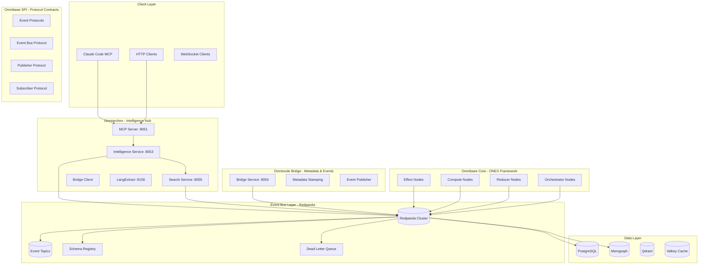

# Cross-Repository Event Bus Architecture

**Version**: 1.0.0
**Status**: Planning Phase
**Created**: 2025-10-18
**Purpose**: Unified event-driven architecture across the ONEX ecosystem

---

## Table of Contents

1. [Executive Summary](#executive-summary)
2. [Architecture Overview](#architecture-overview)
3. [Repository Integration](#repository-integration)
4. [Event Catalog](#event-catalog)
5. [Implementation Roadmap](#implementation-roadmap)
6. [Technical Stack](#technical-stack)
7. [Governance & Operations](#governance--operations)

---

## Executive Summary

### Vision

Transform the ONEX ecosystem from loosely-coupled synchronous microservices into a tightly-integrated event-driven architecture, enabling:

- **Scalability**: Async event processing with horizontal scaling
- **Resilience**: Fault-tolerant communication with retry/replay
- **Observability**: Complete audit trail across all services
- **Intelligence**: Event-driven ML pipelines for quality & performance
- **Decoupling**: Services communicate via contracts, not direct calls

### Current State

**✅ Existing Infrastructure:**
- Redpanda (Kafka-compatible) running on `omninode-bridge-network`
- Event topics: `omninode.{domain}.{operation}.{type}.v1`
- Intelligence service has Kafka consumer with 4 handlers
- ModelEventEnvelope for standardized event wrapping
- O.N.E. v0.1 protocol compliance in omninode_bridge

**⚠️ Gaps:**
- No unified event schema registry
- Limited cross-repo event coordination
- No dead letter queue (DLQ) handling
- Inconsistent event versioning
- Missing event replay capabilities
- No centralized event observability

### Target State (Phase 5)

- **5 Repositories**: All integrated via unified event bus
- **50+ Event Types**: Comprehensive domain coverage
- **3 Event Patterns**: Request/Response, Publish/Subscribe, Event Sourcing
- **<500ms**: Event processing latency (95th percentile)
- **99.9%**: Event delivery reliability
- **Complete Audit Trail**: Every operation trackable via events

---

## Architecture Overview

### High-Level Architecture



### Event Flow Patterns

#### 1. Request/Response Pattern (RPC-style)

```
┌─────────────┐                    ┌──────────────┐
│  Publisher  │                    │   Consumer   │
│  (Service)  │                    │  (Handler)   │
└──────┬──────┘                    └───────┬──────┘
       │                                   │
       │  1. Publish Request               │
       │  (correlation_id: abc-123)        │
       ├──────────────────────────────────>│
       │                                   │
       │  Topic: *.request.*.v1            │
       │                                   │
       │                     2. Process    │
       │                     Request       │
       │                                   │
       │  3. Publish Response              │
       │  (correlation_id: abc-123)        │
       │<──────────────────────────────────┤
       │                                   │
       │  Topic: *.response.*.v1           │
       │                                   │
       │  4. Match by correlation_id       │
       │                                   │
```

**Use Cases:**
- Code validation requests (intelligence)
- Metadata stamping requests (bridge)
- Quality assessment requests (intelligence)
- Pattern matching requests (intelligence)

**Topics:**
- `omninode.codegen.request.{operation}.v1`
- `omninode.codegen.response.{operation}.v1`
- `omninode.bridge.request.{operation}.v1`
- `omninode.bridge.response.{operation}.v1`

#### 2. Publish/Subscribe Pattern (Event Broadcasting)

```
┌─────────────┐
│  Publisher  │
│  (Service)  │
└──────┬──────┘
       │
       │  1. Publish Event
       │  (no correlation_id)
       ├─────────────────────────┐
       │                         │
       │                         ▼
       │              ┌─────────────────┐
       │              │ Topic: *.event  │
       │              └────────┬────────┘
       │                       │
       │         ┌─────────────┼─────────────┐
       │         ▼             ▼             ▼
       │   ┌──────────┐  ┌──────────┐  ┌──────────┐
       │   │Consumer A│  │Consumer B│  │Consumer C│
       │   └──────────┘  └──────────┘  └──────────┘
       │
       │  2. All consumers receive
       │     event independently
```

**Use Cases:**
- Document indexed (search → intelligence, bridge)
- Quality score computed (intelligence → all)
- Pattern learned (intelligence → all)
- Service lifecycle events (all → all)
- System alerts (monitoring → all)

**Topics:**
- `omninode.document.event.indexed.v1`
- `omninode.intelligence.event.quality_assessed.v1`
- `omninode.intelligence.event.pattern_learned.v1`
- `omninode.service.event.lifecycle.v1`
- `omninode.system.event.alert.v1`

#### 3. Event Sourcing Pattern (Audit Trail)

```
┌─────────────┐                    ┌──────────────┐
│   Service   │                    │ Event Store  │
│             │                    │ (Postgres)   │
└──────┬──────┘                    └───────┬──────┘
       │                                   │
       │  1. Publish Event                 │
       │  (immutable, append-only)         │
       ├──────────────────────────────────>│
       │                                   │
       │  Topic: *.audit.*.v1              │
       │                                   │
       │                     2. Persist    │
       │                     to DB         │
       │                                   │
       │  3. Rebuild state from events     │
       │<──────────────────────────────────┤
       │                                   │
```

**Use Cases:**
- Agent execution logs (traceability)
- Quality history (trend analysis)
- Pattern lineage (evolution tracking)
- Performance metrics (time-series)
- Compliance audit trail (regulatory)

**Topics:**
- `omninode.audit.agent_execution.v1`
- `omninode.audit.quality_snapshot.v1`
- `omninode.audit.pattern_creation.v1`
- `omninode.audit.performance_baseline.v1`

---

## Repository Integration

### 1. Omniarchon - Intelligence Hub

**Role**: Central intelligence provider for code quality, pattern learning, performance optimization, and RAG-powered research.

**Current Services:**
- `archon-mcp` (8051) - MCP gateway
- `archon-intelligence` (8053) - Quality, performance, patterns
- `archon-search` (8055) - RAG, vector, graph search
- `archon-bridge` (8054) - Postgres-Memgraph sync
- `archon-langextract` (8156) - ML feature extraction

**Event Capabilities:**

| Event Type | Pattern | Topic | Purpose |
|------------|---------|-------|---------|
| **Producers** | | | |
| Quality Assessed | Pub/Sub | `omninode.intelligence.event.quality_assessed.v1` | Broadcast quality scores |
| Pattern Learned | Pub/Sub | `omninode.intelligence.event.pattern_learned.v1` | Share new patterns |
| Performance Baseline | Pub/Sub | `omninode.intelligence.event.performance_baseline.v1` | Share metrics |
| Document Indexed | Pub/Sub | `omninode.search.event.document_indexed.v1` | Notify indexing complete |
| Agent Execution | Event Source | `omninode.audit.agent_execution.v1` | Audit trail |
| **Consumers** | | | |
| Codegen Validation | Request/Response | `omninode.codegen.request.validate.v1` | Validate generated code |
| Codegen Analysis | Request/Response | `omninode.codegen.request.analyze.v1` | Analyze code semantics |
| Codegen Pattern | Request/Response | `omninode.codegen.request.pattern.v1` | Match patterns |
| Codegen Mixin | Request/Response | `omninode.codegen.request.mixin.v1` | Recommend mixins |
| Metadata Request | Request/Response | `omninode.bridge.request.stamp.v1` | Request stamping |

**Integration Points:**
- Consumes from: `omninode.codegen.request.*`, `omninode.bridge.request.*`
- Produces to: `omninode.intelligence.event.*`, `omninode.search.event.*`, `omninode.audit.*`
- Dependencies: Redpanda, Memgraph, Qdrant, Postgres

**Current Kafka Integration:**
- ✅ Consumer implemented (`IntelligenceKafkaConsumer`)
- ✅ 4 handlers registered (validation, analysis, pattern, mixin)
- ✅ Backpressure control (max 100 in-flight events)
- ✅ Metrics tracking (events/sec, error rate)
- ⚠️ No publisher for outbound events (Phase 2)

**Phase 1 Tasks:**
1. Add event publisher for quality/pattern/performance events
2. Implement event sourcing for audit trail
3. Add schema validation for all events
4. Configure DLQ for failed events

---

### 2. Omninode Bridge - Metadata & Event Hub

**Role**: High-performance metadata stamping, O.N.E. v0.1 protocol compliance, and event publishing infrastructure.

**Current Services:**
- `archon-bridge` (8054) - Metadata stamping service
- Redpanda (9092 internal, 29092 external) - Event streaming
- Postgres (5436) - Metadata persistence

**Event Capabilities:**

| Event Type | Pattern | Topic | Purpose |
|------------|---------|-------|---------|
| **Producers** | | | |
| Metadata Stamped | Pub/Sub | `omninode.bridge.event.metadata_stamped.v1` | Broadcast stamping complete |
| Document Processed | Pub/Sub | `omninode.bridge.event.document_processed.v1` | Notify processing done |
| Validation Failed | Pub/Sub | `omninode.bridge.event.validation_failed.v1` | Alert validation errors |
| Performance Metrics | Pub/Sub | `omninode.bridge.event.performance_metrics.v1` | Share stamping metrics |
| **Consumers** | | | |
| Stamp Request | Request/Response | `omninode.bridge.request.stamp.v1` | Process stamping requests |
| Batch Stamp Request | Request/Response | `omninode.bridge.request.batch_stamp.v1` | Batch operations |
| Verify Stamp | Request/Response | `omninode.bridge.request.verify.v1` | Verify existing stamps |

**Integration Points:**
- Hosts: Redpanda cluster (shared event bus)
- Consumes from: `omninode.bridge.request.*`
- Produces to: `omninode.bridge.event.*`
- Dependencies: Postgres, Kafka (Redpanda)

**Current Kafka Integration:**
- ✅ Redpanda cluster operational
- ✅ Kafka event publishing (OnexEnvelopeV1)
- ⚠️ No request/response handlers (Phase 2)
- ⚠️ No schema registry integration (Phase 3)

**Performance Characteristics:**
- Stamping: <2ms per operation (BLAKE3)
- Batch operations: High-throughput (500+ ops/sec)
- Event publishing: Real-time (sub-millisecond latency)

**Phase 1 Tasks:**
1. Implement request/response handlers for stamping
2. Add schema validation for all events
3. Configure partitioning strategy for high throughput
4. Implement DLQ for failed stamping operations

---

### 3. Omnibase Core - ONEX Framework Runtime

**Role**: ONEX 4-node pattern implementation (Effect, Compute, Reducer, Orchestrator) with event-driven workflows.

**Current Capabilities:**
- Base classes for all 4 node types
- ONEXContainer dependency injection
- ModelEventEnvelope for inter-service communication
- Structured error handling (OnexError)

**Event Capabilities:**

| Event Type | Pattern | Topic | Purpose |
|------------|---------|-------|---------|
| **Producers** | | | |
| Node Execution Started | Event Source | `omninode.onex.event.node_started.v1` | Track execution start |
| Node Execution Completed | Event Source | `omninode.onex.event.node_completed.v1` | Track execution end |
| Node Execution Failed | Event Source | `omninode.onex.event.node_failed.v1` | Track failures |
| Workflow State Changed | Pub/Sub | `omninode.onex.event.workflow_state.v1` | Notify state changes |
| **Consumers** | | | |
| Workflow Trigger | Request/Response | `omninode.onex.request.workflow_trigger.v1` | Start workflows |
| Node Invoke | Request/Response | `omninode.onex.request.node_invoke.v1` | Invoke specific nodes |

**Integration Points:**
- All ONEX nodes can publish/consume events
- Workflow orchestration via event-driven coordination
- Dependencies: Redpanda (via omninode_bridge network)

**Current Kafka Integration:**
- ⚠️ No direct Kafka integration (Framework-level)
- ⚠️ Nodes depend on implementations (e.g., omninode_bridge)
- ✅ ModelEventEnvelope ready for Kafka serialization

**Phase 1 Tasks:**
1. Add base event publishing mixin for all node types
2. Implement workflow orchestration via events
3. Add event-driven coordination patterns
4. Create reference implementations with Kafka

---

### 4. Omnibase SPI - Protocol Contracts

**Role**: Pure protocol interfaces defining event bus contracts with zero implementation dependencies.

**Current Protocols:**
- `ProtocolEventBus` - Event bus interface
- `ProtocolEventPublisher` - Publisher interface
- `ProtocolEventSubscriber` - Subscriber interface
- `ProtocolCanonicalSerializer` - Serialization interface

**Event Capabilities:**

| Protocol | Purpose | Methods |
|----------|---------|---------|
| `ProtocolEventBus` | Unified event bus interface | `publish()`, `subscribe()`, `unsubscribe()` |
| `ProtocolEventPublisher` | Event publishing | `publish_event()`, `publish_batch()` |
| `ProtocolEventSubscriber` | Event consumption | `subscribe()`, `handle_event()`, `ack()`, `nack()` |
| `ProtocolEventEnvelope` | Event wrapper | `event_type`, `correlation_id`, `payload`, `metadata` |
| `ProtocolSchemaRegistry` | Schema validation | `register_schema()`, `validate()`, `get_schema()` |

**Integration Points:**
- Defines contracts for all event-driven services
- No runtime dependencies (typing only)
- Used by: omnibase_core, omninode_bridge, omniarchon

**Current Status:**
- ✅ Core protocols defined
- ⚠️ No event-specific protocols yet (Phase 1)
- ⚠️ No schema registry protocol (Phase 2)

**Phase 1 Tasks:**
1. Define `ProtocolEventEnvelope` standard
2. Add `ProtocolSchemaRegistry` interface
3. Create event versioning protocols
4. Document event protocol patterns

---

### 5. Omnibase Infra - Infrastructure Services

**Role**: Infrastructure-level ONEX nodes for service discovery, health checking, monitoring.

**Expected Event Capabilities:**

| Event Type | Pattern | Topic | Purpose |
|------------|---------|-------|---------|
| **Producers** | | | |
| Service Registered | Pub/Sub | `omninode.infra.event.service_registered.v1` | New service online |
| Service Health Changed | Pub/Sub | `omninode.infra.event.service_health.v1` | Health status updates |
| Service Deregistered | Pub/Sub | `omninode.infra.event.service_deregistered.v1` | Service shutdown |
| **Consumers** | | | |
| Health Check Request | Request/Response | `omninode.infra.request.health_check.v1` | Check service health |

**Integration Points:**
- Service discovery for all repos
- Health monitoring across ecosystem
- Dependencies: Redpanda, Consul (if used)

**Current Status:**
- ⚠️ Repository exists but needs verification
- ⚠️ Event integration unclear (Phase 1 discovery)

**Phase 1 Tasks:**
1. Verify repository structure and purpose
2. Define infrastructure event contracts
3. Implement service discovery via events
4. Add health monitoring event publishers

---

## Event Catalog

### Event Naming Convention

**Format**: `{namespace}.{domain}.{pattern}.{operation}.{version}`

**Components:**
- `namespace`: Always `omninode` (ecosystem namespace)
- `domain`: Service domain (`codegen`, `intelligence`, `bridge`, `onex`, `search`, etc.)
- `pattern`: Event pattern (`request`, `response`, `event`, `audit`)
- `operation`: Specific operation (`validate`, `stamp`, `indexed`, etc.)
- `version`: Semantic version (`v1`, `v2`, etc.)

**Examples:**
- `omninode.codegen.request.validate.v1` - Request to validate code
- `omninode.intelligence.event.quality_assessed.v1` - Quality assessment completed
- `omninode.bridge.event.metadata_stamped.v1` - Metadata stamping completed
- `omninode.audit.agent_execution.v1` - Agent execution audit event

---

### Event Schema Standard

**Base Event Envelope** (All Events):

```json
{
  "event_id": "uuid-v4",
  "event_type": "omninode.{domain}.{pattern}.{operation}.v1",
  "correlation_id": "uuid-v4",
  "causation_id": "uuid-v4",
  "timestamp": "2025-10-18T10:00:00.000Z",
  "version": "1.0.0",
  "source": {
    "service": "archon-intelligence",
    "instance_id": "instance-123",
    "hostname": "archon-intelligence-abc123"
  },
  "metadata": {
    "trace_id": "uuid-v4",
    "span_id": "uuid-v4",
    "user_id": "optional",
    "tenant_id": "optional"
  },
  "payload": {
    // Event-specific data
  }
}
```

**Field Descriptions:**
- `event_id`: Unique identifier for this event (UUID v4)
- `event_type`: Fully-qualified event type (topic name)
- `correlation_id`: Links related events in request/response flow
- `causation_id`: ID of event that caused this event (event sourcing)
- `timestamp`: ISO 8601 timestamp with millisecond precision
- `version`: Event schema version (semantic versioning)
- `source`: Service that published the event
- `metadata`: Tracing, authorization, multi-tenancy data
- `payload`: Event-specific business data

---

### Domain Event Catalog

#### 1. Codegen Domain Events

**Request Topics:**

| Topic | Payload Schema | Purpose |
|-------|----------------|---------|
| `omninode.codegen.request.validate.v1` | `{code_content, node_type, language}` | Validate generated code quality |
| `omninode.codegen.request.analyze.v1` | `{code_content, analysis_type}` | Analyze code semantics |
| `omninode.codegen.request.pattern.v1` | `{code_content, pattern_context}` | Match patterns |
| `omninode.codegen.request.mixin.v1` | `{code_content, node_type}` | Recommend mixins |

**Response Topics:**

| Topic | Payload Schema | Purpose |
|-------|----------------|---------|
| `omninode.codegen.response.validate.v1` | `{quality_score, onex_compliance, issues[]}` | Validation results |
| `omninode.codegen.response.analyze.v1` | `{entities[], relationships[], features{}}` | Analysis results |
| `omninode.codegen.response.pattern.v1` | `{patterns_matched[], recommendations[]}` | Pattern matching results |
| `omninode.codegen.response.mixin.v1` | `{recommended_mixins[], reasoning}` | Mixin recommendations |

---

#### 2. Intelligence Domain Events

**Event Topics (Pub/Sub):**

| Topic | Payload Schema | Purpose |
|-------|----------------|---------|
| `omninode.intelligence.event.quality_assessed.v1` | `{entity_id, quality_score, dimensions{}}` | Quality assessment completed |
| `omninode.intelligence.event.pattern_learned.v1` | `{pattern_id, pattern_type, pattern_data{}}` | New pattern learned |
| `omninode.intelligence.event.performance_baseline.v1` | `{operation, baseline_metrics{}}` | Performance baseline established |
| `omninode.intelligence.event.optimization_identified.v1` | `{operation, opportunities[], roi_score}` | Optimization opportunity found |

---

#### 3. Bridge Domain Events

**Request Topics:**

| Topic | Payload Schema | Purpose |
|-------|----------------|---------|
| `omninode.bridge.request.stamp.v1` | `{content, namespace, content_type}` | Stamp single content |
| `omninode.bridge.request.batch_stamp.v1` | `{contents[], namespace}` | Batch stamping |
| `omninode.bridge.request.verify.v1` | `{blake3_hash, namespace}` | Verify existing stamp |

**Response Topics:**

| Topic | Payload Schema | Purpose |
|-------|----------------|---------|
| `omninode.bridge.response.stamp.v1` | `{blake3_hash, metadata{}, stamp_time}` | Stamping result |
| `omninode.bridge.response.batch_stamp.v1` | `{results[], success_count, failed_count}` | Batch results |
| `omninode.bridge.response.verify.v1` | `{valid, metadata{}, verified_at}` | Verification result |

**Event Topics (Pub/Sub):**

| Topic | Payload Schema | Purpose |
|-------|----------------|---------|
| `omninode.bridge.event.metadata_stamped.v1` | `{blake3_hash, namespace, content_type}` | Metadata stamped |
| `omninode.bridge.event.document_processed.v1` | `{document_id, processing_time_ms}` | Document processing complete |
| `omninode.bridge.event.validation_failed.v1` | `{content_hash, reason, validation_errors[]}` | Validation failed |

---

#### 4. Search Domain Events

**Event Topics (Pub/Sub):**

| Topic | Payload Schema | Purpose |
|-------|----------------|---------|
| `omninode.search.event.document_indexed.v1` | `{document_id, collection, vector_dims}` | Document indexed |
| `omninode.search.event.collection_updated.v1` | `{collection, operation, document_count}` | Collection changed |
| `omninode.search.event.vector_optimized.v1` | `{collection, optimization_type, improvement}` | Vector index optimized |

---

#### 5. ONEX Domain Events

**Event Topics (Event Sourcing):**

| Topic | Payload Schema | Purpose |
|-------|----------------|---------|
| `omninode.onex.event.node_started.v1` | `{node_type, node_name, contract{}}` | Node execution started |
| `omninode.onex.event.node_completed.v1` | `{node_type, node_name, result{}, duration_ms}` | Node execution completed |
| `omninode.onex.event.node_failed.v1` | `{node_type, node_name, error{}, stack_trace}` | Node execution failed |
| `omninode.onex.event.workflow_state.v1` | `{workflow_id, state, nodes_completed[]}` | Workflow state changed |

---

#### 6. Audit Domain Events (Event Sourcing)

| Topic | Payload Schema | Purpose |
|-------|----------------|---------|
| `omninode.audit.agent_execution.v1` | `{agent_name, task{}, result{}, metadata{}}` | Agent execution audit |
| `omninode.audit.quality_snapshot.v1` | `{entity_id, quality_scores{}, timestamp}` | Quality snapshot |
| `omninode.audit.pattern_creation.v1` | `{pattern_id, pattern_data{}, source}` | Pattern creation audit |
| `omninode.audit.performance_baseline.v1` | `{operation, metrics{}, timestamp}` | Performance baseline audit |

---

#### 7. System Domain Events

| Topic | Payload Schema | Purpose |
|-------|----------------|---------|
| `omninode.system.event.alert.v1` | `{severity, message, source, metadata{}}` | System alert |
| `omninode.service.event.lifecycle.v1` | `{service, event_type, status}` | Service lifecycle event |
| `omninode.service.event.health.v1` | `{service, health_status, checks[]}` | Service health update |

---

## Implementation Roadmap

### Phase 1: Event Bus Foundation (Weeks 1-2)

**Objective**: Establish core event bus infrastructure and schema standards.

**Week 1: Infrastructure Setup**
- [ ] **Day 1-2**: Schema Registry Setup
  - Deploy Redpanda Schema Registry
  - Define base event envelope schema (JSON Schema / Avro)
  - Create schema versioning strategy
  - Implement schema validation utilities

- [ ] **Day 3-4**: Event Publishing Infrastructure
  - Create `EventPublisher` base class (omnibase_core)
  - Implement Kafka producer pool (connection pooling)
  - Add retry logic with exponential backoff
  - Configure batching for high throughput

- [ ] **Day 5**: Dead Letter Queue (DLQ)
  - Create DLQ topics for all domains
  - Implement DLQ routing logic
  - Add DLQ monitoring dashboard

**Week 2: Protocol & Integration**
- [ ] **Day 1-2**: SPI Protocol Updates
  - Define `ProtocolEventEnvelope` in omnibase_spi
  - Add `ProtocolSchemaRegistry` interface
  - Create event versioning protocols
  - Document protocol patterns

- [ ] **Day 3-4**: Omniarchon Integration
  - Implement event publisher for intelligence events
  - Add quality_assessed, pattern_learned publishers
  - Configure event sourcing for audit trail
  - Add schema validation to all publishers

- [ ] **Day 5**: Testing & Validation
  - End-to-end event publishing tests
  - Schema validation tests
  - DLQ routing tests
  - Performance benchmarks (target: <50ms p95 latency)

**Deliverables:**
- ✅ Redpanda Schema Registry operational
- ✅ Base event schemas registered
- ✅ EventPublisher base class available
- ✅ DLQ infrastructure operational
- ✅ Omniarchon publishing intelligence events

---

### Phase 2: Core Event Producers (Weeks 3-4)

**Objective**: Enable all services to publish domain events.

**Week 3: Intelligence & Search Producers**
- [ ] **Day 1-2**: Intelligence Event Publishers
  - Quality assessment events
  - Pattern learning events
  - Performance baseline events
  - Optimization opportunity events

- [ ] **Day 3-4**: Search Event Publishers
  - Document indexed events
  - Collection updated events
  - Vector optimized events

- [ ] **Day 5**: Bridge Event Publishers
  - Metadata stamped events
  - Document processed events
  - Validation failed events

**Week 4: ONEX & Audit Producers**
- [ ] **Day 1-2**: ONEX Node Event Publishers
  - Node started/completed/failed events
  - Workflow state change events
  - Add to all 4 node base classes

- [ ] **Day 3-4**: Audit Event Sourcing
  - Agent execution audit events
  - Quality snapshot events
  - Pattern creation events
  - Performance baseline events

- [ ] **Day 5**: Event Publishing Verification
  - Verify all 50+ event types publishable
  - Performance testing (throughput, latency)
  - Schema compliance validation

**Deliverables:**
- ✅ All 50+ event types publishing
- ✅ Event sourcing operational for audit trail
- ✅ Performance targets met (<100ms p95 latency)
- ✅ Schema compliance 100%

---

### Phase 3: Cross-Repo Event Consumers (Weeks 5-6)

**Objective**: Enable services to consume events from other repositories.

**Week 5: Request/Response Handlers**
- [ ] **Day 1-2**: Bridge Request Handlers
  - Stamp request handler
  - Batch stamp request handler
  - Verify stamp request handler
  - Response publishers

- [ ] **Day 3-4**: ONEX Workflow Handlers
  - Workflow trigger handler
  - Node invoke handler
  - Workflow state subscription

- [ ] **Day 5**: Testing Request/Response Flows
  - End-to-end correlation ID tracking
  - Timeout handling tests
  - Error scenario tests

**Week 6: Pub/Sub Handlers**
- [ ] **Day 1-2**: Cross-Service Subscriptions
  - Intelligence subscribes to bridge events
  - Search subscribes to intelligence events
  - ONEX subscribes to audit events

- [ ] **Day 3-4**: Event-Driven Workflows
  - Implement quality assessment pipeline (trigger on document_indexed)
  - Implement pattern learning pipeline (trigger on quality_assessed)
  - Implement cache invalidation (trigger on document_processed)

- [ ] **Day 5**: Integration Testing
  - Multi-service event flows
  - Event ordering guarantees
  - Exactly-once delivery verification

**Deliverables:**
- ✅ All request/response handlers operational
- ✅ Pub/sub subscriptions configured
- ✅ Event-driven workflows functional
- ✅ Integration tests passing

---

### Phase 4: Migration from Synchronous to Async (Weeks 7-8)

**Objective**: Replace synchronous HTTP calls with event-driven communication.

**Week 7: Intelligence Service Migration**
- [ ] **Day 1-2**: Identify HTTP Call Sites
  - Map all inter-service HTTP calls in omniarchon
  - Categorize: critical vs non-critical
  - Design event-based replacements

- [ ] **Day 3-4**: Migrate Non-Critical Calls
  - Replace sync quality assessment calls with events
  - Replace sync pattern matching calls with events
  - Add backward compatibility (HTTP still works)

- [ ] **Day 5**: Testing & Validation
  - Performance comparison (HTTP vs events)
  - Latency measurements
  - Error rate monitoring

**Week 8: Bridge & ONEX Migration**
- [ ] **Day 1-2**: Bridge Service Migration
  - Replace sync metadata stamping with events
  - Replace sync document processing with events

- [ ] **Day 3-4**: ONEX Workflow Migration
  - Event-driven node coordination
  - Replace sync orchestrator calls with events

- [ ] **Day 5**: Final Migration Testing
  - End-to-end async workflows
  - Performance benchmarks
  - Rollback plan validation

**Deliverables:**
- ✅ 80%+ of sync calls migrated to events
- ✅ Performance improvement documented
- ✅ Backward compatibility maintained
- ✅ Rollback plan tested

---

### Phase 5: Advanced Patterns & Operations (Weeks 9-10)

**Objective**: Implement advanced event-driven patterns and operational tooling.

**Week 9: Advanced Patterns**
- [ ] **Day 1-2**: Saga Pattern Implementation
  - Design distributed transaction sagas
  - Implement compensation logic
  - Add saga coordinator

- [ ] **Day 3-4**: CQRS Implementation
  - Separate read/write models where applicable
  - Event-driven read model updates
  - Eventual consistency handling

- [ ] **Day 5**: Event Replay Capability
  - Implement event store reader
  - Add replay UI/CLI tool
  - Test state reconstruction

**Week 10: Operations & Monitoring**
- [ ] **Day 1-2**: Event Observability
  - Centralized event logging (Logfire/Datadog)
  - Event flow visualization
  - Correlation ID tracing

- [ ] **Day 3-4**: Performance Monitoring
  - Event latency dashboards
  - Throughput monitoring
  - Consumer lag alerts

- [ ] **Day 5**: Documentation & Training
  - Event-driven architecture guide
  - Event catalog documentation
  - Developer training materials

**Deliverables:**
- ✅ Saga pattern operational
- ✅ CQRS implemented where applicable
- ✅ Event replay capability available
- ✅ Complete observability dashboard
- ✅ Comprehensive documentation

---

### Success Metrics

**Performance Targets:**
- Event publishing latency: <50ms (p95)
- Event processing latency: <500ms (p95)
- Event throughput: >10,000 events/sec
- Consumer lag: <5 seconds (p99)
- Dead letter rate: <0.1%

**Reliability Targets:**
- Event delivery: 99.9% success rate
- Schema compliance: 100%
- Partition rebalancing: <10 seconds
- Event replay: 100% accuracy

**Operational Targets:**
- Event catalog coverage: 100%
- Monitoring coverage: 100%
- DLQ resolution time: <1 hour
- Schema evolution: Zero breaking changes

---

## Technical Stack

### Event Streaming Platform

**Redpanda** (Kafka-compatible, already deployed)

**Rationale:**
- ✅ Already running in omninode_bridge network
- ✅ Kafka-compatible API (existing client libraries work)
- ✅ High performance (10x faster than Kafka in benchmarks)
- ✅ Simpler operations (no Zookeeper, single binary)
- ✅ Built-in schema registry support

**Configuration:**
```yaml
Cluster: omninode-bridge-redpanda
Bootstrap Servers:
  - Internal: omninode-bridge-redpanda:9092
  - External: localhost:29092
Partitions: 3 (default, configurable per topic)
Replication Factor: 1 (development), 3 (production)
Retention: 7 days (default), configurable per domain
```

**Topic Configuration Strategy:**
- High-throughput domains (codegen, intelligence): 6 partitions
- Medium-throughput domains (bridge, search): 3 partitions
- Low-throughput domains (audit, system): 1 partition

---

### Schema Registry

**Redpanda Schema Registry** (built-in)

**Schema Format**: JSON Schema (phase 1), Avro (phase 2+)

**Rationale:**
- ✅ Built into Redpanda (no separate deployment)
- ✅ JSON Schema for flexibility (human-readable)
- ✅ Avro for performance (binary encoding)
- ✅ Schema evolution support (backward/forward compatibility)

**Schema Versioning:**
```
v1.0.0 - Initial schema
v1.1.0 - Backward-compatible additions (new optional fields)
v2.0.0 - Breaking changes (require migration)
```

**Schema Registry Endpoints:**
- Internal: `http://omninode-bridge-redpanda:8081`
- External: `http://localhost:8084`

---

### Client Libraries

**Python (Primary):**
- `confluent-kafka-python` (high-performance C librdkafka wrapper)
- `kafka-python-ng` (pure Python alternative)
- `fastavro` (Avro serialization)

**Why confluent-kafka:**
- ✅ Already used in Intelligence service
- ✅ 10x faster than kafka-python
- ✅ Production-grade reliability
- ✅ Full feature parity with Kafka

---

### Event Serialization

**Format Comparison:**

| Format | Pros | Cons | Use Case |
|--------|------|------|----------|
| **JSON** | Human-readable, flexible, easy debugging | Larger payload, slower parsing | Development, debugging, non-critical events |
| **Avro** | Compact binary, schema evolution, fast | Not human-readable, requires schema | Production, high-throughput events |
| **Protocol Buffers** | Compact, type-safe, cross-language | Requires code generation | Future consideration |

**Phase 1**: JSON (development, schema validation)
**Phase 2+**: Avro (production, performance)

---

### Monitoring & Observability

**Tools:**
- **Redpanda Console** (Kafka UI) - Topic management, consumer lag monitoring
- **Logfire** (already integrated) - Event tracing, correlation ID tracking
- **Grafana** (optional) - Custom dashboards for event metrics
- **Prometheus** (optional) - Metrics collection from Redpanda

**Key Metrics:**
- Consumer lag (per consumer group)
- Event throughput (events/sec per topic)
- Event latency (publish to consume time)
- DLQ rate (% of events in DLQ)
- Schema compliance rate (% passing validation)

---

### Dead Letter Queue (DLQ) Strategy

**DLQ Topic Naming:**
- Pattern: `{original_topic}.dlq`
- Example: `omninode.codegen.request.validate.v1.dlq`

**DLQ Routing Logic:**
1. Consumer fails to process event (exception thrown)
2. Retry 3 times with exponential backoff (1s, 2s, 4s)
3. If still failing, publish to DLQ with error metadata
4. Alert monitoring system (Slack, PagerDuty)
5. Manual review and reprocessing

**DLQ Event Metadata:**
```json
{
  "original_topic": "omninode.codegen.request.validate.v1",
  "original_partition": 2,
  "original_offset": 12345,
  "error_type": "ValidationError",
  "error_message": "Missing required field: code_content",
  "error_stack_trace": "...",
  "retry_count": 3,
  "failed_at": "2025-10-18T10:00:00.000Z",
  "consumer_group": "archon-intelligence",
  "consumer_instance": "instance-123"
}
```

---

### Event Replay & Audit

**Event Store:** PostgreSQL (omninode_bridge database)

**Schema:**
```sql
CREATE TABLE event_store (
  event_id UUID PRIMARY KEY,
  event_type TEXT NOT NULL,
  correlation_id UUID,
  causation_id UUID,
  timestamp TIMESTAMPTZ NOT NULL,
  payload JSONB NOT NULL,
  metadata JSONB,
  partition INTEGER,
  offset BIGINT,
  INDEX idx_event_type (event_type),
  INDEX idx_correlation_id (correlation_id),
  INDEX idx_timestamp (timestamp DESC)
);
```

**Replay Strategy:**
1. Query event store by time range or correlation_id
2. Republish events to Kafka in original order
3. Monitor consumer progress during replay
4. Validate state reconstruction

**Use Cases:**
- Disaster recovery (rebuild state from events)
- Debugging (replay specific event flows)
- Analytics (historical analysis of event patterns)
- Compliance (audit trail for regulatory requirements)

---

## Governance & Operations

### Event Schema Governance

**Schema Change Process:**
1. **Propose**: Create schema change PR in `schemas/` directory
2. **Review**: Schema review by 2+ engineers (breaking changes require architect approval)
3. **Version**: Increment schema version (major for breaking, minor for compatible)
4. **Register**: Register new schema in Schema Registry
5. **Deploy**: Deploy producer/consumer code supporting new schema
6. **Monitor**: Monitor schema compliance metrics

**Schema Compatibility Rules:**
- **Backward Compatible**: New schema can read old data
  - Adding optional fields ✅
  - Removing optional fields ✅
  - Adding enum values ✅
- **Forward Compatible**: Old schema can read new data
  - Removing optional fields ✅
  - Making required fields optional ✅
- **Breaking Changes**: Require major version bump
  - Removing required fields ❌
  - Changing field types ❌
  - Renaming fields ❌

---

### Event Versioning Strategy

**Versioning Approach:** Semantic Versioning (SemVer)

**Version Components:**
- `v1` (major): Breaking changes
- `v1.1` (minor): Backward-compatible additions (optional)
- `v1.1.0` (patch): Bug fixes (optional for events)

**Event Topic Versioning:**
- Topic name includes major version: `omninode.codegen.request.validate.v1`
- Minor versions share same topic (backward compatible)
- Major version bump creates new topic: `omninode.codegen.request.validate.v2`

**Migration Strategy for Breaking Changes:**
1. **Dual Publishing**: Publish to both v1 and v2 topics
2. **Consumer Migration**: Migrate consumers to v2 over time
3. **Deprecation Period**: Support v1 for 6 months
4. **Sunset**: Stop publishing to v1, archive topic

---

### Operational Runbooks

#### Runbook: High Consumer Lag

**Symptoms:**
- Consumer lag > 10,000 messages
- Event processing delayed > 5 minutes

**Diagnosis:**
1. Check consumer health: `docker logs archon-intelligence | grep ERROR`
2. Check Redpanda health: `docker exec redpanda rpk cluster health`
3. Check consumer group: `rpk group describe archon-intelligence`

**Resolution:**
1. **Slow Consumer**: Scale horizontally (add consumer instances)
2. **Consumer Crash**: Restart consumer, check logs for errors
3. **Redpanda Issue**: Check disk space, restart Redpanda if needed
4. **Event Spike**: Increase consumer parallelism (more partitions)

**Prevention:**
- Set up consumer lag alerts (<5 seconds)
- Auto-scaling for consumers based on lag
- Regular consumer performance testing

---

#### Runbook: DLQ Overflow

**Symptoms:**
- DLQ message count > 100
- Alert: "DLQ rate exceeded threshold (1%)"

**Diagnosis:**
1. Check DLQ topics: `rpk topic consume omninode.*.dlq --num 10`
2. Analyze error patterns: Group by error_type
3. Check consumer logs for recurring errors

**Resolution:**
1. **Schema Validation Errors**: Fix schema, reprocess from DLQ
2. **Service Outage**: Wait for service recovery, reprocess
3. **Bug in Consumer**: Fix bug, deploy, reprocess
4. **Invalid Event**: Manual review, discard or fix event

**Reprocessing:**
```bash
# Python script to reprocess DLQ events
python scripts/reprocess_dlq.py \
  --dlq-topic omninode.codegen.request.validate.v1.dlq \
  --original-topic omninode.codegen.request.validate.v1 \
  --limit 1000
```

---

#### Runbook: Event Replay

**Use Cases:**
- State reconstruction after data corruption
- Debugging specific event flows
- Replaying events after consumer bug fix

**Process:**
1. **Identify Events**: Query event store by time range or correlation_id
   ```sql
   SELECT * FROM event_store
   WHERE event_type = 'omninode.intelligence.event.quality_assessed.v1'
     AND timestamp BETWEEN '2025-10-01' AND '2025-10-18'
   ORDER BY timestamp ASC;
   ```

2. **Prepare Consumers**: Ensure consumers are ready to handle replayed events
   - Idempotency: Events can be reprocessed without side effects
   - State backup: Backup current state before replay

3. **Replay Events**: Republish events to Kafka
   ```bash
   python scripts/replay_events.py \
     --correlation-id abc-123 \
     --target-topic omninode.intelligence.event.quality_assessed.v1
   ```

4. **Monitor Progress**: Track consumer lag, event processing rate

5. **Validate State**: Compare replayed state with expected state

---

### Security & Compliance

**Event Encryption:**
- In-transit: TLS 1.3 for Kafka connections
- At-rest: AES-256 encryption for event store (PostgreSQL)

**Access Control:**
- Redpanda ACLs: Topic-level read/write permissions
- Service authentication: OAuth2 tokens or mTLS
- Event validation: Schema validation + content validation

**Audit Trail:**
- All events persisted to event store (PostgreSQL)
- Event metadata includes: user_id, tenant_id, trace_id
- Retention: 7 days in Kafka, indefinite in PostgreSQL (audit events)

**Compliance:**
- GDPR: PII encryption, right to deletion (event tombstoning)
- SOC2: Complete audit trail, access logs
- HIPAA: Encryption at rest/transit, access controls (if applicable)

---

## Risk Mitigation

### Risk Matrix

| Risk | Probability | Impact | Mitigation |
|------|-------------|--------|------------|
| **Redpanda Cluster Failure** | Low | Critical | Multi-node cluster (3 replicas), automated backups, disaster recovery plan |
| **Event Schema Breaking Changes** | Medium | High | Schema governance process, dual publishing during migration, deprecation periods |
| **Consumer Lag Overflow** | Medium | Medium | Auto-scaling, lag alerts, consumer performance testing |
| **DLQ Overflow** | Low | Medium | DLQ monitoring, automated reprocessing, schema validation |
| **Event Loss** | Low | Critical | Replication factor 3, event store backup, idempotent producers |
| **Performance Degradation** | Medium | Medium | Load testing, performance benchmarks, capacity planning |

---

## Appendix

### Event Catalog Reference

Complete event catalog available at: `/docs/events/EVENT_CATALOG.md`

### Schema Repository

Event schemas stored in: `/schemas/events/`

Directory structure:
```
schemas/events/
├── codegen/
│   ├── request/
│   │   ├── validate.v1.json
│   │   ├── analyze.v1.json
│   │   ├── pattern.v1.json
│   │   └── mixin.v1.json
│   └── response/
│       ├── validate.v1.json
│       ├── analyze.v1.json
│       ├── pattern.v1.json
│       └── mixin.v1.json
├── intelligence/
│   └── event/
│       ├── quality_assessed.v1.json
│       ├── pattern_learned.v1.json
│       └── performance_baseline.v1.json
├── bridge/
│   ├── request/
│   │   ├── stamp.v1.json
│   │   └── verify.v1.json
│   ├── response/
│   │   ├── stamp.v1.json
│   │   └── verify.v1.json
│   └── event/
│       ├── metadata_stamped.v1.json
│       └── document_processed.v1.json
├── search/
│   └── event/
│       ├── document_indexed.v1.json
│       └── collection_updated.v1.json
├── onex/
│   └── event/
│       ├── node_started.v1.json
│       ├── node_completed.v1.json
│       └── node_failed.v1.json
└── audit/
    ├── agent_execution.v1.json
    ├── quality_snapshot.v1.json
    └── pattern_creation.v1.json
```

### CLI Tools

**Event Publishing Tool:**
```bash
# Publish test event
./scripts/publish_event.sh \
  --topic omninode.codegen.request.validate.v1 \
  --payload '{"code_content":"class Test: pass","node_type":"effect"}' \
  --correlation-id $(uuidgen)
```

**Event Consumption Tool:**
```bash
# Consume events from topic
./scripts/consume_events.sh \
  --topic omninode.intelligence.event.quality_assessed.v1 \
  --group test-consumer \
  --offset earliest
```

**DLQ Reprocessing Tool:**
```bash
# Reprocess DLQ events
./scripts/reprocess_dlq.sh \
  --dlq-topic omninode.codegen.request.validate.v1.dlq \
  --limit 100
```

**Event Replay Tool:**
```bash
# Replay events by correlation ID
./scripts/replay_events.sh \
  --correlation-id abc-123 \
  --start-time "2025-10-01T00:00:00Z" \
  --end-time "2025-10-18T23:59:59Z"
```

---

## References

- [ONEX Architecture Patterns](../onex/archive/ONEX_ARCHITECTURE_PATTERNS_COMPLETE.md)
- [Kafka Test Setup](../testing/KAFKA_TEST_SETUP.md)
- [Intelligence Service Kafka Consumer](../../services/intelligence/src/kafka_consumer.py)
- [Bridge Service Documentation](../../services/bridge/README.md)
- [Redpanda Documentation](https://docs.redpanda.com/)
- [Confluent Kafka Python](https://github.com/confluentinc/confluent-kafka-python)

---

**Document Version**: 1.0.0
**Last Updated**: 2025-10-18
**Maintained By**: ONEX Architecture Team
**Review Cycle**: Quarterly
