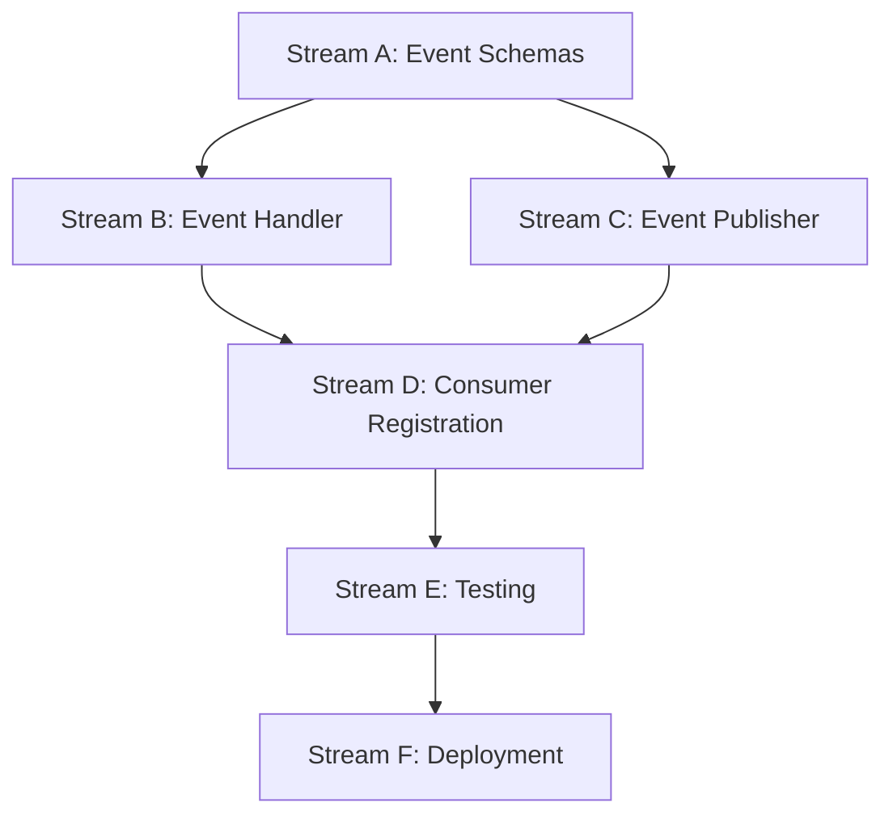

# Tree + Stamping Event Adapter: Requirements Analysis & Parallel Execution Plan

**Version**: 1.0.0
**Status**: Requirements Complete
**Date**: 2025-10-24
**Priority**: Immediate

---

## Executive Summary

### Critical Finding: POC Architecture Was Wrong ❌

The POC document (`POC_TREE_STAMPING_INTEGRATION.md`) **mistakenly proposed REST APIs and MCP tools**. This is **architecturally incorrect** for Archon's event-driven infrastructure.

**WRONG Approach** (from POC):
- ❌ REST API endpoints (`/api/intelligence/file-location/index`, `/search`, `/status`)
- ❌ MCP tools (`find_file_location`)
- ❌ Direct HTTP synchronous calls from external clients

**CORRECT Approach** (Event-Driven):
- ✅ Kafka event adapter node
- ✅ Event consumers listening to topics
- ✅ Event publishers for responses
- ✅ Async, non-blocking, decoupled architecture

### What Already Exists ✅

**Good News**: Most of the hard work is done!

1. **TreeStampingBridge Orchestrator** (`services/intelligence/src/integrations/tree_stamping_bridge.py`)
   - ✅ Complete pipeline: Tree → Intelligence → Stamping → Indexing
   - ✅ Batch processing (100 files at a time)
   - ✅ Parallel execution (asyncio.gather)
   - ✅ Qdrant + Memgraph + Valkey integration
   - ✅ Performance optimized (<5min for 1000 files)

2. **HTTP Clients**
   - ✅ OnexTreeClient (port 8058, service healthy)
   - ✅ MetadataStampingClient (port 8057, service healthy)
   - ✅ Circuit breaker patterns
   - ✅ Retry logic with exponential backoff

3. **Kafka Infrastructure**
   - ✅ KafkaEventPublisher (confluent_kafka producer)
   - ✅ IntelligenceKafkaConsumer (consumer with 21+ handlers registered)
   - ✅ ModelEventEnvelope (event envelope pattern)
   - ✅ BaseResponsePublisher (handler base class)

### What's Missing (THIS is What We Build) 🎯

**Event-Driven Adapter Layer**:

```
┌─────────────────────────────────────────────────────────────────┐
│           KAFKA EVENT BUS (Redpanda)                            │
│  Topic: dev.archon-intelligence.tree.index-project-requested.v1 │
└───────────────────────────┬─────────────────────────────────────┘
                            │
                            ↓
┌─────────────────────────────────────────────────────────────────┐
│     TreeStampingHandler (NEW - Event Consumer)                  │
│  • Consumes indexing request events                             │
│  • Calls existing TreeStampingBridge.index_project()            │
│  • Publishes completion/failure events                          │
└───────────────────────────┬─────────────────────────────────────┘
                            │
                            ↓
┌─────────────────────────────────────────────────────────────────┐
│     TreeStampingBridge (EXISTING - Orchestrator)                │
│  • HTTP calls to OnexTree & Stamping services                   │
│  • Batch processing + parallel execution                        │
│  • Qdrant/Memgraph/Valkey indexing                              │
└───────────────────────────┬─────────────────────────────────────┘
                            │
                            ↓
┌─────────────────────────────────────────────────────────────────┐
│           KAFKA EVENT BUS (Redpanda)                            │
│  Topic: dev.archon-intelligence.tree.index-project-completed.v1 │
└─────────────────────────────────────────────────────────────────┘
```

**Components to Build** (6 work streams):

1. **Event Schemas** - Pydantic models for request/response payloads
2. **Event Handler** - TreeStampingHandler (consumes Kafka events)
3. **Event Publisher** - Response publishing via BaseResponsePublisher
4. **Consumer Registration** - Wire handler into KafkaConsumer
5. **Testing** - Unit + integration tests
6. **Deployment** - Docker config updates

---

## Architecture Deep Dive

### Event Flow (End-to-End)

**1. Indexing Request Event** (Published by external service or API)
```json
{
  "event_id": "550e8400-e29b-41d4-a716-446655440000",
  "event_type": "dev.archon-intelligence.tree.index-project-requested.v1",
  "correlation_id": "660e8400-e29b-41d4-a716-446655440000",
  "timestamp": "2025-10-24T10:00:00.000Z",
  "source": {
    "service": "archon-mcp",
    "instance_id": "instance-123"
  },
  "payload": {
    "project_path": "/path/to/omniarchon",
    "project_name": "omniarchon",
    "include_tests": true,
    "force_reindex": false
  }
}
```

**2. Handler Consumes Event**
```python
class TreeStampingHandler(BaseResponsePublisher):
    def can_handle(self, event_type: str) -> bool:
        return event_type in [
            "tree.index-project-requested",
            "dev.archon-intelligence.tree.index-project-requested.v1"
        ]

    async def handle_event(self, event: EventProtocol) -> bool:
        payload = self._get_payload(event)
        correlation_id = self._get_correlation_id(event)

        # Call existing orchestrator
        result = await self.bridge.index_project(
            project_path=payload["project_path"],
            project_name=payload["project_name"],
            include_tests=payload.get("include_tests", True),
            force_reindex=payload.get("force_reindex", False)
        )

        # Publish response event
        if result.success:
            await self._publish_index_completed(correlation_id, result)
        else:
            await self._publish_index_failed(correlation_id, result.errors)

        return True
```

**3. Completion Event Published** (On success)
```json
{
  "event_id": "770e8400-e29b-41d4-a716-446655440000",
  "event_type": "dev.archon-intelligence.tree.index-project-completed.v1",
  "correlation_id": "660e8400-e29b-41d4-a716-446655440000",
  "causation_id": "550e8400-e29b-41d4-a716-446655440000",
  "timestamp": "2025-10-24T10:05:00.000Z",
  "source": {
    "service": "archon-intelligence",
    "instance_id": "instance-456"
  },
  "payload": {
    "project_name": "omniarchon",
    "files_discovered": 1247,
    "files_indexed": 1245,
    "vector_indexed": 1245,
    "graph_indexed": 1245,
    "cache_warmed": true,
    "duration_ms": 285000,
    "errors": [],
    "warnings": ["2 files failed intelligence generation"]
  }
}
```

**4. Failure Event Published** (On error)
```json
{
  "event_id": "880e8400-e29b-41d4-a716-446655440000",
  "event_type": "dev.archon-intelligence.tree.index-project-failed.v1",
  "correlation_id": "660e8400-e29b-41d4-a716-446655440000",
  "causation_id": "550e8400-e29b-41d4-a716-446655440000",
  "timestamp": "2025-10-24T10:01:00.000Z",
  "source": {
    "service": "archon-intelligence",
    "instance_id": "instance-456"
  },
  "payload": {
    "project_name": "omniarchon",
    "error_code": "TREE_DISCOVERY_FAILED",
    "error_message": "OnexTree service unavailable",
    "duration_ms": 5200,
    "retry_recommended": true,
    "retry_after_seconds": 60
  }
}
```

### Kafka Topics (Event Bus)

**Request Topics** (Consumed by Intelligence Service):
```
dev.archon-intelligence.tree.index-project-requested.v1
dev.archon-intelligence.tree.search-files-requested.v1
dev.archon-intelligence.tree.get-status-requested.v1
```

**Response Topics** (Published by Intelligence Service):
```
dev.archon-intelligence.tree.index-project-completed.v1
dev.archon-intelligence.tree.index-project-failed.v1
dev.archon-intelligence.tree.search-files-completed.v1
dev.archon-intelligence.tree.search-files-failed.v1
dev.archon-intelligence.tree.get-status-completed.v1
dev.archon-intelligence.tree.get-status-failed.v1
```

### Handler Pattern (Extends BaseResponsePublisher)

**Base Class** (`src/handlers/base_response_publisher.py`):
```python
class BaseResponsePublisher:
    """
    Base class for event handlers that publish responses.

    Provides:
    - Event payload extraction (_get_payload)
    - Correlation ID tracking (_get_correlation_id)
    - Response publishing infrastructure
    - Metrics tracking
    - Error handling patterns
    """

    def can_handle(self, event_type: str) -> bool:
        """Check if handler can process event type."""
        raise NotImplementedError

    async def handle_event(self, event: Union[EventProtocol, Dict, Any]) -> bool:
        """Process event and return success status."""
        raise NotImplementedError

    async def _publish_response(self, topic: str, payload: Any, correlation_id: str):
        """Publish response event to Kafka."""
        # Implementation provided by base class
```

**Handler Implementation** (What we build):
```python
class TreeStampingHandler(BaseResponsePublisher):
    """
    Event handler for Tree + Stamping integration requests.

    Consumes: index-project-requested, search-files-requested, get-status-requested
    Publishes: *-completed, *-failed
    Orchestrates: TreeStampingBridge operations
    """

    def __init__(self, bridge: TreeStampingBridge):
        super().__init__()
        self.bridge = bridge
        self.metrics = {"events_handled": 0, "events_failed": 0}

    def can_handle(self, event_type: str) -> bool:
        return event_type in [
            "tree.index-project-requested",
            "tree.search-files-requested",
            "tree.get-status-requested",
        ]

    async def handle_event(self, event) -> bool:
        correlation_id = self._get_correlation_id(event)
        payload = self._get_payload(event)
        event_type = self._get_event_type(event)

        # Route to appropriate handler method
        if "index-project" in event_type:
            return await self._handle_index_project(correlation_id, payload)
        elif "search-files" in event_type:
            return await self._handle_search_files(correlation_id, payload)
        elif "get-status" in event_type:
            return await self._handle_get_status(correlation_id, payload)

        return False
```

---

## Parallel Execution Plan

### Work Stream Dependencies



**Critical Path**: A → B → D → E → F (Schemas → Handler → Registration → Testing → Deployment)

**Parallel Opportunities**:
- Stream A (Schemas) and Stream F (Docker config) can start immediately
- Stream B (Handler) and Stream C (Publisher) can work in parallel after A completes
- Stream E (Testing) can start writing test scaffolding in parallel with B/C

---

### Stream A: Event Schemas (Priority: P0 - BLOCKING)

**Objective**: Define Pydantic event payload models for all request/response events

**Dependencies**: None (can start immediately)

**Files to Create**:
```
services/intelligence/src/events/models/tree_stamping_events.py
```

**Tasks**:
1. Define request payload models:
   - `ModelIndexProjectRequestPayload`
   - `ModelSearchFilesRequestPayload`
   - `ModelGetStatusRequestPayload`

2. Define response payload models:
   - `ModelIndexProjectCompletedPayload`
   - `ModelIndexProjectFailedPayload`
   - `ModelSearchFilesCompletedPayload`
   - `ModelSearchFilesFailedPayload`
   - `ModelGetStatusCompletedPayload`
   - `ModelGetStatusFailedPayload`

3. Define enums:
   - `EnumTreeStampingEventType`
   - `EnumIndexingErrorCode`
   - `EnumIndexingStatus`

4. Add validation rules:
   - Path validation (no path traversal)
   - Quality score ranges (0.0-1.0)
   - Limit validation (1-1000)

**Success Criteria**:
- ✅ All request/response payloads modeled
- ✅ Pydantic validation working
- ✅ Event envelope integration verified
- ✅ JSON serialization/deserialization tested

**Code Template**:
```python
"""
Tree Stamping Event Schemas - ONEX Compliant Kafka Events

Event schemas for Tree + Stamping integration operations:
- INDEX_PROJECT_REQUESTED: Triggered when project indexing is requested
- INDEX_PROJECT_COMPLETED: Triggered when indexing completes successfully
- INDEX_PROJECT_FAILED: Triggered when indexing fails
- SEARCH_FILES_REQUESTED: Triggered when file search is requested
- SEARCH_FILES_COMPLETED: Triggered when search completes
- SEARCH_FILES_FAILED: Triggered when search fails
- GET_STATUS_REQUESTED: Triggered when status check is requested
- GET_STATUS_COMPLETED: Triggered when status check completes
- GET_STATUS_FAILED: Triggered when status check fails

Created: 2025-10-24
Reference: EVENT_BUS_ARCHITECTURE.md, ModelEventEnvelope
"""

from enum import Enum
from typing import List, Optional
from pydantic import BaseModel, Field, field_validator


class EnumTreeStampingEventType(str, Enum):
    """Event types for tree stamping operations."""

    INDEX_PROJECT_REQUESTED = "INDEX_PROJECT_REQUESTED"
    INDEX_PROJECT_COMPLETED = "INDEX_PROJECT_COMPLETED"
    INDEX_PROJECT_FAILED = "INDEX_PROJECT_FAILED"
    SEARCH_FILES_REQUESTED = "SEARCH_FILES_REQUESTED"
    SEARCH_FILES_COMPLETED = "SEARCH_FILES_COMPLETED"
    SEARCH_FILES_FAILED = "SEARCH_FILES_FAILED"
    GET_STATUS_REQUESTED = "GET_STATUS_REQUESTED"
    GET_STATUS_COMPLETED = "GET_STATUS_COMPLETED"
    GET_STATUS_FAILED = "GET_STATUS_FAILED"


class ModelIndexProjectRequestPayload(BaseModel):
    """
    Payload for INDEX_PROJECT_REQUESTED event.

    Triggers full project indexing pipeline:
    1. Tree discovery (OnexTree)
    2. Intelligence generation (MetadataStamping)
    3. Vector indexing (Qdrant)
    4. Graph indexing (Memgraph)
    5. Cache warming (Valkey)
    """

    project_path: str = Field(
        ...,
        description="Absolute path to project root directory",
        examples=["/Volumes/PRO-G40/Code/omniarchon"],
        min_length=1,
    )

    project_name: str = Field(
        ...,
        description="Unique project identifier (slug)",
        examples=["omniarchon", "omninode-bridge"],
        min_length=1,
        max_length=100,
    )

    include_tests: bool = Field(
        default=True,
        description="Include test files in indexing",
    )

    force_reindex: bool = Field(
        default=False,
        description="Force reindex even if already indexed",
    )

    @field_validator("project_path")
    @classmethod
    def validate_project_path(cls, v: str) -> str:
        """Prevent path traversal attacks."""
        if ".." in v or not v.startswith("/"):
            raise ValueError("Invalid project path: must be absolute, no path traversal")
        return v


class ModelIndexProjectCompletedPayload(BaseModel):
    """Payload for INDEX_PROJECT_COMPLETED event."""

    project_name: str
    files_discovered: int = Field(ge=0)
    files_indexed: int = Field(ge=0)
    vector_indexed: int = Field(ge=0)
    graph_indexed: int = Field(ge=0)
    cache_warmed: bool
    duration_ms: int = Field(ge=0)
    errors: List[str] = Field(default_factory=list)
    warnings: List[str] = Field(default_factory=list)


# ... (similar models for other events)
```

**Estimated Time**: 4-6 hours
**Assignable**: Independent developer

---

### Stream B: Event Handler (Priority: P0 - BLOCKING)

**Objective**: Implement TreeStampingHandler to consume indexing request events

**Dependencies**: Stream A (Event Schemas)

**Files to Create**:
```
services/intelligence/src/handlers/tree_stamping_handler.py
```

**Tasks**:
1. Create TreeStampingHandler class extending BaseResponsePublisher
2. Implement can_handle() for event type routing
3. Implement handle_event() dispatcher
4. Implement _handle_index_project() method:
   - Extract payload from event
   - Call TreeStampingBridge.index_project()
   - Handle success/failure paths
   - Publish response events

5. Implement _handle_search_files() method
6. Implement _handle_get_status() method
7. Add metrics tracking
8. Add error handling with retry logic

**Success Criteria**:
- ✅ Handler consumes events correctly
- ✅ Calls TreeStampingBridge orchestrator
- ✅ Publishes response events
- ✅ Error handling comprehensive
- ✅ Metrics tracked

**Code Template**:
```python
"""
Tree Stamping Event Handler

Handles tree + stamping integration requests via Kafka events.
Orchestrates TreeStampingBridge operations and publishes responses.

Created: 2025-10-24
Purpose: Event-driven project indexing and file location search
"""

import logging
import time
from typing import Any, Dict, Union

from src.integrations.tree_stamping_bridge import TreeStampingBridge
from .base_response_publisher import BaseResponsePublisher, EventProtocol
from ..events.models.tree_stamping_events import (
    ModelIndexProjectRequestPayload,
    ModelIndexProjectCompletedPayload,
    ModelIndexProjectFailedPayload,
    EnumTreeStampingEventType,
)

logger = logging.getLogger(__name__)


class TreeStampingHandler(BaseResponsePublisher):
    """
    Handle tree + stamping integration requests via Kafka events.

    Consumes:
    - dev.archon-intelligence.tree.index-project-requested.v1
    - dev.archon-intelligence.tree.search-files-requested.v1
    - dev.archon-intelligence.tree.get-status-requested.v1

    Publishes:
    - dev.archon-intelligence.tree.index-project-completed.v1
    - dev.archon-intelligence.tree.index-project-failed.v1
    - (similar for search and status)
    """

    def __init__(self, bridge: TreeStampingBridge):
        super().__init__()
        self.bridge = bridge
        self.metrics = {
            "events_handled": 0,
            "events_failed": 0,
            "total_processing_time_ms": 0.0,
        }

    def can_handle(self, event_type: str) -> bool:
        """Check if this handler can process the event type."""
        return event_type in [
            "tree.index-project-requested",
            "tree.search-files-requested",
            "tree.get-status-requested",
        ]

    async def handle_event(self, event: Union[EventProtocol, Dict, Any]) -> bool:
        """Handle tree stamping event."""
        start_time = time.perf_counter()

        try:
            correlation_id = self._get_correlation_id(event)
            payload = self._get_payload(event)
            event_type = self._get_event_type(event)

            logger.info(
                f"Handling tree stamping event: type={event_type} | "
                f"correlation_id={correlation_id}"
            )

            # Route to appropriate handler
            if "index-project" in event_type:
                success = await self._handle_index_project(correlation_id, payload)
            elif "search-files" in event_type:
                success = await self._handle_search_files(correlation_id, payload)
            elif "get-status" in event_type:
                success = await self._handle_get_status(correlation_id, payload)
            else:
                logger.warning(f"Unknown event type: {event_type}")
                success = False

            # Update metrics
            elapsed_ms = (time.perf_counter() - start_time) * 1000
            self.metrics["events_handled"] += 1
            self.metrics["total_processing_time_ms"] += elapsed_ms

            if not success:
                self.metrics["events_failed"] += 1

            return success

        except Exception as e:
            logger.error(f"Error handling event: {e}", exc_info=True)
            self.metrics["events_failed"] += 1
            return False

    async def _handle_index_project(
        self, correlation_id: str, payload: Dict[str, Any]
    ) -> bool:
        """Handle index project request."""
        try:
            # Validate payload
            request = ModelIndexProjectRequestPayload(**payload)

            logger.info(
                f"Starting project indexing: {request.project_name} at {request.project_path}"
            )

            # Call orchestrator
            result = await self.bridge.index_project(
                project_path=request.project_path,
                project_name=request.project_name,
                include_tests=request.include_tests,
                force_reindex=request.force_reindex,
            )

            # Publish response
            if result.success:
                await self._publish_index_completed(correlation_id, result)
            else:
                await self._publish_index_failed(correlation_id, result.errors)

            return result.success

        except Exception as e:
            logger.error(f"Index project failed: {e}", exc_info=True)
            await self._publish_index_failed(
                correlation_id,
                [f"Internal error: {str(e)}"]
            )
            return False

    async def _publish_index_completed(
        self, correlation_id: str, result: Any
    ) -> None:
        """Publish index project completed event."""
        payload = ModelIndexProjectCompletedPayload(
            project_name=result.project_name,
            files_discovered=result.files_discovered,
            files_indexed=result.files_indexed,
            vector_indexed=result.vector_indexed,
            graph_indexed=result.graph_indexed,
            cache_warmed=result.cache_warmed,
            duration_ms=result.duration_ms,
            errors=result.errors,
            warnings=result.warnings,
        )

        await self._publish_response(
            topic="dev.archon-intelligence.tree.index-project-completed.v1",
            payload=payload,
            correlation_id=correlation_id,
        )

    async def _publish_index_failed(
        self, correlation_id: str, errors: List[str]
    ) -> None:
        """Publish index project failed event."""
        # Implementation similar to above
        pass

    # Similar methods for search and status...

    def get_handler_name(self) -> str:
        """Get handler name for logging."""
        return "TreeStampingHandler"
```

**Estimated Time**: 8-10 hours
**Assignable**: Independent developer (requires Stream A completion)

---

### Stream C: Event Publisher Integration (Priority: P1)

**Objective**: Integrate response publishing into BaseResponsePublisher

**Dependencies**: Stream A (Event Schemas)

**Files to Modify**:
```
services/intelligence/src/handlers/base_response_publisher.py
```

**Tasks**:
1. Review existing _publish_response() implementation
2. Ensure correlation_id propagation
3. Add causation_id support (links response to request)
4. Verify event envelope construction
5. Add response topic configuration
6. Test publisher with mock events

**Success Criteria**:
- ✅ Response events published correctly
- ✅ Correlation ID preserved
- ✅ Causation ID links request → response
- ✅ Event envelope valid
- ✅ Publisher metrics tracked

**Estimated Time**: 4-6 hours
**Assignable**: Can work in parallel with Stream B

---

### Stream D: Kafka Consumer Registration (Priority: P0 - BLOCKING)

**Objective**: Wire TreeStampingHandler into IntelligenceKafkaConsumer

**Dependencies**: Stream B (Event Handler), Stream C (Publisher)

**Files to Modify**:
```
services/intelligence/src/kafka_consumer.py
deployment/docker-compose.yml
.env / .env.example
```

**Tasks**:
1. Add TreeStampingHandler import to kafka_consumer.py
2. Register handler in _register_handlers() method:
   ```python
   # Tree + Stamping Integration handler (2025-10-24)
   tree_stamping_handler = TreeStampingHandler(
       bridge=TreeStampingBridge()
   )
   self.handlers.append(tree_stamping_handler)
   logger.info("Registered TreeStampingHandler")
   ```

3. Add Kafka topics to environment configuration:
   ```bash
   # Tree + Stamping Topics
   KAFKA_TREE_INDEX_PROJECT_REQUEST=dev.archon-intelligence.tree.index-project-requested.v1
   KAFKA_TREE_SEARCH_FILES_REQUEST=dev.archon-intelligence.tree.search-files-requested.v1
   KAFKA_TREE_GET_STATUS_REQUEST=dev.archon-intelligence.tree.get-status-requested.v1
   ```

4. Add topics to create_intelligence_kafka_consumer() factory:
   ```python
   topics = [
       # ... existing topics ...
       os.getenv("KAFKA_TREE_INDEX_PROJECT_REQUEST",
                 "dev.archon-intelligence.tree.index-project-requested.v1"),
       os.getenv("KAFKA_TREE_SEARCH_FILES_REQUEST",
                 "dev.archon-intelligence.tree.search-files-requested.v1"),
       os.getenv("KAFKA_TREE_GET_STATUS_REQUEST",
                 "dev.archon-intelligence.tree.get-status-requested.v1"),
   ]
   ```

5. Update docker-compose.yml with topic environment variables

**Success Criteria**:
- ✅ Handler registered in consumer
- ✅ Topics subscribed
- ✅ Events routed to handler
- ✅ Consumer health check passes

**Estimated Time**: 2-4 hours
**Assignable**: Requires Stream B + C completion

---

### Stream E: Testing Infrastructure (Priority: P1)

**Objective**: Comprehensive testing for event adapter

**Dependencies**: Stream B (Handler), Stream D (Registration)

**Files to Create**:
```
services/intelligence/tests/unit/test_tree_stamping_handler.py
services/intelligence/tests/integration/test_tree_stamping_event_flow.py
```

**Tasks**:

**Unit Tests** (`test_tree_stamping_handler.py`):
1. Test can_handle() routing logic
2. Test _handle_index_project() with mock bridge
3. Test _handle_search_files() with mock bridge
4. Test _handle_get_status() with mock bridge
5. Test error handling paths
6. Test metrics tracking
7. Test response publishing

**Integration Tests** (`test_tree_stamping_event_flow.py`):
1. Test end-to-end event flow (publish → consume → process → respond)
2. Test with real Kafka (Redpanda testcontainer)
3. Test with mocked TreeStampingBridge
4. Test correlation ID preservation
5. Test error events published correctly
6. Test concurrent event processing

**Code Template (Unit Test)**:
```python
import pytest
from unittest.mock import AsyncMock, MagicMock
from src.handlers.tree_stamping_handler import TreeStampingHandler
from src.integrations.tree_stamping_bridge import ProjectIndexResult


@pytest.fixture
def mock_bridge():
    """Mock TreeStampingBridge."""
    bridge = AsyncMock()
    bridge.index_project = AsyncMock(
        return_value=ProjectIndexResult(
            success=True,
            project_name="test-project",
            files_discovered=100,
            files_indexed=98,
            vector_indexed=98,
            graph_indexed=98,
            cache_warmed=True,
            duration_ms=5000,
        )
    )
    return bridge


@pytest.fixture
def handler(mock_bridge):
    """Create handler with mocked bridge."""
    return TreeStampingHandler(bridge=mock_bridge)


@pytest.mark.asyncio
async def test_handle_index_project_success(handler, mock_bridge):
    """Test successful index project handling."""
    event = {
        "event_id": "test-event-123",
        "correlation_id": "test-correlation-123",
        "event_type": "tree.index-project-requested",
        "payload": {
            "project_path": "/tmp/test-project",
            "project_name": "test-project",
            "include_tests": True,
            "force_reindex": False,
        },
    }

    success = await handler.handle_event(event)

    assert success is True
    mock_bridge.index_project.assert_called_once_with(
        project_path="/tmp/test-project",
        project_name="test-project",
        include_tests=True,
        force_reindex=False,
    )
    assert handler.metrics["events_handled"] == 1
    assert handler.metrics["events_failed"] == 0


@pytest.mark.asyncio
async def test_handle_index_project_failure(handler, mock_bridge):
    """Test index project failure handling."""
    # Configure mock to raise exception
    mock_bridge.index_project = AsyncMock(side_effect=Exception("Service unavailable"))

    event = {
        "event_id": "test-event-456",
        "correlation_id": "test-correlation-456",
        "event_type": "tree.index-project-requested",
        "payload": {
            "project_path": "/tmp/test-project",
            "project_name": "test-project",
        },
    }

    success = await handler.handle_event(event)

    assert success is False
    assert handler.metrics["events_failed"] == 1
```

**Success Criteria**:
- ✅ Unit tests >80% coverage
- ✅ Integration tests pass with real Kafka
- ✅ All error paths tested
- ✅ Performance tests validate <2s indexing trigger

**Estimated Time**: 10-12 hours
**Assignable**: Can start test scaffolding in parallel with Stream B

---

### Stream F: Deployment Configuration (Priority: P2)

**Objective**: Update Docker and deployment configs

**Dependencies**: None (can start immediately)

**Files to Modify**:
```
deployment/docker-compose.yml
.env.example
services/intelligence/.env
```

**Tasks**:
1. Add Kafka topic environment variables to docker-compose.yml
2. Update .env.example with new topics
3. Document topic naming convention
4. Add health check for new handler
5. Update CLAUDE.md with event adapter documentation

**Success Criteria**:
- ✅ Docker compose supports new topics
- ✅ Environment variables documented
- ✅ CLAUDE.md updated
- ✅ Services start cleanly

**Estimated Time**: 2-3 hours
**Assignable**: Can work in parallel with all streams

---

## Integration Strategy

### Phase 1: Core Handler (Day 1-2)
**Parallel Work**:
- Stream A: Event Schemas (Developer 1)
- Stream F: Docker Config (Developer 2)

**Sequential**:
- Stream B: Event Handler (Developer 1, after Stream A)
- Stream C: Publisher Integration (Developer 2, after Stream A)

### Phase 2: Integration (Day 3)
**Sequential**:
- Stream D: Consumer Registration (Developer 1, after Stream B + C)
- Stream E: Testing (Developer 2, can start earlier with mocks)

### Phase 3: Validation (Day 4)
**Parallel**:
- Run integration tests
- Performance testing
- End-to-end validation with real services

---

## Success Criteria

### Functional Requirements
- ✅ Handler consumes indexing request events
- ✅ TreeStampingBridge orchestrator called correctly
- ✅ Response events published (success/failure)
- ✅ Correlation ID preserved through flow
- ✅ Error handling comprehensive
- ✅ Metrics tracked

### Non-Functional Requirements
- ✅ Event processing <100ms overhead (handler logic only)
- ✅ Indexing completes in <5min for 1000 files (existing performance)
- ✅ Error rate <0.1%
- ✅ No message loss (Kafka guarantees)
- ✅ Test coverage >80%

### Integration Requirements
- ✅ Works with existing TreeStampingBridge (no changes)
- ✅ Works with existing OnexTree service
- ✅ Works with existing MetadataStamping service
- ✅ Works with existing Kafka infrastructure
- ✅ No breaking changes to existing handlers

---

## Risk Analysis

### Technical Risks

**1. Event Schema Evolution** (Medium Risk)
- **Risk**: Schema changes break compatibility
- **Mitigation**:
  - Use versioned topics (`.v1` suffix)
  - Follow semantic versioning
  - Maintain backward compatibility
- **Fallback**: Support multiple schema versions

**2. TreeStampingBridge Failures** (Medium Risk)
- **Risk**: Orchestrator fails during long-running indexing
- **Mitigation**:
  - Existing retry logic in bridge
  - Circuit breakers in HTTP clients
  - Publish failure events with retry recommendations
- **Fallback**: DLQ (Dead Letter Queue) for failed events

**3. Kafka Backpressure** (Low Risk)
- **Risk**: Consumer can't keep up with events
- **Mitigation**:
  - Existing backpressure control (max 100 in-flight)
  - Batch processing in TreeStampingBridge
  - Async non-blocking event processing
- **Fallback**: Scale consumers horizontally

**4. Event Ordering** (Low Risk)
- **Risk**: Out-of-order events cause issues
- **Mitigation**:
  - Use correlation_id for request/response pairing
  - Idempotent operations (force_reindex flag)
  - Status checks independent of event order
- **Fallback**: Single partition per project (if needed)

### Integration Risks

**1. Service Unavailability** (Medium Risk)
- **Risk**: OnexTree or Stamping service down
- **Mitigation**:
  - Circuit breakers in HTTP clients (existing)
  - Retry logic with exponential backoff (existing)
  - Health checks before operations (existing)
- **Fallback**: Publish failure events, retry after cooldown

**2. Concurrent Indexing** (Low Risk)
- **Risk**: Multiple requests index same project simultaneously
- **Mitigation**:
  - Check indexing status before starting (existing)
  - Use force_reindex flag explicitly
  - Idempotent operations
- **Fallback**: Last write wins, use timestamps

---

## Timeline & Resource Allocation

**Total Estimated Time**: 30-40 hours (4-5 working days with 2 developers)

**Developer 1** (Schemas + Handler):
- Day 1: Stream A (Event Schemas) - 6 hours
- Day 2: Stream B (Event Handler) - 10 hours
- Day 3: Stream D (Registration) - 4 hours
- Day 4: Stream E (Testing) - 6 hours
**Total**: 26 hours

**Developer 2** (Publisher + Config + Testing):
- Day 1: Stream F (Docker Config) - 3 hours
- Day 2: Stream C (Publisher) - 6 hours
- Day 3: Stream E (Testing scaffolding) - 6 hours
- Day 4: Stream E (Integration tests) - 6 hours
**Total**: 21 hours

**Parallel Efficiency**: ~40% time savings vs sequential (7 days → 4 days)

---

## Next Steps (Immediate Actions)

### Day 1 Morning (Start Immediately)
1. **Developer 1**: Create `/services/intelligence/src/events/models/tree_stamping_events.py`
   - Define event enums
   - Define request payloads
   - Define response payloads
   - Add validation rules

2. **Developer 2**: Update `/deployment/docker-compose.yml`
   - Add Kafka topic environment variables
   - Update .env.example
   - Document topic naming

### Day 1 Afternoon
1. **Developer 1**: Continue Stream A (Event Schemas)
   - Add comprehensive docstrings
   - Add JSON schema examples
   - Write unit tests for payload validation

2. **Developer 2**: Start Stream C (Publisher Integration)
   - Review BaseResponsePublisher
   - Plan response publishing logic
   - Write publisher unit tests

### Day 2
1. **Developer 1**: Stream B (Event Handler)
   - Implement TreeStampingHandler
   - Implement handler methods
   - Add metrics tracking

2. **Developer 2**: Complete Stream C, start Stream E
   - Complete publisher integration
   - Start writing integration test scaffolding

### Day 3-4
1. **Developer 1**: Stream D + E
   - Register handler in consumer
   - Run integration tests
   - Fix any issues

2. **Developer 2**: Stream E
   - Complete integration tests
   - Performance testing
   - End-to-end validation

---

## Conclusion

**Key Takeaways**:

1. **Architecture Correction**: The POC document was fundamentally wrong. We're building an **event adapter**, not REST APIs.

2. **Leverage Existing Work**: TreeStampingBridge orchestrator already exists and works. We just need to wrap it with event handlers.

3. **Event-Driven Benefits**:
   - Async, non-blocking
   - Decoupled services
   - Scalable (horizontal scaling via consumer groups)
   - Resilient (Kafka guarantees, retries, DLQ)

4. **Minimal New Code**: ~500 lines total
   - 200 lines: Event schemas
   - 200 lines: Event handler
   - 100 lines: Tests + config

5. **Fast Execution**: 4-5 days with 2 developers working in parallel

**Expected Outcome**:
- Production-ready event adapter
- Zero changes to existing services
- Fully tested and validated
- Scalable and resilient

**Next Action**: Execute Day 1 tasks immediately ✅

---

**Document Metadata**:
- **Created**: 2025-10-24
- **Author**: Polymorphic Agent (Claude Code)
- **Status**: Requirements Complete, Ready for Execution
- **Next Review**: After Stream A completion (Day 1 EOD)
